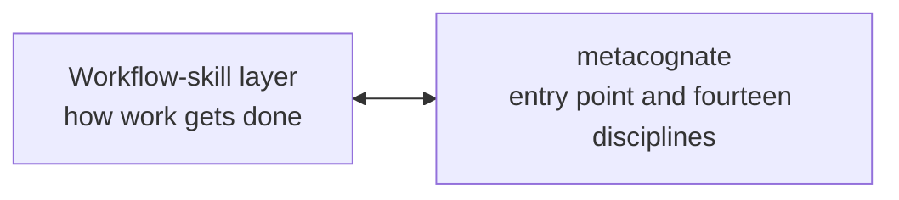
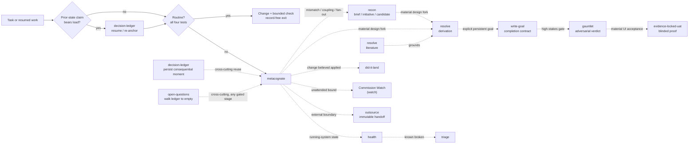

# epistemic-skills

<!-- ZMS-ESTATE:BEGIN -->

> **Estate status:** `maintenance` · **Purpose:** `governance_method` · **Portfolio role:** `none`
> **Canonical for:** epistemic-agent-skill-package
> Lifecycle authority: `<private-fleet-repo>/governance/estate.yaml`.

<!-- ZMS-ESTATE:END -->

Epistemic disciplines for agentic work: use the least process that can still expose an error capable of changing the action or the completion claim.

**Version 6.0.0.** This is the version on `main` — **prepared, not yet published**. No `v6.0.0` tag or GitHub Release exists; its publication gate has not been passed, and the gate record in progress is [RELEASE-6.0.0.md](docs/release/RELEASE-6.0.0.md). The project's current [immutable support point](https://github.com/ZMS-Labs/epistemic-skills/releases/tag/v5.1.0) is **v5.1.0**, and every install recipe below pins it. The package is harness-agnostic, follows the [Agent Skills specification](https://agentskills.io/specification), and is licensed under [GPL-3.0-or-later](LICENSE).

[](https://github.com/ZMS-Labs/epistemic-skills/releases/latest)
[](https://github.com/ZMS-Labs/epistemic-skills/actions/workflows/epistemic-flexibility.yml)
[](https://github.com/ZMS-Labs/epistemic-skills/actions/workflows/release-security.yml)
[](https://github.com/ZMS-Labs/epistemic-skills/actions/workflows/github-code-scanning/codeql)
[](LICENSE)

The README is the fast path into the project. The [GitHub Wiki](https://github.com/ZMS-Labs/epistemic-skills/wiki) is the practical handbook. The immutable released skill files, contracts, schemas, checks, and evidence remain authoritative.

## Contents

- [What this is—and is not](#what-this-isand-is-not)
- [Choose your path](#choose-your-path)
- [Five-minute start](#five-minute-start)
- [Routine work first](#routine-work-first)
- [metacognate: the single entry point](#metacognate-the-single-entry-point)
- [Choose by task](#choose-by-task)
- [The epistemic arc](#the-epistemic-arc)
- [Fifteen-skill catalog](#fifteen-skill-catalog)
- [Installation and compatibility](#installation-and-compatibility)
- [Architecture and source policy](#architecture-and-source-policy)
- [Coordination with epistemic-calibration](#coordination-with-epistemic-calibration)
- [Trust, evidence, and known limits](#trust-evidence-and-known-limits)
- [Developing and contributing](#developing-and-contributing)
- [License and support](#license-and-support)

## What this is—and is not

Most agent-skill collections organize **how work proceeds**: brainstorming, planning, implementation, debugging, review, and verification. epistemic-skills sits beneath that workflow layer and asks a different question: **what would make the target, decision, evidence, handoff, or acceptance claim trustworthy enough to bear load?**

The package provides **fifteen** skills: one entry point, **fourteen** disciplines. Pairing them with a workflow-skill layer such as [superpowers](https://github.com/obra/superpowers) is a judgment the entry point makes at the moment it is needed, not a separate seat. Each method has a positive trigger, an output contract, and a stopping boundary.

It is not:

- a replacement for coding, testing, debugging, planning, or ordinary review;
- a mandate to run every skill or generate a process artifact for every edit;
- an automatic truth engine—records, schemas, and receipts have explicit evidentiary limits;
- proof that one model, provider, or harness is universally superior; or
- a reason to continue reasoning when the correct boundary is hold, escalation, or a bounded reversible probe.

The governing principle is **floors, not ceilings; proportional cost**. Extra process earns no credit unless it can expose an action-changing error.

## Choose your path

Users and maintainers are equal first-class audiences:

| Use the skills | Develop and maintain |
|---|---|
| [Start Here](https://github.com/ZMS-Labs/epistemic-skills/wiki/Start-Here) | [Architecture and Contracts](https://github.com/ZMS-Labs/epistemic-skills/wiki/Architecture-and-Contracts) |
| [Choosing a Skill](https://github.com/ZMS-Labs/epistemic-skills/wiki/Choosing-a-Skill) | [Cross-Harness Packaging](https://github.com/ZMS-Labs/epistemic-skills/wiki/Cross-Harness-Packaging) |
| [Routine Work and Proportionality](https://github.com/ZMS-Labs/epistemic-skills/wiki/Routine-Work-and-Proportionality) | [Testing and Evaluations](https://github.com/ZMS-Labs/epistemic-skills/wiki/Testing-and-Evaluations) |
| [Workflow Recipes](https://github.com/ZMS-Labs/epistemic-skills/wiki/Workflow-Recipes) | [Evidence, Status, and Known Limitations](https://github.com/ZMS-Labs/epistemic-skills/wiki/Evidence-Status-and-Known-Limitations) |
| [Installation and Harness Compatibility](https://github.com/ZMS-Labs/epistemic-skills/wiki/Installation-and-Harness-Compatibility) | [Contributing](https://github.com/ZMS-Labs/epistemic-skills/wiki/Contributing) |
| [Skill Catalog](https://github.com/ZMS-Labs/epistemic-skills/wiki/Skill-Catalog) | [Release Process and Versioning](https://github.com/ZMS-Labs/epistemic-skills/wiki/Release-Process-and-Versioning) |
| | [Security, Provenance, and DCO](https://github.com/ZMS-Labs/epistemic-skills/wiki/Security-Provenance-and-DCO) |

The Wiki is unversioned navigation over versioned sources. If a handbook summary and a released contract differ, the immutable `v5.1.0` source controls — and that precedence is load-bearing right now. The handbook still describes a v5.0.0-era package: most pages say fourteen skills, there is no `manifest` page, and several retired seats are still written in the present tense. Use it for orientation; read the in-tree `SKILL.md` for any contract you intend to rely on.

## Five-minute start

1. **Install one immutable copy.** Choose the native path for your harness under [Installation and compatibility](#installation-and-compatibility). Use the generic Agent Skills path only when no native plugin or extension exists.
2. **Reload the harness or start a fresh task.** Trigger discovery and role registries are commonly session-bound.
3. **Choose the entry point.** There is one: `metacognate`. It is the only skill you invoke by name; every other member fires on its own description. (One carve-out: `manifest`, the mission-custody seat, may also be invoked directly — on `manifest this` or `/manifest` — for mission lifecycle acts.) It applies the routine gate first, and declining is its most common correct outcome.
4. **Verify the inventory and source.** Expect exactly the count your source ships: the `main` tree or a v5.1.0 package or tagged checkout ships fifteen (v4.1.0 and v4.0.0 ship eleven; v3.4.0 ships seventeen; v3.3.0 ships fourteen; v3.1.0/v3.2.0 ship twelve; the pinned `v3.0.0` tag also ships eleven — its different eleven)—not two copies found through different install mechanisms.
5. **Let routine work leave.** A local, reversible, directly checkable, non-precedential task should finish with its bounded check and no process-only artifact.

For a harness without a native package surface, the complete generic install is:

```bash
npx skills add https://github.com/ZMS-Labs/epistemic-skills/tree/v5.1.0/plugins/epistemic-skills/skills
```

Do not run that command on top of a native plugin install. The [installation handbook](https://github.com/ZMS-Labs/epistemic-skills/wiki/Installation-and-Harness-Compatibility) includes verification and recovery details for every packaged harness.

## Routine work first

Routine work is the default exit, not a lesser form of rigor. A task stays on the routine path only when it is all four of:

1. **Reversible** by an ordinary revert.
2. **Local**—it crosses no security, privacy, authorization, tenancy, billing, legal, infrastructure, network, public-contract, migration, or cross-service boundary.
3. **Directly checkable** by a targeted test, local preview, deterministic reproduction, or comparably bounded observation.
4. **Non-precedential**—no unresolved decision, scholarly premise, authorization, or cross-session judgment must be preserved.

For unfamiliar but routine-looking work, perform **two-read micro-recon**: inspect the target artifact and its nearest test or example. If they agree with the request and the four conditions still hold, make the smallest change and run the bounded check.

Routine work produces no entry-point record, blindspot report, formal record, ledger entry, UAT packet, or proof that other triggers were absent. Escalate only when the reads expose an observed mismatch, hidden coupling, unresolved scope, material fan-out risk, or another positive trigger.

See the [routine-work guide](https://github.com/ZMS-Labs/epistemic-skills/wiki/Routine-Work-and-Proportionality) and the [released normative reference](https://github.com/ZMS-Labs/epistemic-skills/blob/v5.1.0/plugins/epistemic-skills/skills/metacognate/reference/routine-fast-path.md).

## metacognate: the single entry point

`metacognate` is the one skill you invoke by name. Every other member fires on its
own `description`.



- **It carries a procedure, never an inventory.** No member list appears in it, and
  none may be added. A seat that enumerates its members becomes a hand-maintained
  projection of a directory, and every such projection here has drifted — one
  shipped a description naming two skills that no longer existed.
- **Tier 1 is iron**, scoped strictly to the irreversible: consent before an
  irreversible act, an oracle adequate to its claim, no actor certifying its own
  acceptance, and no hard gate overridable from the other side. These bind both
  strands, including a workflow layer's own gates.
- **Tier 2 is judgment**: what would have to be true for this to be right, and
  which of those can I not currently answer? The unanswerable one names the work.
  If all are answerable, engage nothing — **silence is a success state**.
- **Pairing is a judgment at a moment, not a table.** Either strand may interrupt
  the other, and control comes back to the point of interruption. That is why the
  former `helix` pair table was replaced rather than renamed: a table maps stages,
  but it cannot hand control back.

*Replaced `using-epistemic-skills` and `helix` in v5.0.0. Both seats were deleted;
their evaluation corpora were preserved at package level. See
`docs/superpowers/specs/2026-08-06-epistemic-skills-v5-design.md`.*

## Choose by task

| Task shape | Entry point | Expected result |
|---|---|---|
| Local, reversible, directly checkable, non-precedential change | Ordinary workflow | Change plus bounded check; no epistemic artifact |
| Non-routine task, or the approach itself is uncertain | `metacognate` | The unanswerable condition, the discipline it names, and where to return; silent if the task clears the routine gate |
| Need the state of a running system, or a health claim is about to bear load | `health` | Per-subject `OK`/`WARN`/`CRITICAL`/`UNKNOWN`; `UNKNOWN` never aggregates into `OK` |
| A specific thing is broken and the cause is not established | `triage` | `CAUSE`/`NARROWED`/`UNKNOWN`/`NOT-BROKEN` with the discriminating observation |
| A change is believed applied and something depends on it | `did-it-land` | `LANDED`/`REVERTED`/`UNVERIFIED` from a runtime observation, never a source read |
| A bound must be noticed between sessions, or an external observer must be commissioned or re-proved | `watch` | Validated `watch-commission@1`: `DECLARED`/`BLOCKED`/`INERT`/`PROVEN`/`SUSPECT`; the skill itself never watches |
| Resume from a compaction summary, handoff, or remembered state | `decision-ledger` (resume mode) | Re-anchored state digest or visible uncertainty |
| Micro-recon exposes map/territory mismatch, hidden coupling, fuzzy scope, or fan-out risk | `recon` (brief mode) | Read-only territory map and rewritten request |
| Material software/system fork or correctness/property claim | `resolve` (derivation) | Inline focused derivation or a revision-bound formal record |
| Claim depends on scholarly evidence or a research connector | `resolve` (literature) | Qualified evidence with reception, holdings, and degradation stated |
| Operator explicitly asks to author or start a persistent goal | `write-goal` | Approved completion contract with proof, scope, blockers, and stop rule |
| Consequential uncovered decision, assumption, or recurrent correction must survive | `decision-ledger` | Reused adequate artifact or a minimal ledger entry |
| Work crosses to an external model, agent, or process | **outsource** | Target-readable immutable handoff packet and short pointer, or `BLOCKED` |
| High-stakes or irreversible decision needs an adversarial gate | `gauntlet` | Conflict Ledger and computed GO / CONDITIONAL / NO-GO |
| Material UI-facing work needs an acceptance claim | `evidence-locked-uat` | Actor evidence, blinded verification, and deterministic verdict |
| Get every open decision answered by the operator before work continues | `open-questions` | Emptied-or-parked question ledger and a 4-field exit stamp |

The [workflow recipes](https://github.com/ZMS-Labs/epistemic-skills/wiki/Workflow-Recipes) show how these boundaries compose without turning the table into a checklist.

## The epistemic arc

The arc is a set of trigger-dependent handoffs, not a conveyor belt every task must traverse:



`watch` commissions observation; an external runtime performs it. A separate
mission-control layer may retain and act on the commission, but no Markdown skill
remains awake between sessions.

`resolve` (literature), `decision-ledger`, `outsource`, and `open-questions` are cross-cutting. Resume re-anchoring is `decision-ledger` resume mode (pre-arc). `context-audit` is maintenance-triggered outside the arc. Craft doctrine (`intent-traced-merge`, `agent-interface-design`) is read on demand — not a firing skill. Most tasks clear the routine gate or fire one discipline. See [The Epistemic Arc](https://github.com/ZMS-Labs/epistemic-skills/wiki/The-Epistemic-Arc) for handoff details and [Core Concepts](https://github.com/ZMS-Labs/epistemic-skills/wiki/Core-Concepts) for the five epistemic-flexibility controls.

## Fifteen-skill catalog

The package contains exactly one entry point and fourteen disciplines. Each name appears once, and every row links to its canonical `SKILL.md` in this tree — the file that defines the contract. (Earlier editions sent six of these rows to Wiki pages instead; that contradicted the precedence rule above, and the handbook has since drifted a major version behind.) For the immutable form of any contract, read the same path at a release tag.

| Skill | Positive trigger | Purpose | Output |
|---|---|---|---|
| [`metacognate`](plugins/epistemic-skills/skills/metacognate/SKILL.md) | The approach is uncertain, a claim is about to bear load, an observation contradicts a tool, or work resumes from a summary | Decide how much process this deserves — usually none — and hand control back | The unanswerable condition and the discipline it names; silence when the routine gate clears |
| [`manifest`](plugins/epistemic-skills/skills/manifest/SKILL.md) | Work is mission-shaped — multi-session, consequential, cross-agent, or interruption-expensive — or the explicit phrase `manifest this` | Open, resume, advance, verify, or close a custodied mission: recorded authority, hash-chained checkpoints, drift re-anchoring, acceptance by a distinct acceptor | The mission's durable state under `missions/<id>/` (mission-custody@1 records), never the chat |
| [`health`](plugins/epistemic-skills/skills/health/SKILL.md) | The state of a running system is wanted, or a health claim is about to bear load | Probe declared subjects against declared bounds, and say what could not be reached | Per-subject state; a roll-up carrying any `UNKNOWN` is at best `UNKNOWN` |
| [`triage`](plugins/epistemic-skills/skills/triage/SKILL.md) | A specific subject is broken or degraded and the cause is not established | Eliminate candidates by observation, cheapest discriminator first, and stop at the cause | A verdict with the observation that ruled the alternatives out; the remedy is a separate act |
| [`did-it-land`](plugins/epistemic-skills/skills/did-it-land/SKILL.md) | A change is believed applied and something now depends on it being true | Observe the runtime, identify what actually loads, and re-check past the revert window | `LANDED`/`REVERTED`/`UNVERIFIED`; `UNVERIFIED` is the default |
| [Commission Watch (`watch`)](plugins/epistemic-skills/skills/watch/SKILL.md) | A bound must be noticed between sessions, or an external observer must be commissioned or re-proved | Specify, commission, and proof-fire an external observer; the skill itself never persists | Validated `watch-commission@1`: `DECLARED`/`BLOCKED`/`INERT`/`PROVEN`/`SUSPECT` |
| [`recon`](plugins/epistemic-skills/skills/recon/SKILL.md) | Territory must be mapped before effort commits: a fuzzy/contradicted brief, a large foggy effort, or an external project overlapping your own (three modes: brief / initiative / candidate) | Read, decompose, or harvest — understanding only, never a change | Rewritten request; decision map + fog-free tickets; or harvest record with per-level spend decisions |
| [`resolve`](plugins/epistemic-skills/skills/resolve/SKILL.md) | A live question or material decision needs an instrument, not an opinion (three instruments: derivation / literature / probe) | Settle it with the cheapest sufficient instrument; the instrument produces evidence, never the downstream verdict | Derivation or `formal-rigor-record@2`; claim-evidence matrix; or recorded probe answer with the build disposed |
| [`write-goal`](plugins/epistemic-skills/skills/write-goal/SKILL.md) | Explicit intent to author, refine, or start a durable goal | Bind operator intent to proof, scope, blockers, and stop rules | Approved goal contract; execution/certification remains downstream |
| [`decision-ledger`](plugins/epistemic-skills/skills/decision-ledger/SKILL.md) | Uncovered consequential decision, assumption, or recurrent correction will bear future load | Reuse adequate durable records and persist only the gap | Existing artifact reference or `ledger-entry@1`; never a verdict |
| [`outsource`](plugins/epistemic-skills/skills/outsource/SKILL.md) | Durable handoff to an external model, agent, or process | Make the repository carry complete context and provenance | Committed, pushed, target-readable packet plus short pointer, or `BLOCKED` |
| [`gauntlet`](plugins/epistemic-skills/skills/gauntlet/SKILL.md) | High-stakes, one-way-door, high-blast-radius, risky pre-merge, or explicit adversarial gate | Multi-lens review of a frozen, truth-gated subject | Conflict Ledger and computed GO / CONDITIONAL / NO-GO |
| [`evidence-locked-uat`](plugins/epistemic-skills/skills/evidence-locked-uat/SKILL.md) | Explicit UAT or material interaction/state/accessibility-sensitive UI acceptance | Separate actor, blinded verifier, and deterministic judge | Evidence packet and strict verdict; `INCONCLUSIVE` never becomes PASS |
| [`open-questions`](plugins/epistemic-skills/skills/open-questions/SKILL.md) | Operator asks to be interviewed until no open questions remain; un-best-guessable irreversible fork with operator present | Exhaustive serial clarification interview (docket + cascade modes); the auto-trigger runs fork-scoped only | Emptied-or-parked ledger + 4-field stamp; fork-scoped exit: lineage resolved, one closing offer, declined items deferred to the durable tracker with defaults |
| [`context-audit`](plugins/epistemic-skills/skills/context-audit/SKILL.md) | Explicit audit request, detected cross-layer instruction conflict, or model-generation upgrade | Audit the assembled instruction context for conflicts, duplicates, and dead weight; classify-and-watch, never quota-cut | Cut list as diff, conflict ledger, re-baseline watch note; operator-gated class-by-class apply |

**Craft doctrine (not disciplines):** [`intent-traced-merge`](plugins/epistemic-skills/reference/craft/intent-traced-merge.md) and [`agent-interface-design`](plugins/epistemic-skills/reference/craft/agent-interface-design.md) are preserved as reference doctrine with their archived batteries and epoch results (v4.0.0 demotion — workflow/craft methods, not epistemic moment disciplines).

## Installation and compatibility

### One copy, one version, one canonical tree

Install with **exactly one mechanism per harness**. Native plugin **or** generic skill install—never both. For 5.1.0, replace an older untagged copy, reload, and verify both the skill count and source path. Duplicate copies create duplicate triggers and can silently mix contract versions.

| Harness | v5.1.0 surface | Required follow-through | Honest support boundary |
|---|---|---|---|
| Claude Code | Local marketplace from tagged checkout | Start a fresh task | Package discovery from one immutable checkout |
| Codex | Tagged plugin marketplace | Render five Gauntlet roles; start a new task | Manifest does not itself register custom collaboration-agent types |
| Cursor | Tagged local checkout or team marketplace | Reload window; verify the tag's full skill count (fifteen at v5.1.0) | Public listing unavailable; recorded behavioral epoch is `BLOCKED_EXTERNAL` |
| Gemini CLI | Tagged extension | Restart and validate extension | Uses root context and canonical symlinked tree |
| Antigravity (`agy`) | Tagged native local plugin | Validate with `agy` | Choose native, Gemini link, or import—only one |
| Kimi Code | Tagged repository plugin | `/reload` or new session | Plugin instructions map isolated-agent primitives |
| ZCode | Tagged local checkout, junction-projected into `~/.zcode/skills` | Start a fresh session; verify the tag's full skill count (fifteen at v5.1.0) | Session bootstrap junctions `~/.claude/skills` only — skills riding as Claude *plugins* are not auto-imported; junction surface verified on one fleet device, plugin install untested |
| ChatGPT / OpenAI | Generated bundle from the release (`packaging/openai/chatgpt-skill`) | Upload the generated zip per [the packaging guide](docs/CHATGPT-AND-OPENAI-PACKAGING.md) | Generated-artifact bridge: a snapshot of the released tree, not self-updating; the bundle carries no live execution |
| Generic Agent Skills host | Tagged canonical skills URL | Reload host and verify source | Host must supply any runtime primitive the selected skill requires |

**Shared-budget boundary (every harness):** harnesses cap the total description bytes they load; over the harness cap, descriptions are dropped **silently** — the skill files exist and the count looks right while triggers never fire. This package consumes 8,636 bytes (its own recorded ceiling). If other skills share your harness's budget, verify triggers actually fire after install; a file count alone is not proof of loading.

Full installation, migration, runtime-degradation, and troubleshooting guidance lives in the [installation handbook](https://github.com/ZMS-Labs/epistemic-skills/wiki/Installation-and-Harness-Compatibility).

### Claude Code

```bash
git clone --depth 1 --branch v5.1.0 https://github.com/ZMS-Labs/epistemic-skills.git /path/to/epistemic-skills-v5.1.0
```

```text
/plugin marketplace add /absolute/path/to/epistemic-skills-v5.1.0
/plugin install epistemic-skills@epistemic-skills
```

Use one marketplace source only, then start a fresh task. Prefer the immutable `v5.1.0` tag for stable installs; `main` may include post-tag corrective documentation and contract hardening (see [successor progress](docs/release/SUCCESSOR-PROGRESS-104-105-2026-08-07.md)).

### Codex

```powershell
codex plugin marketplace add ZMS-Labs/epistemic-skills --ref v5.1.0
codex plugin add epistemic-skills@epistemic-skills
python "$HOME/.codex/plugins/cache/epistemic-skills/epistemic-skills/5.1.0/skills/gauntlet/scripts/render_codex_agents.py" --out "$HOME/.codex/agents"
```

Start a new Codex task after rendering. The renderer converts the five canonical packaged Markdown roles into Codex's user-agent registry. The Gauntlet retains a hashed exact-role materialization fallback for tasks that started before registration.

### Cursor

Cursor packaging is present, but the plugin is **not publicly listed**. `/add-plugin epistemic-skills` is not a valid public-install claim until Cursor accepts the listing. Use a tagged local checkout or a Cursor Teams/Enterprise team-marketplace import.

Windows local install:

```powershell
git clone --depth 1 --branch v5.1.0 https://github.com/ZMS-Labs/epistemic-skills.git .\epistemic-skills-v5.1.0
Set-Location .\epistemic-skills-v5.1.0
if ((git describe --tags --exact-match) -ne 'v5.1.0') { throw 'expected v5.1.0' }
New-Item -ItemType Directory -Force -Path "$env:USERPROFILE\.cursor\plugins\local" | Out-Null
$src = (Resolve-Path .\plugins\epistemic-skills).Path
$dest = Join-Path $env:USERPROFILE '.cursor\plugins\local\epistemic-skills'
if (Test-Path -LiteralPath $dest) { throw "destination already exists; inspect it before replacement: $dest" }
cmd /c mklink /J "$dest" "$src"
```

macOS/Linux local install:

```bash
git clone --depth 1 --branch v5.1.0 https://github.com/ZMS-Labs/epistemic-skills.git ./epistemic-skills-v5.1.0
cd ./epistemic-skills-v5.1.0
test "$(git describe --tags --exact-match)" = v5.1.0
mkdir -p ~/.cursor/plugins/local
ln -sfn "$(pwd)/plugins/epistemic-skills" ~/.cursor/plugins/local/epistemic-skills
```

Run **Developer: Reload Window**, verify the tag's full skill count (fifteen at v5.1.0) under Customize → Skills, and do not also install them into `~/.cursor/skills/`.

### Gemini CLI

```bash
gemini extensions install https://github.com/ZMS-Labs/epistemic-skills --ref v5.1.0 --consent
# Local development only:
gemini extensions link /path/to/epistemic-skills
```

Restart the session and run `gemini extensions validate` when validating a checkout. Stable users should use the tagged install, not the mutable development link.

### Antigravity (`agy`)

```bash
git clone --depth 1 --branch v5.1.0 https://github.com/ZMS-Labs/epistemic-skills.git /path/to/epistemic-skills-v5.1.0
agy plugin install /path/to/epistemic-skills-v5.1.0
agy plugin validate /path/to/epistemic-skills-v5.1.0
```

Use one of native `agy plugin install`, Gemini extension link, or `agy plugin import gemini`; do not combine them.

### Kimi Code

```text
/plugins install https://github.com/ZMS-Labs/epistemic-skills/tree/v5.1.0
# Local development only, from a clone:
/plugins install /path/to/epistemic-skills
```

Run `/reload` or start a new session. `.kimi-plugin/plugin.json` points to the canonical package tree and supplies the Kimi tool mappings.

### Generic harness

```bash
npx skills add https://github.com/ZMS-Labs/epistemic-skills/tree/v5.1.0/plugins/epistemic-skills/skills
```

Use this only when the host has no native plugin or extension. Frontmatter `description` is the trigger; the body is the method. Compatibility means the host preserves the selected skill's capability, ordering, isolation, persistence, and fail-closed contracts—not merely that it can display Markdown.

## Architecture and source policy

One canonical tree contains all method files; thin harness manifests expose that tree without forking behavior:

```text
epistemic-skills/
├── plugins/epistemic-skills/
│   ├── skills/<name>/SKILL.md           canonical skill cores (fifteen)
│   ├── agents/                          five canonical Gauntlet roles
│   ├── contracts/                       schemas + executable verifiers:
│   │   ├── handoff-receipt / skill-run-ledger / calibration schemas
│   │   ├── mission-custody/             custody gate, hook, and CLI
│   │   ├── watch-commission/            commission validation
│   │   └── v6-assurance/                release claim-to-proof validator
│   ├── .claude-plugin/plugin.json
│   ├── .codex-plugin/plugin.json
│   ├── .cursor-plugin/plugin.json
│   └── .kimi-plugin/plugin.json
├── skills  ──symlink──> plugins/epistemic-skills/skills
├── agents  ──symlink──> plugins/epistemic-skills/agents
├── .claude-plugin/marketplace.json
├── .agents/plugins/marketplace.json
├── .cursor-plugin/{plugin,marketplace}.json
├── gemini-extension.json + GEMINI.md
├── .kimi-plugin/plugin.json
├── plugin.json                           Antigravity marker
├── RELEASING.md                          the release gate (RG-1..RG-9)
├── .ledger/entries.jsonl                 append-only durable decisions
├── packaging/                            generated non-native bundles
└── docs/                                 releases, evidence, design history
```

Harness manifests are thin by rule: they point at the canonical tree and never fork a method.
A skill's behavior is defined in exactly one place.

### Contract layers

| Layer | What it establishes | What it does not establish |
|---|---|---|
| Skill contract | Trigger, method, output, boundary, degradation, and handoff | That a particular run followed the contract correctly |
| Artifact/schema contract | Shape, vocabulary, required fields, and machine-verifiable invariants | Truth of the conclusion or quality of judgment |
| `handoff-receipt@1` | Producer-declared identity/provenance fields, hash binding, validity envelope | Authenticated origin, authorship, verdict truth, or independence |
| Runtime contract | Required isolation, tool, storage, ordering, and failure semantics | Equivalent behavioral quality across providers or harnesses |

See [Architecture and Contracts](https://github.com/ZMS-Labs/epistemic-skills/wiki/Architecture-and-Contracts) and [Cross-Harness Packaging](https://github.com/ZMS-Labs/epistemic-skills/wiki/Cross-Harness-Packaging).

### Source and version policy

For a stable behavior claim, use this order:

1. immutable released `SKILL.md`, contract, schema, or executable check;
2. released references, records, and evidence at the same tag;
3. README and Wiki explanations.

`main` is current development and may move. The Wiki is a curated, unversioned handbook and must label current-development links. Historical audits and evaluations retain the status and scope they had at their frozen revision. Stable installation commands always use an immutable tag.

## Coordination with epistemic-calibration

The runtime product and its behavioral measurement counterpart remain separate,
independently versioned repositories. **epistemic-skills owns intervention
contracts; epistemic-calibration owns corpora, trial execution, and calibrated
estimates.** They exchange revision-bound records rather than sharing mutable
source or creating an installation dependency.

The [coordination charter](docs/coordination/epistemic-calibration.md) records
the coordination status as frozen at its 2d66a27 (v3.0.0-era)
baseline, the product boundary, the proposed
`epistemic-product-calibration@1` exchange unit, adoption questions, and phased
pilot plan. Calibration-side state remains unverified until that repository
returns an immutable reference; the charter does not turn a proposed bilateral
contract into an accepted one. No such reference has been returned in the three
major versions since that baseline, so treat this coordination as **dormant**:
real as a stated boundary, inert as a dependency.

## Trust, evidence, and known limits

**Version 6.0.0** is prepared on `main` and is **not** a support point: no tag, no Release, publication gate not passed. Its in-progress gate record is [RELEASE-6.0.0.md](docs/release/RELEASE-6.0.0.md). **Version 5.1.0** remains the current immutable support point: fifteen skills, aligned package surfaces, deterministic checks, and a tagged source snapshot. Its predecessor **v5.0.0** was published with explicit gate honesty — item 6 only PARTIALLY MET at publication, item 8 WAIVED / NOT MET — and a post-release independent review returned **NO-GO** for retrospective certification. Read the [errata](docs/release/RELEASE-5.0.0-ERRATA-2026-08-06.md), [post-release review](docs/release/POST-RELEASE-INDEPENDENT-REVIEW-5.0.0-2026-08-06.md), and [successor progress](docs/release/SUCCESSOR-PROGRESS-104-105-2026-08-07.md) before treating v5.0.0 as gate-complete. Corrective work for issues #104/#105 landed on `main` after the immutable tag; do not move the tag.

Earlier support points remain historically accurate for their own campaigns, and a named limit
stays on this page until a later campaign actually retires it. None has been rewritten into a pass.

### Where v6.0.0 stands

v6.0.0 is prepared and unpublished, for reasons this section states rather than hides:

- It adds a **mission-custody contract** (the `manifest` seat) and a **v6 assurance contract**
  ([`validate_v6_assurance.py`](plugins/epistemic-skills/contracts/v6-assurance/validate_v6_assurance.py))
  that binds release claims to machine-checked proof.
- The candidate freeze carries a **72-row claim-to-proof matrix**, and the two
  populations in it must not be conflated. **31 class claims** state what this
  release asserts: **21 PROVED, 8 LIMITED** (proven within stated bounds),
  **2 PARTIAL, 0 UNPROVED**. The other **41 rows are an open-issue census**,
  one per tracker item, where `UNPROVED` means "this issue is still open" and
  never meant a failed proof. An earlier edition of this note reported the raw
  total as though two-fifths of the release's claims were unproven; that was
  the headline honesty number and it was wrong.
- `CLM-INDEPENDENT-GAUNTLET`, the one class claim that stood UNPROVED, is
  closed by **operator ratification** of the rc5 verdict (D20) — not by an
  operator-dispatched review. The seat was fresh and non-authoring, satisfying
  the oracle; the dispatch limb is closed by the operator adopting the verdict
  after the fact. `docs/v6/operator-decision-record-2026-08-20.md` states this
  so no reader has to reconstruct it.
- The freeze seals **141 source files** by per-file digest against an exact candidate commit, so a
  post-freeze edit to any of them turns CI red.
- Five independent panels reviewed successive build candidates: **four returned NO-GO**, the fifth
  GO. Two further reviews of the *publication act* — one of them cross-family — **both returned
  NO-GO**.
- The shipped packet therefore reads `readiness: NOT_READY` with
  `blocking_claims: ["CLM-INDEPENDENT-GAUNTLET"]`. It refuses to certify itself, and the validator
  exits 0 **because** of that refusal — that green is never support for publishing.

What blocks the tag is the release *record*, not the engineering: publication identity, an evidence
table with immutable coordinates, and two operator acts that cannot be delegated. Two of those
seven reviews were genuinely cross-family (one build panel, one publication read); the rest shared a
model family with the authors and recorded that as an independence *limit*, not as independence. See [RELEASE-6.0.0.md](docs/release/RELEASE-6.0.0.md) and the gate in
[RELEASING.md](RELEASING.md).

### What the evidence supports

- Deterministic checks protect named routing, proportionality, schema, receipt, UAT-judge,
  DCO-policy, package-integration, public-content, mission-custody, and Gauntlet-mechanics
  invariants.
- The v6 assurance contract additionally binds the freeze itself: source-inventory digests, a
  blocking-claims list derived from the matrix rather than hand-written, and a closed owner
  vocabulary whose first run found a real unclassified owner.
- The blinded proportionality campaign retained 162/162 terminal, schema-valid matched calls; the candidate passed the routine, material, and high-risk contract while corrected full-ceremony and always-routine parodies failed.
- A tag and GitHub Release provide an immutable support coordinate for packaged contracts and
  install instructions — which is precisely what v6.0.0 does not yet have.

### Required limitations — frozen at the v3.2.0 behavioral campaign

**No later campaign has superseded these rows.** The releases since v3.2.0 added deterministic and
structural assurance, not new behavioral measurement, so this remains the project's most recent
behavioral evidence and its limits still bind.

| Boundary | Honest v3.2.0 status |
|---|---|
| Behavioral correctness | The post-hoc semantic review found **two genuine P0 failures**, `tm-02` and `tm-03`. Do not claim all observed candidates were correct. |
| AGY adjudication | Forty-four OpenAI-origin candidates received no valid semantic judgment because all **88 AGY attempts** ended as zero-token quota failures. These are availability failures—not merit judgments, passes, or proof the responses would fail. |
| Generality | Provider, repetition, and judge assignment are confounded; paired seats are correlated. The release does not establish universal superiority or cross-provider generality. |
| Cursor | v3.2.0 packaging exists, but public marketplace listing is unavailable and the retained behavioral epoch is **`BLOCKED_EXTERNAL`**. Packaging readiness is not runtime behavioral proof. |
| Structural polarity | Closed-taxonomy and formal-only parodies outperformed the candidate on available structural scoring, and three AGY parody arms are absent. Structural conformance is not semantic correctness. |
| Gauntlet certification | The amended arbitrator-certification battery (AC-07 = seat-provenance neutrality) ran blind on 2026-08-04: **10/10 planted-flaw catch** (threshold 9/10), verdict-match 8/10 — **CERTIFIED at standard rigor** for the seat's discipline at those 10 cases. Same-model-family caveat stands; this is not a panel behavioral-superiority claim. |
| Post-hoc diagnostic | The V3 diagnostic remains exactly **`release_credit: none`**. It informed bounded risk acceptance but did not repair, qualify, or retroactively pass the excluded campaign. |

Operator risk acceptance covered only the named behavioral-confidence gaps. It did **not** waive or satisfy deterministic, DCO, CodeQL, secret-scanning, provenance, independent-review, or publication-identity gates. The machine-readable [risk record](docs/release/RELEASE-3.0.0-RISK-ACCEPTANCE.json) — append-only since 3.0.0 (revisit history records re-adjudications and met exit criteria; accepted scopes are never rewritten) — controls the precise scope.

Read [Evidence, Status, and Known Limitations](https://github.com/ZMS-Labs/epistemic-skills/wiki/Evidence-Status-and-Known-Limitations), the [5.0.0 release record](docs/release/RELEASE-5.0.0.md), the [5.0.0 errata](docs/release/RELEASE-5.0.0-ERRATA-2026-08-06.md), the [3.2.0 release record](https://github.com/ZMS-Labs/epistemic-skills/blob/v3.2.0/docs/release/RELEASE-3.2.0.md) (the behavioral campaign summarized above), and the [no-credit diagnostic](https://github.com/ZMS-Labs/epistemic-skills/blob/v3.2.0/docs/release/evidence/2026-07-26-formal-rigor-v3-posthoc-diagnostic.md) before making broad behavioral claims.

## Developing and contributing

Start with [CONTRIBUTING.md](CONTRIBUTING.md) and the maintainer handbook. Contract-bearing edits should change the canonical tree, add the smallest discriminating test, keep adapters thin, and preserve routine exits, silent absent triggers, authority boundaries, and record-free outcomes.

### Verification by claim

Run checks in proportion to the change:

```bash
# Routing and proportionality
python plugins/epistemic-skills/evals/epistemic-flexibility/run_tests.py
python plugins/epistemic-skills/evals/proportionality/run_tests.py

# Formal-rigor and package integration
python plugins/epistemic-skills/skills/resolve/derivation/evals/formal-rigor-v2-fixtures/tests/run_tests.py
python plugins/epistemic-skills/skills/outsource/tests/run_tests.py

# Shared mechanics
python .github/scripts/check_json_artifacts.py
python plugins/epistemic-skills/contracts/verify_receipt.py --self-test
python plugins/epistemic-skills/skills/evidence-locked-uat/scripts/judge.py --self-test
python plugins/epistemic-skills/skills/gauntlet/tests/run_tests.py
```

These are useful local entry points, not the complete release gate. The [testing handbook](https://github.com/ZMS-Labs/epistemic-skills/wiki/Testing-and-Evaluations) reproduces the full released stdlib command map and distinguishes deterministic, behavioral, diagnostic, and release-credit evidence.

Every pull-request commit must carry an author-matching DCO trailer:

```text
git commit --signoff
```

A release additionally requires exact-head CI, DCO, CodeQL, full-history secret scanning with a positive control, provenance review, independent publication review, final Gauntlet, and tag/Release identity checks. See [Release Process and Versioning](https://github.com/ZMS-Labs/epistemic-skills/wiki/Release-Process-and-Versioning) and [Security, Provenance, and DCO](https://github.com/ZMS-Labs/epistemic-skills/wiki/Security-Provenance-and-DCO). When GitHub Actions cannot assign runners, use [local CI fallback](docs/CI-LOCAL-FALLBACK.md) and record a receipt.

### Maintainer map

- [Architecture and Contracts](https://github.com/ZMS-Labs/epistemic-skills/wiki/Architecture-and-Contracts)
- [Cross-Harness Packaging](https://github.com/ZMS-Labs/epistemic-skills/wiki/Cross-Harness-Packaging)
- [Testing and Evaluations](https://github.com/ZMS-Labs/epistemic-skills/wiki/Testing-and-Evaluations)
- [Evidence, Status, and Known Limitations](https://github.com/ZMS-Labs/epistemic-skills/wiki/Evidence-Status-and-Known-Limitations)
- [Contributing](https://github.com/ZMS-Labs/epistemic-skills/wiki/Contributing)
- [Release Process and Versioning](https://github.com/ZMS-Labs/epistemic-skills/wiki/Release-Process-and-Versioning)
- [Security, Provenance, and DCO](https://github.com/ZMS-Labs/epistemic-skills/wiki/Security-Provenance-and-DCO)
- [Design History and Audits](https://github.com/ZMS-Labs/epistemic-skills/wiki/Design-History-and-Audits)

## License and support

[GPL-3.0-or-later](LICENSE)—GNU General Public License, version 3 or, at your option, any later version.

- Handbook: [GitHub Wiki](https://github.com/ZMS-Labs/epistemic-skills/wiki)
- Stable releases: [Releases](https://github.com/ZMS-Labs/epistemic-skills/releases)
- Questions and defects: [Issues](https://github.com/ZMS-Labs/epistemic-skills/issues)
- Canonical repository: [ZMS-Labs/epistemic-skills](https://github.com/ZMS-Labs/epistemic-skills)
