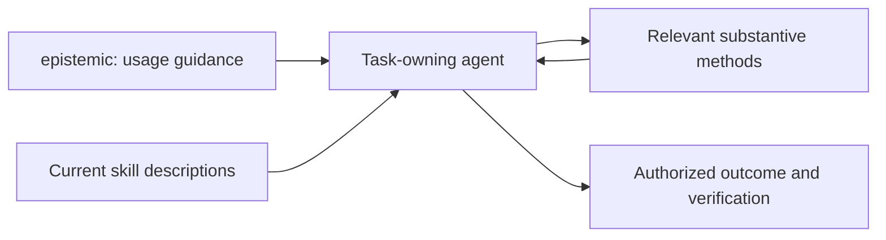
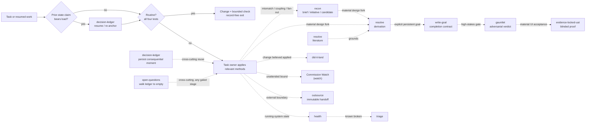

# epistemic-skills

A collection of seventeen agent skills for checking assumptions, evaluating evidence,
reviewing decisions, and verifying that work meets its acceptance criteria.
Each skill combines a defined trigger and stopping rule with references,
examples, and executable checks where a claim can be tested mechanically.

Use the least process that can expose an error capable of changing the action.
A routine edit should finish with a relevant check; a consequential decision may
need structured research, independent review, or a durable handoff.

The skills use the [Agent Skills format](https://agentskills.io/specification).
Thin integration manifests share one canonical skill tree across supported
hosts. See [compatibility](#installation-and-compatibility) for the distinction
between a packaged integration and verified runtime behavior.

**Version 7.0.0 candidate, not yet released.** This source tree contains seventeen
skills: the `epistemic` usage entry and sixteen substantive methods, including
`perspective`. See the [candidate notes](docs/release/RELEASE-7.0.0.md),
[current handbook](docs/wiki-updates/v7.0.0/pages/Home.md), and
[requirement evidence](docs/release/v7-evidence.md). Package version metadata
identifies the prepared candidate; it does not establish a published tag.

**Stable version 6.0.0.** Latest published [release](https://github.com/ZMS-Labs/epistemic-skills/releases/tag/v6.0.0)
(2026-08-21). `main` includes subsequent fixes. The release's independent
publication review did not approve publication; it shipped under a documented
owner exception. See [release status and limitations](#trust-evidence-and-known-limits).

[](https://github.com/ZMS-Labs/epistemic-skills/releases/latest)
[](https://github.com/ZMS-Labs/epistemic-skills/actions/workflows/epistemic-flexibility.yml)
[](https://github.com/ZMS-Labs/epistemic-skills/actions/workflows/release-security.yml)
[](https://github.com/ZMS-Labs/epistemic-skills/actions/workflows/github-code-scanning/codeql)
[](LICENSE)

The README is the fast path into the project. The [GitHub Wiki](https://github.com/ZMS-Labs/epistemic-skills/wiki) is the practical handbook. The immutable released skill files, contracts, schemas, checks, and evidence remain authoritative.

## Contents

- [What this is—and is not](#what-this-isand-is-not)
- [Choose your path](#choose-your-path)
- [Five-minute start](#five-minute-start)
- [Routine work first](#routine-work-first)
- [Using Epistemic Skills](#using-epistemic-skills)
- [Choose by task](#choose-by-task)
- [The epistemic arc](#the-epistemic-arc)
- [Seventeen-skill catalog](#seventeen-skill-catalog)
- [Installation and compatibility](#installation-and-compatibility)
- [Architecture and source policy](#architecture-and-source-policy)
- [Coordination with epistemic-calibration](#coordination-with-epistemic-calibration)
- [Trust, evidence, and known limits](#trust-evidence-and-known-limits)
- [Developing and contributing](#developing-and-contributing)
- [License and support](#license-and-support)

## What this is—and is not

Most agent-skill collections organize **how work proceeds**: brainstorming, planning, implementation, debugging, review, and verification. epistemic-skills sits beneath that workflow layer and asks a different question: **what would make the target, decision, evidence, handoff, or acceptance claim trustworthy enough to bear load?**

The package provides **seventeen** skills: one entry point, **sixteen** disciplines. The `epistemic` usage entry teaches discovery, actual method loading, visible use and continuation. Substantive methods can compose with a workflow package such as [superpowers](https://github.com/obra/superpowers) when applicable. Each method has a positive trigger, an output contract, and a stopping boundary.

It is not:

- a replacement for coding, testing, debugging, planning, or ordinary review;
- a mandate to run every skill or generate a process artifact for every edit;
- an automatic truth engine—records, schemas, and receipts have explicit evidentiary limits;
- proof that one model, provider, or harness is universally superior; or
- a reason to continue reasoning when the correct boundary is hold, escalation, or a bounded reversible probe.

The governing principle is **floors, not ceilings; proportional cost**. Extra process earns no credit unless it can expose an action-changing error.

## Choose your path

Users and maintainers are equal first-class audiences:

| Use the skills | Develop and maintain |
|---|---|
| [Start Here](https://github.com/ZMS-Labs/epistemic-skills/wiki/Start-Here) | [Architecture and Contracts](https://github.com/ZMS-Labs/epistemic-skills/wiki/Architecture-and-Contracts) |
| [Choosing a Skill](https://github.com/ZMS-Labs/epistemic-skills/wiki/Choosing-a-Skill) | [Cross-Harness Packaging](https://github.com/ZMS-Labs/epistemic-skills/wiki/Cross-Harness-Packaging) |
| [Routine Work and Proportionality](https://github.com/ZMS-Labs/epistemic-skills/wiki/Routine-Work-and-Proportionality) | [Testing and Evaluations](https://github.com/ZMS-Labs/epistemic-skills/wiki/Testing-and-Evaluations) |
| [Workflow Recipes](https://github.com/ZMS-Labs/epistemic-skills/wiki/Workflow-Recipes) | [Evidence, Status, and Known Limitations](https://github.com/ZMS-Labs/epistemic-skills/wiki/Evidence-Status-and-Known-Limitations) |
| [Installation and Harness Compatibility](https://github.com/ZMS-Labs/epistemic-skills/wiki/Installation-and-Harness-Compatibility) | [Contributing](https://github.com/ZMS-Labs/epistemic-skills/wiki/Contributing) |
| [Skill Catalog](https://github.com/ZMS-Labs/epistemic-skills/wiki/Skill-Catalog) | [Release Process and Versioning](docs/wiki-updates/v7.0.0/pages/Release-Process-and-Versioning.md) |
| | [Security, Provenance, and DCO](https://github.com/ZMS-Labs/epistemic-skills/wiki/Security-Provenance-and-DCO) |

The live Wiki explains the released contracts. The candidate
[committed handbook](docs/wiki-updates/v7.0.0/pages/Home.md) describes v7; the
[v6 snapshot](docs/wiki-updates/v6.0.0/pages) remains historical. Canonical skill
files take precedence. The version-aware
[`checker`](docs/wiki-updates/v6.0.0/check_wiki.py) validates each against its source.

## Five-minute start

1. **Install one immutable copy.** Choose the native path for your harness under [Installation and compatibility](#installation-and-compatibility). Use the generic Agent Skills path only when no native plugin or extension exists.
2. **Reload the harness or start a fresh task.** Trigger discovery and role registries are commonly session-bound.
3. **Use the guidance for your installed version.** This development tree adds `epistemic` (Using Epistemic Skills); any substantive method is directly invocable. The released v6.0.0 package still has its original entry behavior.
4. **Verify the inventory and source.** v6.0.0 ships fifteen skills. Check that the host loads the expected descriptions from one installation.
5. **Let routine work leave.** A local, reversible, directly checkable, non-precedential task should finish with its bounded check and no process-only artifact.

For a harness without a native package surface, the complete generic install is:

```bash
npx skills add https://github.com/ZMS-Labs/epistemic-skills/tree/v6.0.0/plugins/epistemic-skills/skills
```

Do not run that command on top of a native plugin install. The [installation handbook](https://github.com/ZMS-Labs/epistemic-skills/wiki/Installation-and-Harness-Compatibility) includes verification and recovery details for every packaged harness.

## Routine work first

Routine work is the default exit, not a lesser form of rigor. A task stays on the routine path only when it is all four of:

1. **Reversible** by an ordinary revert.
2. **Local**—it crosses no security, privacy, authorization, tenancy, billing, legal, infrastructure, network, public-contract, migration, or cross-service boundary.
3. **Directly checkable** by a targeted test, local preview, deterministic reproduction, or comparably bounded observation.
4. **Non-precedential**—no unresolved decision, scholarly premise, authorization, or cross-session judgment must be preserved.

For unfamiliar but routine-looking work, perform **two-read micro-recon**: inspect the target artifact and its nearest test or example. If they agree with the request and the four conditions still hold, make the smallest change and run the bounded check.

Routine work produces no entry-point record, blindspot report, formal record, ledger entry, UAT packet, or proof that other triggers were absent. Escalate only when the reads expose an observed mismatch, hidden coupling, unresolved scope, material fan-out risk, or another positive trigger.

See the [routine-work guide](https://github.com/ZMS-Labs/epistemic-skills/wiki/Routine-Work-and-Proportionality) and the [released normative reference](https://github.com/ZMS-Labs/epistemic-skills/blob/v6.0.0/plugins/epistemic-skills/skills/metacognate/reference/routine-fast-path.md).

## Using Epistemic Skills

The development tree's `epistemic` entry teaches how to discover, load and apply
relevant methods. Every substantive skill remains directly invocable.
`using-epistemic-skills` is a compatibility alias for `epistemic`; native alias
invocation depends on verified host support. Otherwise use the canonical name.



Metacognate examines assumptions, evidence, confidence, success criteria and the
approach itself. It can return a correction or confirm the current approach;
it is no longer the exclusive entry or a mandatory dispatcher.

When a skill is actually used, briefly acknowledge its contribution. Reading or
announcing a skill alone does not establish application. Reuse adequate evidence,
preserve current user decisions and continue the authorized task after a method
returns. Routine work does not require a process-only record.

These are development changes for v7, not claims about the immutable v6.0.0
installation above. Startup delivery and comparative benefit require separate
verification. The historical Helix coordinator and pair table remain retired.

## Choose by task

| Task shape | Entry point | Expected result |
|---|---|---|
| Local, reversible, directly checkable, non-precedential change | Ordinary workflow | Change plus bounded check; no epistemic artifact |
| Assumptions, evidence, confidence or the approach need examination | `metacognate` | Supported conclusion, correction or uncertainty that informs the next action |
| Need the state of a running system, or a health claim is about to bear load | `health` | Per-subject `OK`/`WARN`/`CRITICAL`/`UNKNOWN`; `UNKNOWN` never aggregates into `OK` |
| A specific thing is broken and the cause is not established | `triage` | `CAUSE`/`NARROWED`/`UNKNOWN`/`NOT-BROKEN` with the discriminating observation |
| A change is believed applied and something depends on it | `did-it-land` | `LANDED`/`REVERTED`/`UNVERIFIED` from a runtime observation, never a source read |
| A bound must be noticed between sessions, or an external observer must be commissioned or re-proved | `watch` | Validated `watch-commission@1`: `DECLARED`/`BLOCKED`/`INERT`/`PROVEN`/`SUSPECT`; the skill itself never watches |
| Resume from a compaction summary, handoff, or remembered state | `decision-ledger` (resume mode) | Re-anchored state digest or visible uncertainty |
| Micro-recon exposes map/territory mismatch, hidden coupling, fuzzy scope, or fan-out risk | `recon` (brief mode) | Read-only territory map and rewritten request |
| Material software/system fork or correctness/property claim | `resolve` (derivation) | Inline focused derivation or a revision-bound formal record |
| Claim depends on scholarly evidence or a research connector | `resolve` (literature) | Qualified evidence with reception, holdings, and degradation stated |
| Operator explicitly asks to author or start a persistent goal | `write-goal` | Approved completion contract with proof, scope, blockers, and stop rule |
| Consequential uncovered decision, assumption, or recurrent correction must survive | `decision-ledger` | Reused adequate artifact or a minimal ledger entry |
| Work crosses to an external model, agent, or process | **outsource** | Target-readable handoff or verified terminal return, with caller continuation |
| High-stakes or irreversible decision needs an adversarial gate | `gauntlet` | Conflict Ledger and computed GO / CONDITIONAL / NO-GO |
| Material UI-facing work needs an acceptance claim | `evidence-locked-uat` | Actor evidence, blinded verification, and deterministic verdict |
| Get every open decision answered by the operator before work continues | `open-questions` | Emptied-or-parked question ledger and a 4-field exit stamp |

The [workflow recipes](https://github.com/ZMS-Labs/epistemic-skills/wiki/Workflow-Recipes) show how these boundaries compose without turning the table into a checklist.

## The epistemic arc

The arc is a set of trigger-dependent handoffs, not a conveyor belt every task must traverse:



`watch` commissions observation; an external runtime performs it. A separate
mission-control layer may retain and act on the commission, but no Markdown skill
remains awake between sessions.

`resolve` (literature), `decision-ledger`, `outsource`, and `open-questions` are cross-cutting. Resume re-anchoring is `decision-ledger` resume mode (pre-arc). `context-audit` is maintenance-triggered outside the arc. Craft doctrine (`intent-traced-merge`, `agent-interface-design`) is read on demand — not a firing skill. Most tasks clear the routine gate or fire one discipline. See [The Epistemic Arc](https://github.com/ZMS-Labs/epistemic-skills/wiki/The-Epistemic-Arc) for handoff details and [Core Concepts](https://github.com/ZMS-Labs/epistemic-skills/wiki/Core-Concepts) for the five epistemic-flexibility controls.

## Seventeen-skill catalog

The package contains one entry point and sixteen disciplines. Each row links to
its canonical `SKILL.md`. Read the same path at a release tag for the released
version of that contract.

| Skill | Positive trigger | Purpose | Output |
|---|---|---|---|
| [`epistemic`](plugins/epistemic-skills/skills/epistemic/SKILL.md) | Starting or resuming without suite usage guidance; explicit usage request | Discover, load, apply and visibly acknowledge relevant methods | Guidance and continuation; no separate planner or task ledger |
| [`perspective`](plugins/epistemic-skills/skills/perspective/SKILL.md) | A focused or adaptive perspective can expose a consequential blind spot | Apply useful lenses and return to the task | Insight, improvement, finding or uncertainty; no compulsory panel |
| [`metacognate`](plugins/epistemic-skills/skills/metacognate/SKILL.md) | Assumptions, evidence, confidence, success criteria or approach need examination | Examine the reasoning and challenge its decisive link | Supported conclusion, correction or material uncertainty; return to the task |
| [`manifest`](plugins/epistemic-skills/skills/manifest/SKILL.md) | Work is mission-shaped — multi-session, consequential, cross-agent, or interruption-expensive — or the explicit phrase `manifest this` | Open, resume, advance, verify, or close a custodied mission: recorded authority, hash-chained checkpoints, drift re-anchoring, acceptance by a distinct acceptor | The mission's durable state under `missions/<id>/` (mission-custody@1 records), never the chat |
| [`health`](plugins/epistemic-skills/skills/health/SKILL.md) | The state of a running system is wanted, or a health claim is about to bear load | Probe declared subjects against declared bounds, and say what could not be reached | Per-subject state; a roll-up carrying any `UNKNOWN` is at best `UNKNOWN` |
| [`triage`](plugins/epistemic-skills/skills/triage/SKILL.md) | A specific subject is broken or degraded and the cause is not established | Eliminate candidates by observation, cheapest discriminator first, and stop at the cause | A verdict with discriminating evidence; continue authorized repair and verify the original failure |
| [`did-it-land`](plugins/epistemic-skills/skills/did-it-land/SKILL.md) | A change is believed applied and something now depends on it being true | Observe the runtime, identify what actually loads, and re-check past the revert window | `LANDED`/`REVERTED`/`UNVERIFIED`; `UNVERIFIED` is the default |
| [Commission Watch (`watch`)](plugins/epistemic-skills/skills/watch/SKILL.md) | A bound must be noticed between sessions, or an external observer must be commissioned or re-proved | Specify, commission, and proof-fire an external observer; the skill itself never persists | Validated `watch-commission@1`: `DECLARED`/`BLOCKED`/`INERT`/`PROVEN`/`SUSPECT` |
| [`recon`](plugins/epistemic-skills/skills/recon/SKILL.md) | Territory must be mapped before effort commits: a fuzzy/contradicted brief, a large foggy effort, or an external project overlapping your own (three modes: brief / initiative / candidate) | Read, decompose, or harvest — understanding only, never a change | Rewritten request; decision map + fog-free tickets; or harvest record with per-level spend decisions |
| [`resolve`](plugins/epistemic-skills/skills/resolve/SKILL.md) | A live question or material decision needs an instrument, not an opinion (three instruments: derivation / literature / probe) | Settle it with the cheapest sufficient instrument; the instrument produces evidence, never the downstream verdict | Derivation or `formal-rigor-record@2`; claim-evidence matrix; or recorded probe answer with the build disposed |
| [`write-goal`](plugins/epistemic-skills/skills/write-goal/SKILL.md) | Explicit intent to author, refine, or start a durable goal | Bind operator intent to proof, scope, blockers, and stop rules | Approved goal contract; execution/certification remains downstream |
| [`decision-ledger`](plugins/epistemic-skills/skills/decision-ledger/SKILL.md) | Uncovered consequential decision, assumption, or recurrent correction will bear future load | Reuse adequate durable records and persist only the gap | Existing artifact reference or `ledger-entry@1`; never a verdict |
| [`outsource`](plugins/epistemic-skills/skills/outsource/SKILL.md) | Durable handoff to an external model, agent, or process | Make the repository carry complete context and provenance | Target-readable outbound packet, verified COMPLETE return, or `BLOCKED` |
| [`gauntlet`](plugins/epistemic-skills/skills/gauntlet/SKILL.md) | High-stakes, one-way-door, high-blast-radius, risky pre-merge, or explicit adversarial gate | Multi-lens review of a frozen, truth-gated subject | Conflict Ledger and computed GO / CONDITIONAL / NO-GO |
| [`evidence-locked-uat`](plugins/epistemic-skills/skills/evidence-locked-uat/SKILL.md) | Explicit UAT or material interaction/state/accessibility-sensitive UI acceptance | Observe expected and disconfirming outcomes; report actual actor/verifier separation | Evidence packet and strict verdict; `INCONCLUSIVE` never becomes PASS |
| [`open-questions`](plugins/epistemic-skills/skills/open-questions/SKILL.md) | Operator asks to be interviewed until no open questions remain; un-best-guessable irreversible fork with operator present | Exhaustive serial clarification interview (docket + cascade modes); the auto-trigger runs fork-scoped only | Emptied-or-parked ledger + 4-field stamp; fork-scoped exit: lineage resolved, one closing offer, declined items deferred to the durable tracker with defaults |
| [`context-audit`](plugins/epistemic-skills/skills/context-audit/SKILL.md) | Explicit audit request, detected cross-layer instruction conflict, or model-generation upgrade | Audit the assembled instruction context for conflicts, duplicates, and dead weight; classify-and-watch, never quota-cut | Cut list as diff, conflict ledger, re-baseline watch note; operator-gated class-by-class apply |

**Craft doctrine (not disciplines):** [`intent-traced-merge`](plugins/epistemic-skills/reference/craft/intent-traced-merge.md) and [`agent-interface-design`](plugins/epistemic-skills/reference/craft/agent-interface-design.md) are preserved as reference doctrine with their archived batteries and epoch results (v4.0.0 demotion — workflow/craft methods, not epistemic moment disciplines).

## Installation and compatibility

### One copy, one version, one canonical tree

Install with **exactly one mechanism per harness**. Native plugin **or** generic skill install—never both. For 6.0.0, replace an older untagged copy, reload, and verify both the skill count and source path. Duplicate copies create duplicate triggers and can silently mix contract versions.

| Harness | v6.0.0 surface | Required follow-through | Honest support boundary |
|---|---|---|---|
| Claude Code | Local marketplace from tagged checkout | Start a fresh task | Package discovery from one immutable checkout |
| Codex | Tagged plugin marketplace | Render five Gauntlet roles; start a new task | Manifest does not itself register custom collaboration-agent types |
| Cursor | Tagged local checkout or team marketplace | Reload window; verify the tag's full skill count (fifteen at v6.0.0) | Public listing unavailable; recorded behavioral epoch is `BLOCKED_EXTERNAL` |
| Gemini CLI | Tagged extension | Restart and validate extension | Uses root context and canonical symlinked tree |
| Antigravity (`agy`) | Tagged native local plugin | Validate with `agy` | Choose native, Gemini link, or import—only one |
| Kimi Code | Tagged repository plugin | `/reload` or new session | Plugin instructions map isolated-agent primitives |
| ZCode | Tagged local checkout, junction-projected into `~/.zcode/skills` | Start a fresh session; verify the tag's full skill count (fifteen at v6.0.0) | Session bootstrap junctions `~/.claude/skills` only — skills riding as Claude *plugins* are not auto-imported; limited local discovery evidence; native plugin installation unverified |
| ChatGPT / OpenAI | Generated bundle from the release (`packaging/openai/chatgpt-skill`) | Upload the generated zip per [the packaging guide](docs/CHATGPT-AND-OPENAI-PACKAGING.md) | Generated-artifact bridge: a snapshot of the released tree, not self-updating; the bundle carries no live execution |
| Generic Agent Skills host | Tagged canonical skills URL | Reload host and verify source | Host must supply any runtime primitive the selected skill requires |

**Description loading:** hosts may limit the descriptions they load. Verify
discovery after installation, especially when using several skill collections.
The package's [description-budget check](.github/scripts/check_description_budget.py)
measures its own metadata; it cannot establish a host's remaining capacity.

Full installation, migration, runtime-degradation, and troubleshooting guidance lives in the [installation handbook](https://github.com/ZMS-Labs/epistemic-skills/wiki/Installation-and-Harness-Compatibility).

### Claude Code

```bash
git clone --depth 1 --branch v6.0.0 https://github.com/ZMS-Labs/epistemic-skills.git /path/to/epistemic-skills-v6.0.0
```

```text
/plugin marketplace add /absolute/path/to/epistemic-skills-v6.0.0
/plugin install epistemic-skills@epistemic-skills
```

Use one marketplace source only, then start a fresh task. Prefer the immutable `v6.0.0` tag for stable installs; `main` may include post-tag corrective documentation and contract hardening (see [successor progress](docs/release/SUCCESSOR-PROGRESS-104-105-2026-08-07.md)).

### Codex

```powershell
codex plugin marketplace add ZMS-Labs/epistemic-skills --ref v6.0.0
codex plugin add epistemic-skills@epistemic-skills
python "$HOME/.codex/plugins/cache/epistemic-skills/epistemic-skills/6.0.0/skills/gauntlet/scripts/render_codex_agents.py" --out "$HOME/.codex/agents"
```

Start a new Codex task after rendering. The renderer converts the five canonical packaged Markdown roles into Codex's user-agent registry. The Gauntlet retains a hashed exact-role materialization fallback for tasks that started before registration.

### Cursor

Cursor packaging is present, but the plugin is **not publicly listed**. `/add-plugin epistemic-skills` is not a valid public-install claim until Cursor accepts the listing. Use a tagged local checkout or a Cursor Teams/Enterprise team-marketplace import.

Windows local install:

```powershell
git clone --depth 1 --branch v6.0.0 https://github.com/ZMS-Labs/epistemic-skills.git .\epistemic-skills-v6.0.0
Set-Location .\epistemic-skills-v6.0.0
if ((git describe --tags --exact-match) -ne 'v6.0.0') { throw 'expected v6.0.0' }
New-Item -ItemType Directory -Force -Path "$env:USERPROFILE\.cursor\plugins\local" | Out-Null
$src = (Resolve-Path .\plugins\epistemic-skills).Path
$dest = Join-Path $env:USERPROFILE '.cursor\plugins\local\epistemic-skills'
if (Test-Path -LiteralPath $dest) { throw "destination already exists; inspect it before replacement: $dest" }
cmd /c mklink /J "$dest" "$src"
```

macOS/Linux local install:

```bash
git clone --depth 1 --branch v6.0.0 https://github.com/ZMS-Labs/epistemic-skills.git ./epistemic-skills-v6.0.0
cd ./epistemic-skills-v6.0.0
test "$(git describe --tags --exact-match)" = v6.0.0
mkdir -p ~/.cursor/plugins/local
ln -sfn "$(pwd)/plugins/epistemic-skills" ~/.cursor/plugins/local/epistemic-skills
```

Run **Developer: Reload Window**, verify the tag's full skill count (fifteen at v6.0.0) under Customize → Skills, and do not also install them into `~/.cursor/skills/`.

### Gemini CLI

```bash
gemini extensions install https://github.com/ZMS-Labs/epistemic-skills --ref v6.0.0 --consent
# Local development only:
gemini extensions link /path/to/epistemic-skills
```

Restart the session and run `gemini extensions validate` when validating a checkout. Stable users should use the tagged install, not the mutable development link.

### Antigravity (`agy`)

```bash
git clone --depth 1 --branch v6.0.0 https://github.com/ZMS-Labs/epistemic-skills.git /path/to/epistemic-skills-v6.0.0
agy plugin install /path/to/epistemic-skills-v6.0.0
agy plugin validate /path/to/epistemic-skills-v6.0.0
```

Use one of native `agy plugin install`, Gemini extension link, or `agy plugin import gemini`; do not combine them.

### Kimi Code

```text
/plugins install https://github.com/ZMS-Labs/epistemic-skills/tree/v6.0.0
# Local development only, from a clone:
/plugins install /path/to/epistemic-skills
```

Run `/reload` or start a new session. `.kimi-plugin/plugin.json` points to the canonical package tree and supplies the Kimi tool mappings.

### Generic harness

```bash
npx skills add https://github.com/ZMS-Labs/epistemic-skills/tree/v6.0.0/plugins/epistemic-skills/skills
```

Use this only when the host has no native plugin or extension. Frontmatter `description` is the trigger; the body is the method. Compatibility means the host preserves the selected skill's capability, ordering, isolation, persistence, and fail-closed contracts—not merely that it can display Markdown.

## Architecture and source policy

One canonical tree contains all method files; thin harness manifests expose that tree without forking behavior:

```text
epistemic-skills/
├── plugins/epistemic-skills/
│   ├── skills/<name>/SKILL.md           canonical skill cores (seventeen)
│   ├── agents/                          five canonical Gauntlet roles
│   ├── contracts/                       schemas + executable verifiers:
│   │   ├── handoff-receipt / skill-run-ledger / calibration schemas
│   │   ├── mission-custody/             custody gate, hook, and CLI
│   │   ├── watch-commission/            commission validation
│   │   └── v6-assurance/                release claim-to-proof validator
│   ├── .claude-plugin/plugin.json
│   ├── .codex-plugin/plugin.json
│   ├── .cursor-plugin/plugin.json
│   └── .kimi-plugin/plugin.json
├── skills  ──symlink──> plugins/epistemic-skills/skills
├── agents  ──symlink──> plugins/epistemic-skills/agents
├── .claude-plugin/marketplace.json
├── .agents/plugins/marketplace.json
├── .cursor-plugin/{plugin,marketplace}.json
├── gemini-extension.json + GEMINI.md
├── .kimi-plugin/plugin.json
├── plugin.json                           Antigravity marker
├── RELEASING.md                          the release gate (RG-1..RG-9)
├── .ledger/entries.jsonl                 append-only durable decisions
├── packaging/                            generated non-native bundles
└── docs/                                 releases, evidence, design history
```

Harness manifests are thin by rule: they point at the canonical tree and never fork a method.
A skill's behavior is defined in exactly one place.

### Contract layers

| Layer | What it establishes | What it does not establish |
|---|---|---|
| Skill contract | Trigger, method, output, boundary, degradation, and handoff | That a particular run followed the contract correctly |
| Artifact/schema contract | Shape, vocabulary, required fields, and machine-verifiable invariants | Truth of the conclusion or quality of judgment |
| `handoff-receipt@1` | Producer-declared identity/provenance fields, hash binding, validity envelope | Authenticated origin, authorship, verdict truth, or independence |
| Runtime contract | Required isolation, tool, storage, ordering, and failure semantics | Equivalent behavioral quality across providers or harnesses |

See [Architecture and Contracts](https://github.com/ZMS-Labs/epistemic-skills/wiki/Architecture-and-Contracts) and [Cross-Harness Packaging](https://github.com/ZMS-Labs/epistemic-skills/wiki/Cross-Harness-Packaging).

### Source and version policy

For a stable behavior claim, use this order:

1. immutable released `SKILL.md`, contract, schema, or executable check;
2. released references, records, and evidence at the same tag;
3. README and Wiki explanations.

`main` is current development and may move. The Wiki is a curated, unversioned handbook and must label current-development links. Historical audits and evaluations retain their original outcomes and revision scope; see the [documentation guide](docs/README.md) for redaction provenance. Stable installation commands always use an immutable tag.

## Coordination with epistemic-calibration

The runtime product and its behavioral measurement counterpart remain separate,
independently versioned repositories. **epistemic-skills owns intervention
contracts; epistemic-calibration owns corpora, trial execution, and calibrated
estimates.** They exchange revision-bound records rather than sharing mutable
source or creating an installation dependency.

The [coordination charter](docs/coordination/epistemic-calibration.md) records
a proposed exchange contract at its v3.0.0-era baseline. It is historical design
context, not an installation dependency or a current claim about the other
repository.

## Trust, evidence, and known limits

The v7 candidate’s [evidence packet](docs/release/v7-evidence.md) separates source
checks, loaded context, exercised workflows and comparative benefit. Host coverage
and final release judgment remain pending until recorded there; historical v6
results do not certify this candidate.


v6.0.0 is published and available as a versioned source snapshot. Its
[release notes](docs/release/RELEASE-6.0.0.md) and
[publication record](docs/release/PUBLICATION-RECORD-6.0.0.md) disclose an
**exception release**: four publication reviews returned NO-GO, and the owner
authorized publication with that judgment gate unmet. The published review outcomes remain part of the release record.

The repository includes deterministic checks for routing, schemas, packaging,
receipt integrity, mission custody, review mechanics, and public content.
These checks establish their named invariants. They do not prove that an agent
will follow every instruction or that one model performs better than another.
The [testing handbook](https://github.com/ZMS-Labs/epistemic-skills/wiki/Testing-and-Evaluations)
separates deterministic tests from behavioral evaluations.

Historical audits and evaluations describe the revisions and conditions named
in those records. Use them within that scope. The development branch contains
post-release corrections; installing the v6.0.0 tag does not include them.

### Behavioral evidence and remaining limits

The [2026-08-04 four-arm experiment](plugins/epistemic-skills/evals/epistemic-flexibility/behavioral/results/2026-08-04-four-arm/RESULTS.md)
completed 72 blinded trials and found no arm separation. It does not establish
behavioral superiority. Earlier formal-rigor findings remain relevant within
their own scope; the table below summarizes the v3.2.0 campaign limitations.

| Boundary | Honest v3.2.0 status |
|---|---|
| Behavioral correctness | The post-hoc semantic review found **two genuine P0 failures**, `tm-02` and `tm-03`. Do not claim all observed candidates were correct. |
| AGY adjudication | Forty-four OpenAI-origin candidates received no valid semantic judgment because all **88 AGY attempts** ended as zero-token quota failures. These are availability failures—not merit judgments, passes, or proof the responses would fail. |
| Generality | Provider, repetition, and judge assignment are confounded; paired seats are correlated. The release does not establish universal superiority or cross-provider generality. |
| Cursor | v3.2.0 packaging exists, but public marketplace listing is unavailable and the retained behavioral epoch is **`BLOCKED_EXTERNAL`**. Packaging readiness is not runtime behavioral proof. |
| Structural polarity | Closed-taxonomy and formal-only parodies outperformed the candidate on available structural scoring, and three AGY parody arms are absent. Structural conformance is not semantic correctness. |
| Gauntlet certification | The amended arbitrator-certification battery (AC-07 = seat-provenance neutrality) ran blind on 2026-08-04: **10/10 planted-flaw catch** (threshold 9/10), verdict-match 8/10 — **CERTIFIED at standard rigor** for the seat's discipline at those 10 cases. Same-model-family caveat stands; this is not a panel behavioral-superiority claim. |
| Post-hoc diagnostic | The V3 diagnostic remains exactly **`release_credit: none`**. It informed bounded risk acceptance but did not repair, qualify, or retroactively pass the excluded campaign. |

Operator risk acceptance covered only the named behavioral-confidence gaps. It did **not** waive or satisfy deterministic, DCO, CodeQL, secret-scanning, provenance, independent-review, or publication-identity gates. The machine-readable [risk record](docs/release/RELEASE-3.0.0-RISK-ACCEPTANCE.json) — append-only since 3.0.0 (revisit history records re-adjudications and met exit criteria; accepted scopes are never rewritten) — controls the precise scope.

Read [Evidence, Status, and Known Limitations](https://github.com/ZMS-Labs/epistemic-skills/wiki/Evidence-Status-and-Known-Limitations), the [5.0.0 release record](docs/release/RELEASE-5.0.0.md), the [5.0.0 errata](docs/release/RELEASE-5.0.0-ERRATA-2026-08-06.md), the [3.2.0 release record](https://github.com/ZMS-Labs/epistemic-skills/blob/v3.2.0/docs/release/RELEASE-3.2.0.md) (the behavioral campaign summarized above), and the [no-credit diagnostic](https://github.com/ZMS-Labs/epistemic-skills/blob/v3.2.0/docs/release/evidence/2026-07-26-formal-rigor-v3-posthoc-diagnostic.md) before making broad behavioral claims.

## Developing and contributing

Start with [CONTRIBUTING.md](CONTRIBUTING.md) and the maintainer handbook. Contract-bearing edits should change the canonical tree, add the smallest discriminating test, keep adapters thin, and preserve routine exits, silent absent triggers, authority boundaries, and record-free outcomes.

### Verification by claim

Run checks in proportion to the change:

```bash
# Routing and proportionality
python plugins/epistemic-skills/evals/epistemic-flexibility/run_tests.py
python plugins/epistemic-skills/evals/proportionality/run_tests.py

# Formal-rigor and package integration
python plugins/epistemic-skills/skills/resolve/derivation/evals/formal-rigor-v2-fixtures/tests/run_tests.py
python plugins/epistemic-skills/skills/outsource/tests/run_tests.py

# Shared mechanics
python .github/scripts/check_json_artifacts.py
python plugins/epistemic-skills/contracts/verify_receipt.py --self-test
python plugins/epistemic-skills/skills/evidence-locked-uat/scripts/judge.py --self-test
python plugins/epistemic-skills/skills/gauntlet/tests/run_tests.py
```

These are useful local entry points, not the complete release gate. The [testing handbook](https://github.com/ZMS-Labs/epistemic-skills/wiki/Testing-and-Evaluations) reproduces the full released stdlib command map and distinguishes deterministic, behavioral, diagnostic, and release-credit evidence.

Every pull-request commit must carry an author-matching DCO trailer:

```text
git commit --signoff
```

A release additionally requires exact-head CI, DCO, CodeQL, full-history secret scanning with a positive control, provenance review, the assigned reviewer’s bounded judgment under [current policy](RELEASING.md), and tag/Release identity checks. See [Release Process and Versioning](docs/wiki-updates/v7.0.0/pages/Release-Process-and-Versioning.md) and [Security, Provenance, and DCO](https://github.com/ZMS-Labs/epistemic-skills/wiki/Security-Provenance-and-DCO). When GitHub Actions cannot assign runners, use [local CI fallback](docs/CI-LOCAL-FALLBACK.md) and record a receipt.

### Maintainer map

- [Architecture and Contracts](https://github.com/ZMS-Labs/epistemic-skills/wiki/Architecture-and-Contracts)
- [Cross-Harness Packaging](https://github.com/ZMS-Labs/epistemic-skills/wiki/Cross-Harness-Packaging)
- [Testing and Evaluations](https://github.com/ZMS-Labs/epistemic-skills/wiki/Testing-and-Evaluations)
- [Evidence, Status, and Known Limitations](https://github.com/ZMS-Labs/epistemic-skills/wiki/Evidence-Status-and-Known-Limitations)
- [Contributing](https://github.com/ZMS-Labs/epistemic-skills/wiki/Contributing)
- [Release Process and Versioning](docs/wiki-updates/v7.0.0/pages/Release-Process-and-Versioning.md)
- [Security, Provenance, and DCO](https://github.com/ZMS-Labs/epistemic-skills/wiki/Security-Provenance-and-DCO)
- [Design History and Audits](https://github.com/ZMS-Labs/epistemic-skills/wiki/Design-History-and-Audits)

## License and support

[GPL-3.0-or-later](LICENSE)—GNU General Public License, version 3 or, at your option, any later version.

- Handbook: [GitHub Wiki](https://github.com/ZMS-Labs/epistemic-skills/wiki)
- Stable releases: [Releases](https://github.com/ZMS-Labs/epistemic-skills/releases)
- Questions and defects: [Issues](https://github.com/ZMS-Labs/epistemic-skills/issues)
- Canonical repository: [ZMS-Labs/epistemic-skills](https://github.com/ZMS-Labs/epistemic-skills)
