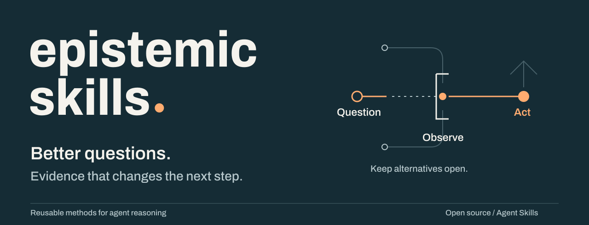
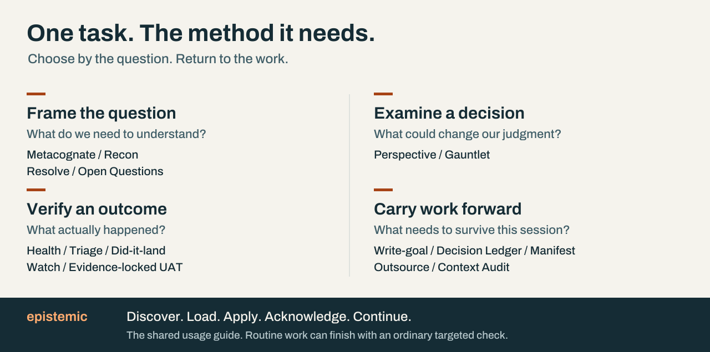

<picture>
  <source media="(max-width: 600px)" srcset="docs/assets/epistemic-cover-mobile.svg">
  
</picture>

# Epistemic Skills

Reusable methods for AI agents to examine assumptions, investigate failures,
evaluate decisions, and verify that work achieved its intended result.
*Epistemic* means concerned with what we know and how we know it.

The aim is practical: an agent should ask the question that matters, use evidence
that could change its answer, and carry the authorized work through to completion.
Each method defines when it helps, what useful result it returns, and when to stop.

**[Start here](#five-minute-start)** · **[Explore the methods](#choose-by-task)** · **[Read the handbook](https://github.com/ZMS-Labs/epistemic-skills/wiki)** · **[Understand the design](docs/handbook/pages/Design-Rationale.md)** · **[Contribute](CONTRIBUTING.md)**

[](https://github.com/ZMS-Labs/epistemic-skills/releases/latest)
[](https://github.com/ZMS-Labs/epistemic-skills/actions/workflows/epistemic-flexibility.yml)
[](LICENSE)

**Version 7.0.0.** The package contains **seventeen** skills: the `epistemic`
usage guide and **sixteen** disciplines. The [published release](https://github.com/ZMS-Labs/epistemic-skills/releases/tag/v7.0.0)
includes versioned source, generated bundles, and verification receipts.

## Routine work first

Fixing a typo does not need a review panel. A local, reversible, directly
checkable change can finish with an ordinary targeted check. Use a substantive
method when the task exposes a question that the ordinary check cannot settle.

| A familiar failure | The question a method brings into focus |
|---|---|
| An explanation sounds plausible, but the bug keeps returning. | What observation distinguishes this cause from the alternatives? |
| The configuration changed, but the application behaves the same. | Which artifact does the consumer actually load? |
| A design review produces agreement without testing assumptions. | What would change the decision—and who examined that possibility? |
| Work resumes with a confident but stale summary. | Which remembered facts still hold, and what evidence supports them? |
| Process consumes more effort than the task. | What is the smallest check that could change the next action? |

The methods are instructions and supporting tools. Their presence does not force
an agent to follow them correctly. [Evidence and limits](#trust-evidence-and-known-limits)
explain what the project has actually verified.

## See it in use

**Illustrative scenario: a service still uses an old setting after a change.**
This example explains the method; it is not a recorded performance result.

> **Request:** “Fix the setting and verify that the service is using it.”

| Moment | Useful work |
|---|---|
| Investigate | Triage, with applicable Systematic Debugging, compares the file you edited with the file the process loads. A startup trace identifies a different configuration path. |
| Repair | The agent corrects the supported cause within the original request's authority. Finding the cause is not the end of an authorized repair. |
| Verify | Did-it-land checks the consumer's behavior after reload. If persistence through a restart was requested, it checks that separately. |
| Explain | “I used Triage to identify the loaded configuration and Did-it-land to verify its effect. The service now reports the expected value after restart.” |

Only claim the observations actually made. If the runtime cannot be reached,
report that limitation and leave the landing claim unverified.

[Follow three worked examples →](docs/handbook/pages/Workflow-Recipes.md)

## Five-minute start

1. **Install one copy for your host.** Use the [installation guide](docs/INSTALLATION.md); avoid combining native and generic installs.
2. **Reload or start a fresh task.** Verify the tag's full skill count and the source your host actually loaded.
3. **Load `epistemic`, or invoke the method you need directly.** A substantive method does not require a separate setup ceremony.
4. **Give it a real task.** Ask for the outcome, provide the relevant context, and retain your normal control over scope and authority.

For a host without a native package surface:

```bash
npx skills add https://github.com/ZMS-Labs/epistemic-skills/tree/v7.0.0/plugins/epistemic-skills/skills
```

Example request after installation:

> Use Perspective to examine whether this migration plan has a rollback blind
> spot. Explain what, if anything, should change, then continue the review.

Invocation syntax varies by host. Use the actual skill mechanism your host
provides. The [start guide](docs/handbook/pages/Start-Here.md) explains explicit
loading, visible acknowledgment, and what to do when a capability is unavailable.

## Using Epistemic Skills

The shared usage guide establishes a simple practice:
**discover → load → apply → acknowledge → continue.**
It is not a scheduler or a substitute for the agent that owns the task.

Methods can cooperate without predefined pairs. Triage prefers available,
applicable Superpowers Systematic Debugging and has a standalone fallback.
Superpowers is an optional companion, not an installation dependency.

Metacognate examines reasoning; Perspective provides focused or adaptive scrutiny;
Gauntlet brings separate examinations together for plural adjudication. These
serve different needs. None is a mandatory stop on every task.

## Choose by task

<picture>
  <source media="(max-width: 600px)" srcset="docs/assets/method-map-mobile.svg">
  
</picture>

### Seventeen-skill catalog

| When you need to… | Method | What you should get |
|---|---|---|
| Learn how to use the collection | [Epistemic](plugins/epistemic-skills/skills/epistemic/SKILL.md) | Relevant method use, a brief acknowledgment, and continuation |
| Examine the reasoning or approach | [Metacognate](plugins/epistemic-skills/skills/metacognate/SKILL.md) | A supported correction, confirmation, or material uncertainty |
| Map unfamiliar or contradictory territory | [Recon](plugins/epistemic-skills/skills/recon/SKILL.md) | A clearer request, map of decisions, or external-project assessment |
| Settle a question with evidence | [Resolve](plugins/epistemic-skills/skills/resolve/SKILL.md) | A derivation, literature assessment, or bounded probe |
| Resolve decisions that require the user's judgment | [Open Questions](plugins/epistemic-skills/skills/open-questions/SKILL.md) | Answered or explicitly parked questions |
| Examine a focused concern or blind spot | [Perspective](plugins/epistemic-skills/skills/perspective/SKILL.md) | Useful insight, an improvement, a finding, or uncertainty |
| Adjudicate a consequential proposal through plural review | [Gauntlet](plugins/epistemic-skills/skills/gauntlet/SKILL.md) | A reasoned verdict with findings, dissent, and limits |
| Determine a running system's state | [Health](plugins/epistemic-skills/skills/health/SKILL.md) | Observed status, including what could not be checked |
| Establish the cause of a failure | [Triage](plugins/epistemic-skills/skills/triage/SKILL.md) | Causal evidence, followed by already-authorized repair and verification |
| Verify an intended effect at its consumer | [Did-it-land](plugins/epistemic-skills/skills/did-it-land/SKILL.md) | Observed effect and separately stated persistence coverage |
| Commission observation between sessions | [Watch](plugins/epistemic-skills/skills/watch/SKILL.md) | A tested external observer; the skill itself does not stay awake |
| Assess material interaction or outcome acceptance | [Evidence-locked UAT](plugins/epistemic-skills/skills/evidence-locked-uat/SKILL.md) | Expected and disconfirming observations, evidence, and an acceptance verdict |
| Author or start a persistent goal | [Write-goal](plugins/epistemic-skills/skills/write-goal/SKILL.md) | A completion contract adapted to the actual harness and user intent |
| Preserve a decision or re-anchor resumed work | [Decision Ledger](plugins/epistemic-skills/skills/decision-ledger/SKILL.md) | An adequate existing record, or the smallest missing durable record |
| Manage a mission with explicit custody | [Manifest](plugins/epistemic-skills/skills/manifest/SKILL.md) | Durable mission state under its opt-in custody contract |
| Hand work across a durable external boundary | [**outsource**](plugins/epistemic-skills/skills/outsource/SKILL.md) | A target-readable handoff or verified terminal return |
| Inspect conflicting or overloaded instructions | [Context Audit](plugins/epistemic-skills/skills/context-audit/SKILL.md) | A contextual diagnosis and proposed, scoped changes |

These summaries help you choose. Canonical `SKILL.md` files define the actual
triggers, boundaries, and procedures. The [handbook catalog](docs/handbook/pages/Skill-Catalog.md)
adds examples and comparisons for each method.

### The epistemic arc

Use the question in front of you to select a method; return its result to the
task. Several methods may cooperate, or an ordinary check may be sufficient.
The [map and boundary comparisons](docs/handbook/pages/How-the-Pieces-Fit.md)
explain the relationships without prescribing a fixed workflow.

## Why the design looks this way

| Design choice | Reason | Tradeoff |
|---|---|---|
| One canonical method tree | Host adapters share the same behavioral source. | Packaging parity still needs checks. |
| Positive triggers and stopping rules | Spend attention where it can change the action. | An agent still has to recognize and apply the trigger. |
| Focused scrutiny and plural review are separate | Match review effort to the question. | Users need clear guidance about which method fits. |
| Visible use, concise reporting | Let the user see what a method contributed. | Announcing a method alone proves nothing. |
| Deterministic checks plus explicit evidence limits | Test machine-checkable properties without inflating behavioral claims. | Important questions still need observed workflows or judgment. |
| Reuse existing decisions and records | Preserve continuity without duplicating adequate ADRs and task records. | Adequacy and freshness must be assessed. |

[Read the design rationale →](docs/handbook/pages/Design-Rationale.md)

## Installation and compatibility

The repository uses the [Agent Skills format](https://agentskills.io/specification)
with thin adapters for Claude Code, Codex, Cursor, Gemini CLI, Antigravity, Kimi,
ZCode, and generic hosts. ChatGPT/OpenAI bundles are generated snapshots.

**Choose your host in the [installation guide](docs/INSTALLATION.md).**
Use an immutable release, preserve customizations, reload, and verify the loaded
source. Host packaging, discovery, startup delivery, and actual method application
are different levels of evidence. The [host report](docs/release/v7-host-coverage.md)
states the observed scope for each surface.

## Architecture and source policy

```text
plugins/epistemic-skills/
├── skills/<name>/SKILL.md    canonical skill cores (seventeen)
├── reference/               shared methods and lens library
├── agents/                  Gauntlet role definitions
└── contracts/               schemas, validators, and runtime mechanics

docs/handbook/pages/         current explanatory handbook
docs/wiki-updates/           historical release handbook snapshots
docs/release/                versioned evidence and release records
packaging/                  generated host bundles
.github/                    checks and publication workflows
```

The released canonical source defines behavior. The current README and handbook
explain it; they can improve after a release without changing its immutable tag.
Examples labeled illustrative teach a method and are not experimental evidence.

For contributors, the [maintainer guide](docs/MAINTAINING.md) maps each kind of
change to its authoring location, generated surfaces, and relevant checks.

## Trust, evidence, and known limits

| Claim | Evidence and boundary |
|---|---|
| v7 was published from a checked source revision | [Publication receipt](https://github.com/ZMS-Labs/epistemic-skills/releases/download/v7.0.0/publication-receipt.json): exact commit, required jobs, tag, assets, and wiki identity |
| Required checks passed on the release candidate | [Hosted gate receipt](https://github.com/ZMS-Labs/epistemic-skills/releases/download/v7.0.0/exact-gates.json): deterministic, security, packaging, and CodeQL outcomes |
| The designated reviewer approved the disclosed scope | [Review receipt](https://github.com/ZMS-Labs/epistemic-skills/releases/download/v7.0.0/designated-review.json): shared implementation context, not independent or blinded |
| Host support has measured limits | [Coverage report](docs/release/v7-host-coverage.md): observed discovery and source checks are distinguished from unexercised model behavior |
| Comparative superiority is unproved | The [v6–v7 pilot](plugins/epistemic-skills/evals/epistemic-flexibility/behavioral/results/2026-09-18-v7/RESULTS.md) produced zero valid pairs. The earlier four-arm experiment found no arm separation. |

The known [macOS custody limitation](https://github.com/ZMS-Labs/epistemic-skills/issues/162)
remains: do not rely on distinct-filename or exclusion guarantees on case-insensitive
POSIX filesystems. The diagnostic failure is retained in the release evidence.

The [implementation packet](docs/release/v7-evidence.md) is a dated
pre-publication record. Its conditional judgment describes that earlier stage;
the final receipts above record publication. Historical adverse findings and
null results remain available in the [evidence guide](docs/handbook/pages/Testing-and-Evaluations.md).

## Developing and contributing

Start with [CONTRIBUTING.md](CONTRIBUTING.md) and the
[edit → check map](docs/MAINTAINING.md). Change the canonical source, run checks
suited to the claim, preserve historical evidence, and keep private local output
out of the public tree. Commits require an author-matching DCO sign-off.

```bash
# Discover and verify canonical skill metadata
python .github/scripts/sync_skill_surfaces.py --check

# Check the current handbook and public documentation
python docs/handbook/stage_wiki.py --check
python .github/scripts/check_public_content.py
```

These are entry checks, not the complete release gate. [CI coverage](docs/actions-tier.md)
and [RELEASING.md](RELEASING.md) describe the broader requirements.

## Explore further

- **Use:** [Worked examples](docs/handbook/pages/Workflow-Recipes.md) · [Skill catalog](docs/handbook/pages/Skill-Catalog.md) · [Troubleshooting](docs/handbook/pages/FAQ-and-Troubleshooting.md)
- **Understand:** [How the pieces fit](docs/handbook/pages/How-the-Pieces-Fit.md) · [Design rationale](docs/handbook/pages/Design-Rationale.md) · [Glossary](docs/handbook/pages/Glossary.md)
- **Maintain:** [Maintainer guide](docs/MAINTAINING.md) · [Documentation map](docs/README.md) · [Testing and evidence](docs/handbook/pages/Testing-and-Evaluations.md)

The separately versioned epistemic-calibration project concerns behavioral
measurement. Its [historical coordination charter](docs/coordination/epistemic-calibration.md)
is background context, not a dependency or a current claim about that project.

## License and support

[GPL-3.0-or-later](LICENSE). Bundled documentation typography retains its
[SIL Open Font License](docs/assets/fonts/OFL.txt).

[Releases](https://github.com/ZMS-Labs/epistemic-skills/releases) · [Issues and questions](https://github.com/ZMS-Labs/epistemic-skills/issues) · [Handbook](https://github.com/ZMS-Labs/epistemic-skills/wiki)
