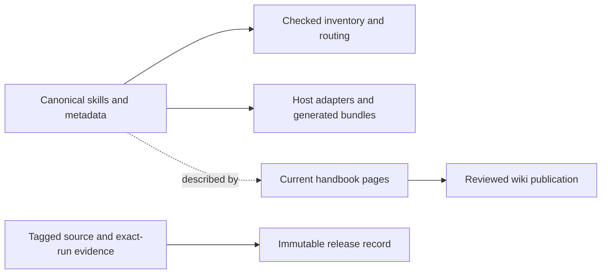

# Maintaining Epistemic Skills

A useful change should have an obvious home and a check that can catch the
mistake it is meant to prevent. This guide connects those two things. For
sign-offs and pull requests, start with [Contributing](../CONTRIBUTING.md).

## The source map

| Surface | Maintainer responsibility |
| --- | --- |
| `plugins/epistemic-skills/skills/` | Author method instructions, descriptions, examples, and per-skill metadata here. This is the canonical skill source. |
| `plugins/epistemic-skills/contracts/` | Keep schemas, validators, accepted examples, and rejection cases consistent. A schema change can affect existing consumers. |
| Host manifests, hooks, and `packaging/openai/` | Adapt delivery to a host without creating another implementation of a method. Verify that host's actual behavior before claiming support. |
| `docs/handbook/pages/` | Author current user guidance. Review it with source changes, then publish the committed pages to the separate wiki repository. |
| `docs/wiki-updates/v*/` and `docs/release/` | Preserve dated snapshots and evidence. A historical failure remains a failure even after a later fix passes. |

The generated event map, map schema, routing guide, and marked inventory blocks
come from canonical skill metadata. Use
[`sync_skill_surfaces.py`](../.github/scripts/sync_skill_surfaces.py) to regenerate
them and inspect its diff. The script checks additional manually maintained
surfaces too; `--write` is not a promise to repair every mismatch automatically.
OpenAI ZIPs are build output. Change their sources and rebuild rather than
editing an archive.

## Change map

Run commands from the repository root. The main Python workflows use Python
3.12. The table gives a focused starting point; the applicable workflow remains
the full check list for a pull request or release.

| If you change… | Edit or inspect… | Check the result with… |
| --- | --- | --- |
| An explanation, example, or navigation link | Current handbook pages and the corresponding README section | `python docs/handbook/stage_wiki.py --check`, then `git diff --check`; inspect the rendered page too |
| A method's trigger or instructions | Its canonical `SKILL.md`, references, and nearest `evals/` or `tests/` | The nearby test runner listed in `epistemic-flexibility.yml`; `python .github/scripts/check_description_budget.py` for description changes |
| Skill membership or event metadata | Canonical skill directories and frontmatter | `python .github/scripts/sync_skill_surfaces.py --write`, inspect the generated diff, then `--check`; run `check_skill_inventory.py` and `check_no_phantom_skills.py` from `.github/scripts/` |
| A machine-readable contract | The contract's schema, validator, examples, and tests | Its adjacent test runner and applicable contract workflow; `python .github/scripts/check_json_artifacts.py` checks JSON parsing, not contract semantics |
| A host adapter or hook | The relevant manifest or hook and its existing tests | Its focused tests plus an observed load or invocation in that host before widening a compatibility claim |
| OpenAI packaging | `packaging/openai/`, canonical package, or bundle builder | The three commands in the [packaging guide](CHATGPT-AND-OPENAI-PACKAGING.md#maintainer-checks) |
| Wiki staging or its verification | `docs/handbook/stage_wiki.py` and nearby tests | `python docs/handbook/test_stage_wiki.py` and `python docs/handbook/stage_wiki.py --check` |
| A workflow or verification script | The workflow, script, and its existing self-tests | Run the affected checks and review [CI coverage](actions-tier.md); preserve negative controls that demonstrate rejection |

Before sharing public documentation or examples, run
`python .github/scripts/check_public_content.py`. It catches configured personal
identifier and private-environment patterns; review the actual prose as well.
Synthetic examples should say they are illustrative and use public-safe values.

## Match the evidence to the claim

| Evidence you have | Claim it can support |
| --- | --- |
| A parser, fixture, or unit test passed | The tested rule behaved as expected on those inputs. |
| A host listed the installed skill | Discovery worked for that host, version, and installation. |
| An observed task applied the method | The method was used in that task; record the outcome and limits. |
| An exact-commit hosted check passed | That job checked that revision under its recorded environment. |
| The published tag, assets, wiki, and receipt agree | Those published surfaces correspond to the recorded source. |

One row does not establish the next. For example, valid hook JSON does not prove
that a host delivered it to the model. The [v7 coverage record](release/v7-host-coverage.md)
shows how to describe partial verification without implying more than was observed.
For an ordinary typo correction, a rendered review and link check are sufficient;
new model trials are not a routine documentation requirement.

## Publish handbook improvements

The wiki is a separate Git repository. A merged source change does not update it
automatically, and a wiki web edit does not update the reviewed source pages.

1. Edit `docs/handbook/pages/` and check the source with
   `python docs/handbook/stage_wiki.py --check`. Review the source PR normally.
2. After the documentation commit is on `origin/main`, prepare a clean clone of
   the correct wiki repository. Keep any pre-existing local wiki edits intact.
3. Use `python docs/handbook/stage_wiki.py --help` for the staging command.
   Supply `--wiki`, the full committed documentation SHA in `--docs-ref`, and
   the published release's exact source SHA in `--expected-release-sha`.
   `--apply` stages pages from those committed sources. It never commits or
   pushes them.
4. Review the staged wiki diff, commit it with a sign-off, and push. Run the
   `wiki-contract` live check and inspect the published pages before claiming
   publication is complete.

Documentation publication can clarify an existing release without moving its
tag or replacing its assets. A new package release follows
[RELEASING.md](../RELEASING.md), with its separate exact-candidate gates.

## Recover without losing the evidence

- **Generated content drifted:** inspect the canonical metadata first, regenerate
  the affected surfaces, and review the diff. Do not patch a generated copy to
  hide an upstream error.
- **A local check skipped work:** read the named skip and state the uncovered
  boundary. The [local CI guide](CI-LOCAL-FALLBACK.md) explains why exit zero can
  coexist with skipped checks.
- **The wiki differs from source:** preserve any edits, compare them with the
  committed handbook, and stage from the intended source revision. Do not use an
  unreviewed web edit as the new source of truth.
- **A released claim needs correction:** add a clearly dated correction or new
  evidence linked to the affected record. Preserve old outcomes; follow the
  release policy for changes to package contents or published assets.

For the completed v7 publication, the
[public receipt](https://github.com/ZMS-Labs/epistemic-skills/releases/download/v7.0.0/publication-receipt.json)
binds the source, checks, assets, and publication state. The earlier
[requirement packet](release/v7-evidence.md) remains a pre-publication record.

## Visual documentation quality

For new or changed visual headings, Mermaid diagrams, flowcharts, sequences, screenshots and charts, follow the [ZMS Labs documentation standard](https://github.com/ZMS-Labs/.github/blob/main/docs/documentation-standard.md#use-visuals-to-explain). Verify labels, arrows, grouping, order and status against authoritative source; distinguish concepts, plans, implementation and observed evidence. Preserve authentic captures and product-local visual identity. Inspect the intended rendering at desktop and narrow widths, supported light/dark themes, readable labels and a useful text equivalent. Keep exact diagrams editable; generated artwork must remain clearly illustrative. Record the source scope, actual semantic/render checks and remaining limits. Use one bounded review and affected rechecks; no independent-model gate is required, and adoption does not certify historical visuals.
