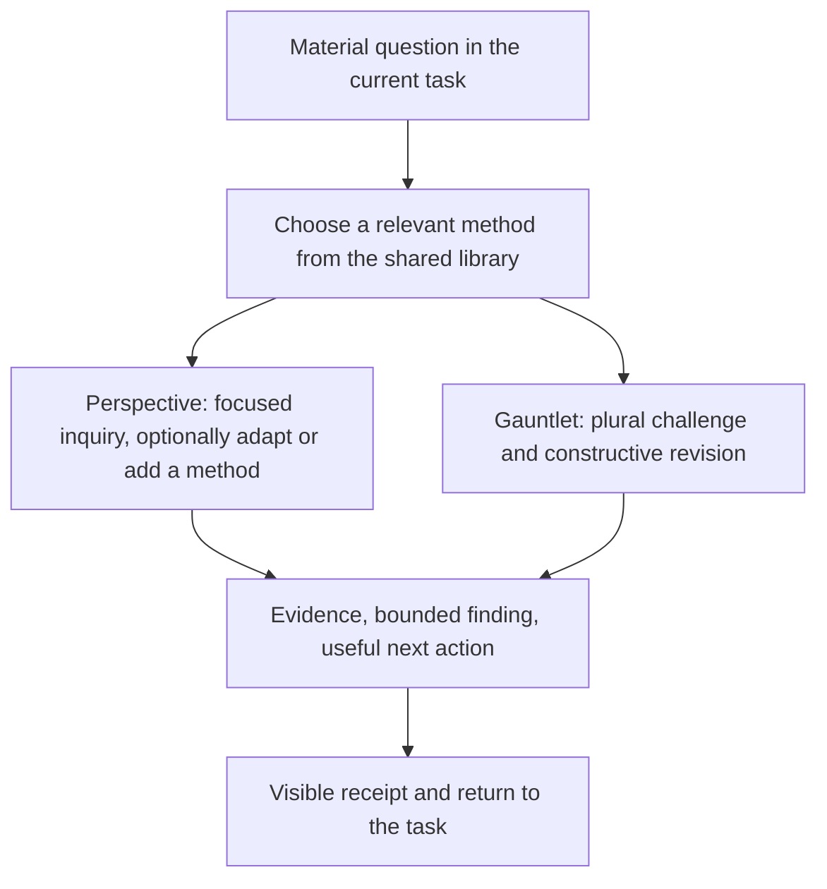

# Shared lens library assessment for v7

Date: 2026-09-18. Status: **accepted design direction; not implemented or behaviorally validated**.

Source baseline: commit `9705f70aec1285597a6ef2a341cede80010c1dcb`, registry v3.0.0. All 102 existing entries were inspected across three non-overlapping source-review slices. The library contains 96 available entries (86 evaluators, four generators, two gates, four adjudicators) and six retired identities. The 27 queued concepts were compared as incomplete proposals, not treated as available lenses.

Accepted dispositions: **15 retain, 68 refine, seven combine as modes, six relocate, six keep retired**. These classify the current IDs; they do not imply a final catalog count.

This continues the [v7 skill assessment](2026-09-18-v7-skill-assessment.md). The owner accepted a shared repertoire usable by Perspective and Gauntlet, with adaptation and bounded task-specific methods. The owner subsequently accepted the recommendations below, including their stated limits and deliberate deferrals. Acceptance establishes design direction; it does not establish behavioral benefit or authorize a claim that the registry has changed. No mandatory independent model-family review is introduced.

Implementation is tracked by R18 in the [consolidated v7 design](../superpowers/specs/2026-09-18-epistemic-skills-v7-design.md) and T3 in its [implementation plan](../superpowers/plans/2026-09-18-epistemic-skills-v7.md). The complete member inventory remains the per-ID source of accepted changes.

## Recommendation

Keep the breadth of useful scrutiny, refine the methods, combine a few genuinely overlapping mechanisms, and develop three clear gaps. Do not optimize for a predetermined lens count. A shared family is a navigation aid; it does not establish that two methods are interchangeable.

The most consequential current defect is **a card prescribing the conclusion it should investigate**. Other recurring defects are unsupported population claims, categorical exclusions, narrow checks treated as universal assurance, and character descriptions mistaken for expertise. An honest “no material finding” must be possible.

The [complete member inventory](2026-09-18-v7-lens-members.md) gives a disposition and concrete changes for every existing ID. Its [structured companion](2026-09-18-v7-lens-members.json) preserves source references, original assessor recommendations and reconciled decisions. These are source-derived design judgments; no behavioral equivalence or improvement has been demonstrated.

## A usable shape

The library should be discoverable by the question and evidence it works on. Illustrative families:

| Family | Questions it helps answer | Existing examples |
|---|---|---|
| Framing and assumptions | Are we answering the right question? What has been assumed? | premise-auditor, polymath-inquisitor, semantic-critic |
| Evidence and inference | What does this evidence establish? What could make the inference fail? | epistemic-auditor, causal-identification-auditor, statistical-validity-critic, data-provenance-auditor |
| Alternatives and decision value | What feasible choice is missing? What information could change the decision? | adjacent-possible-explorer, opposite-steelman, constraint-negotiator, value-of-information-auditor |
| Systems and consequences | What feedback, incentive, timing or irreversible consequence matters? | systemic-logician, game-theorist, second-order-forecaster, reversibility-analyst |
| Engineering and operation | Can this be built, operated, recovered, secured and changed under actual conditions? | effective-configuration-auditor, recovery-integrity-auditor, release-cutover-auditor, stride-security-modeler |
| People, obligations and harm | Whose needs, rights, participation, burdens and safety are at issue? | adoption-realist, human-automation-handoff-auditor, distributive-justice-auditor, safety-hazard-auditor |
| Execution and stewardship | Are prerequisites, responsibilities, scope and ongoing costs handled? | execution-dependency-auditor, requirements-traceability-auditor, scope-sentinel, tech-debt-curator |

These families overlap deliberately; they are not compulsory seats or seven mandatory checks.

Keep memorable aliases where useful, but show a plain method label. For example: “User failure paths (angry-customer)”, “Known exposure analysis (script-kiddie)”, and “External claims versus practice (predatory-regulator)”. The method must not inherit the character's assumed anger, incompetence, credentials or incentives.

## Changes to existing members

| Recommendation | Members or cluster | Reason and boundary |
|---|---|---|
| Retain separate methods | Causal identification, statistics, provenance, numerical reconciliation | Causal identification, inference uncertainty, transformation lineage and arithmetic are different failure mechanisms. One cannot certify the others. |
| Retain separate methods | common-cause-dependency-auditor and chaos-monkey | Static dependency closure and a bounded fault experiment differ. Reusing one finding does not create independent confirmation. |
| Retain separate methods | incident-command-auditor and on-call-realist | Coordination authority and information flow differ from one responder's recovery path. Share the timeline without collapsing the questions. |
| Refine, keep separate | lifecycle-impact-auditor and distributive-justice-auditor | Coverage across lifecycle stages differs from distribution across bearers. Current boundaries overlap; rewriting them is better supported than merging the methods now. |
| Combine as discoverable modes | cloud-native-purist + local-first-survivalist | Compare operating models, dependency exposure, control, cost and exit under the same question. Existing registry already treats them as a mutex pair. |
| Combine as discoverable modes | disgruntled-maintainer + state-sponsored-actor | One adversary-path method can vary initial access, capability, resources and persistence. Preserve these scenario differences. |
| Combine as discoverable modes | construct-validity-auditor + measurement-critic | Keep construct fit and gaming explicit inside a measurement family; the current definitions overlap. Selecting both must not conceal either mechanism. |
| Combine as discoverable mode | sunk-cost-liberator within cognitive-bias-auditor | A continuation check is useful; exclude unrecoverable expenditure from the decision while preserving current assets, learning, obligations and switching costs. |
| Relocate to generation | adjacent-possible-explorer | The current card produces a nearby alternative. That contribution does not itself evaluate the alternative. |
| Repair and relocate synthesis | dialectical-synthesizer | Its “never rules” boundary conflicts with its ruling output/instructions. Preserve constructive synthesis; remove contradictory ruling behavior. |
| Keep explicit workflow roles | pragmatic-judge, sovereign-ruler, governance-lawyer, red-lines-arbitrator; Bayesian mode | Adjudication, authorized values, process checks and categorical constraints remain useful. They are already excluded from evaluator diversity; no present selector error is alleged. |
| Keep retired identities retired | Six historical entries | Preserve coordinates, successors and historical meaning. Earlier mergers are not new v7 reductions. Share oracle-adequacy discipline with Perspective without automatically resurrecting a persona. |

“Combine” is a packaging recommendation, not proof of behavioral equivalence. Preserve the old lookup identity and the distinct mode trigger. If a combined method loses a useful question, keep that question separately selectable.

### Priority repairs that matter more than renaming

- **Epistemic and statistical cards:** replace “a source exists” or “the effect survived correction” as certification with the actual inferential claim and limits.
- **Bias and semantic cards:** test observable reasoning and wording; do not diagnose an author's psychology or intentions from a sentence.
- **Causal card:** randomization is valuable, but attrition, interference, noncompliance and transport remain possible problems.
- **Robustness and foresight:** state authorized decision criteria; do not impose minimax regret, demand three causal hops or equate non-dominance with robustness.
- **FMEA, safety and recovery:** a risk-score product, two nominal controls, one clean stress run or one successful restore cannot establish universal safety.
- **People and adoption:** replace stereotypes with population-specific evidence. Imagined reactions are hypotheses; mandatory users still have adoption and usability burdens.
- **Ethics and rights:** consent, compensation or policy consistency can matter without resolving every normative or legal question. Separate evidence, values and authorized acceptance.
- **Execution:** a requirement link is not verification, and a necessary implementation detail should not manufacture a new permission cycle.
- **Value of information:** correct the inverted falsifier; a test that discriminates supports, rather than defeats, the case for performing it.

## Three additions with a clear case

All three names already occur in the expansion queue. Develop their methods; do not call them available until their definitions exist.

| Queued method | Concrete contribution | Why existing methods are insufficient | Limits and useful output |
|---|---|---|---|
| **evidence-synthesis-auditor** | Trace a material conclusion across an evidence body: duplicated sources, selection, conflicting results, design quality and applicability. | Claim grading, within-study statistics and provenance each cover only part. Multiple citations may be one experiment or one source chain. | Use the existing dossier first. Invoke Resolve only for a material evidence gap. Output what the body licenses, where it conflicts and what remains uncertain; no invented pooled estimate. |
| **stakeholder-representation-auditor** | Identify whose perspective matters, whose input is actually present, who is missing, and where imagined reactions are being passed off as participation. | Adoption, behavior and justice cards address outcomes; they do not systematically establish whose testimony or authority grounds the claim. | Use available input and records. Missing voices remain a limit; the lens does not grant permission to contact anyone or simulate consent. |
| **hermetic-reproducibility-auditor** | Reconstruct a required artifact or behavior from declared inputs in a clean permitted environment; identify undeclared dependencies. | Configuration inspects what currently wins, provenance tracks lineage, and recovery restores state. None makes clean reconstruction its principal method. | Define exact or functional equivalence. A repeated result on the same machine is insufficient, and nondeterminism may preclude identical bytes. |

## Additional candidates and deliberate deferrals

| Candidate | Assessment |
|---|---|
| model-shift-auditor and forecast-calibration-auditor | Credible next candidates with distinct subquestions: does a model transfer, and do probabilities match outcomes over a defined horizon? Do not hide both inside generic statistics. No new empirical validation performed here. |
| simulation-credibility-auditor | Useful domain specialist when simulated results are load-bearing: conceptual assumptions, numerical implementation, uncertainty and external validation. Not a mandatory check for ordinary tasks. |
| morphological-option-space-generator | A plausible gap in systematic coverage of feasible mechanism combinations. Objective-driven generation has supporting research; that does not directly validate a particular morphological method. Compare a bounded mode of current generators before adding another entry. |
| scenario-signpost-designer | Likely a constructive mode linked to robust-decision, decision-ledger and watch: define observable reconsideration triggers. A prompt does not establish ongoing monitoring. |
| organizational-readiness, institutional-power, decommissioning-exit and specialized legal/physical/environmental candidates | Remain in the queue. Some may have distinct methods; this assessment does not establish every boundary or justify enabling them all. Their names are not finished methods. |
| Generic skeptic, critical thinker, generic red team, or new expert persona without a different procedure | No new member recommended. Stance and authority-sounding names do not create a new diagnostic contribution. |

A useful queue is allowed to stay incomplete. This is not a commitment to implement all 27 concepts.

## What the research changed

The [paper matrix and research record](2026-09-18-v7-lens-literature.md) contain 20 selected papers, live scite tallies, notice checks, contradictory findings and metadata repairs.

1. **Personas are not uniformly useless or uniformly helpful.** A broad factual-QA study found no average benefit from added roles; a later controlled persona study found useful intended effects alongside harm from irrelevant attributes. The justified recommendation is to specify the task method and remove irrelevant role baggage, then assess actual behavior. [P05](https://aclanthology.org/2024.findings-emnlp.888/), [P06](https://aclanthology.org/2025.emnlp-main.1364/)
2. **Difference in evidence matters more than a cast of characters.** Human dissent studies distinguish authentic dissent and distributed information from assigned advocacy. LLM debate studies also disagree about how much benefit comes from interaction rather than independent sampling. These findings support caution about counting labels; they do not prove a required model-family rule or a universally optimal panel size. [P01](https://doi.org/10.1002/ejsp.58), [P10](https://doi.org/10.1037/0022-3514.91.6.1080), [P07](https://proceedings.mlr.press/v235/du24e.html), [P08](https://arxiv.org/abs/2508.17536)
3. **A simulated stakeholder is not observed stakeholder evidence.** Human perspective-taking experiments and a feedback-based extension support grounding in actual information. This motivates a representation method while limiting claims from an invented customer, maintainer or affected person. [P03](https://doi.org/10.1037/pspa0000115), [P20](https://doi.org/10.1027/1864-9335/a000452)
4. **Plausible debiasing stories need boundaries.** The disagreeing-perspective estimation result has a later statistical critique. A feedback study improved trained tasks but detected no significant transfer, with a weak transfer measure. Retain concrete counter-tests; do not promise generalized debiasing. [P09](https://doi.org/10.1177/09567976211061321), [P19](https://doi.org/10.1177/09567976241245411), [P12](https://doi.org/10.1016/j.cedpsych.2020.101844)
5. **Method diversity is inspectable.** Different analysts can make different reasonable choices on the same data; specification analysis makes such variation explicit. Select a lens because it asks a distinct question or inspects a distinct failure mechanism, not because its personality sounds different. This final selection rule is a design inference. [P13](https://doi.org/10.1177/2515245917747646), [P14](https://doi.org/10.1038/s41562-020-0912-z)

## Shared contract and visible use

Every reusable method should state:

1. The material question and conditions that make it relevant.
2. Evidence to inspect and the procedure to apply.
3. Possible findings, including no material finding, and a useful constructive consequence.
4. What would revise the finding: observable counterevidence for empirical claims; explicit criteria and authority for value judgments.
5. Missing evidence, blind spots, stopping conditions and the return to the original task.

An illustrative receipt after actual use:

> Perspective · Evidence synthesis: three citations trace to the same experiment. I reduced the confidence claim and kept the unresolved disagreement visible.

This is an example of the proposed method, not a claim that the currently nonexistent card ran during this assessment. The skills actually used here were Brainstorming and Resolve's literature instrument.

## Verification and limits

- Complete 102-ID source inventory; current role/status kept distinct from proposed disposition.
- Twenty selected papers fetched in Consensus and DOI-resolved in scite; aliases deduplicated conceptually. Twenty-two library items (papers plus two notices) deposited and verified by DOI membership in a private scite collection.
- No indexed retraction or concern matched the queried paper coordinates. Two corrections were examined. One indexed paper lacks reception tallies; missing is not zero.
- This is a bounded, judgment-led deep scan, not a systematic review. Most papers are abstract-level; selected full-text results/limitations were inspected for three papers. The library has not been behaviorally validated.
- Source roles, evidence independence, factual accuracy, usefulness and user effort are separate questions. A scholarly rationale does not establish that a prompt works.
- No source registry, skill behavior, selector, release or installation was changed. Notes are local working-tree artifacts until committed and pushed; the private paper collection is the off-machine scholarly deposit.
