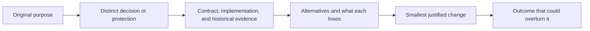

# V7 skill assessment: purpose, evidence, alternatives

Date: 2026-09-18. Source baseline: `9705f70aec1285597a6ef2a341cede80010c1dcb`.

Status: design assessment for discussion. No skill implementation, installation, release, or current runtime behavior is changed by this document. Recommendations below are bounded conclusions from the inspected sources, not claims that a redesigned suite has been validated.

Current implementation reference: the [consolidated v7 design](../superpowers/specs/2026-09-18-epistemic-skills-v7-design.md) and [implementation plan](../superpowers/plans/2026-09-18-epistemic-skills-v7.md) collect the latest accepted decisions, full coverage and remaining execution work. This assessment preserves the discussion history; superseded coordinator proposals are not current requirements.

The objective is useful metacognitive and epistemic intervention: recognize consequential uncertainty, use an appropriate method, avoid preventable mistakes, and complete the authorized task at proportionate cost. Skill count, report volume, invocation count, and schema compliance are incomplete proxies for that objective.

Two owner decisions govern this assessment: preserve and strengthen metacognate's metacognitive purpose and explicit invocation; remove the mandatory independent/cross-family release-review requirement, with the assigned reviewer responsible for this work. Historical review results remain historical facts. Distinguishing evidence collection from acceptance is still useful; a new reviewer or model family is not a universal prerequisite.

## How to read the assessment

Each of the fifteen skills receives its own analysis, including its original decision, the strongest reason to retain it, a concrete task pair, evidence of problems or limits, alternatives and losses, a bounded recommendation, and a condition that would change that recommendation. Related skills share discussion context but are not treated as interchangeable merely because they share vocabulary or artifacts.



Evidence is kept in four categories:

- **Current source fact:** wording, code, or schema present at the baseline. A contradiction can justify a repair without estimating how often agents encounter it.
- **Historical observed result:** a dated, scoped run. Directed skill loading, single trials, and simulated outputs do not establish natural activation or population performance.
- **Design inference:** a plausible consequence or improvement supported by reasoning; it remains a hypothesis until relevant behavior is observed.
- **Illustrative task:** a positive or negative example used to reason about boundaries. These examples were not executed as model trials in this assessment.

An unavailable live observation is not evidence that a skill is useless. Conversely, an attractive purpose or a passing artifact validator is not proof that the skill improves task outcomes. A real defect in one field does not, by itself, justify deleting its whole skill.

## Recommendation map

| Skill | Current recommendation | Strongest reason |
|---|---|---|
| [metacognate](#metacognate) | Keep and strengthen | Regulates reasoning and approach; dispatch is only part of that function. |
| [recon](#recon) | Retain three modes; refine report and return contracts | Framing, decision dependencies, and harvesting prevent different forms of premature commitment. |
| [resolve](#resolve) | Retain provisionally; refine instrument and evidence contracts | Distinguishes proof, scholarship, and experiment; no evidence yet supports undoing its consolidation. |
| [health](#health) | Retain; refine scope/depth reporting | Evaluates current state against declared bounds, including honest unknowns. |
| [triage](#triage) | Retain causal standards; compose with repair workflows | Diagnosis-only and diagnosis-with-repair have different authorization and completion boundaries. |
| [did-it-land](#did-it-land) | Retain; separate observed landing from future durability risk | A system can be healthy while a particular change failed to take effect. |
| [watch](#watch) | Retain; repair proof-state validation | Persistent detection and delivery need proof beyond a one-time health readout. |
| [write-goal](#write-goal) | Retain; reuse its approved contract downstream | Defines desired outcome and acceptable cost without silently creating goals. |
| [manifest](#manifest) | Retain custody; simplify interfaces and correct current documentation | Preserves authorization and progress through interruption; it has real runtime machinery. |
| [decision-ledger](#decision-ledger) | Retain; reconcile discovery with its existing modes | Decisions, outcomes, and re-anchoring differ from generic activity logs. |
| [outsource](#outsource) | Retain durable relay; align trigger and transport scope | Target-readable context and return custody are distinct from ordinary delegation. |
| [gauntlet](#gauntlet) | Preserve adversarial method; make assurance claims mode-specific | Challenging a decision and producing an elaborate panel record are different requirements. |
| [evidence-locked-uat](#evidence-locked-uat) | Retain existing tiers; align proof fields and judge | Observed user workflows cannot be replaced by persuasive review prose. |
| [open-questions](#open-questions) | Retain explicit interview and bounded-fork modes | Eliciting an owner's decision is different from discovering what needs deciding. |
| [context-audit](#context-audit) | Retain; distinguish local conflict response from full maintenance | Examines assembled instructions and loading effects that no individual skill controls. |

These recommendations do not establish that fifteen is the optimal permanent count. They explain why the currently inspected evidence does not support a broad deletion or merger, while identifying concrete repairs and narrower comparisons that could change that conclusion.

## Per-skill reasoning

## metacognate

Core: [SKILL.md](../../plugins/epistemic-skills/skills/metacognate/SKILL.md).

**Decision and origin.** This is the agent's intervention in its own approach: what must be true for the intended action or claim to be justified, which condition is unanswered, and what bounded response could change the action? The v5 design records the owner's proposed `metacognition-skills` name and says the objection was migration/boundary cost, not fit (design:35-49). It replaced an inventory router that drifted and Helix's fixed stage-pairing table with a question-driven intervention procedure (design:25-29, 88-116). Historical qualification: the mature Helix skill already specified pausing and resuming a workflow with a discipline's verdict, and required standalone epistemic outputs to feed a workflow consumer; interruption and return were therefore not wholly new in v5. The v5 routine-silence rule constrained cost, not intellectual purpose; the owner's v7 direction below requires visible acknowledgement of actual skill use.

**Strongest case for keeping it.** All individual skills can perform correctly while the overall approach remains wrong. An agent can produce valid tests for an irrelevant success proxy, research an uncertainty cheaply settled by an observation, or keep polishing a design whose premise has been disproved. No individual specialist necessarily owns recognizing that the approach itself should change. An explicit user invocation also has value: "metacognate" asks for this correction without requiring the user to diagnose which specialist is missing. Deleting the seat would need an equally discoverable home for both functions.

**What the sources establish.** The core already requires a bounded method and return to the interrupted work, and prohibits repeated reflection without new uncertainty (`SKILL.md:46-69`). Therefore "add continuation" is not a missing-method finding here. There is a real tension between the silent, artifact-free fast path (`:98-103`) and the intrinsic fired/declined run record (`:105-115`); distinguish an unloaded routine bypass from a loaded intervention that declines, and make telemetry storage/permission explicit. The categorical acceptance/iron language (`:29-42`) also needs reconciliation with the owner's current review authority; historical policy is not immutable permission. A separate loaded-description checker accepts arbitrary nonempty substrings (`.github/scripts/check_loaded_descriptions.py:88-99`), so its green result cannot establish an intact firing surface.

**Task pair and return.** Positive: a deployment pipeline is green, yet the user sees the old behavior. Recognize that pipeline success does not establish runtime delivery, choose a runtime observation, and return to the repair task with corrected knowledge. Negative: a local copy edit has an adequate preview and no material unresolved premise; finish without a metacognitive report. A correct intervention may validate the original approach rather than change it; aggregate benefit matters more than forcing visible changes in every case.

**Alternatives.** Keep unchanged preserves purpose but leaves ambiguous telemetry/authority and unknown activation quality. Moving only activation reminders into host instructions may improve reach but cannot replace the method. Splitting reflection from a central router recreates the two places that must agree; a static lookup cannot detect a novel mistaken premise. Retiring the seat merely for concision discards a user-facing capability without evidence of an equivalent replacement.

**Recommendation and reversal.** Keep and refine as agreed: preserve explicit invocation, self-correction, falsifying observations, proportionality, and return. Test recognition of unsupported reasoning separately from specialist dispatch and final task outcome. The older four-arm flexibility campaign found no superiority and substantial scorer/dispatch confounds; it predates this skill and neither validates nor refutes metacognate (`evals/epistemic-flexibility/behavioral/results/2026-08-04-four-arm/RESULTS.md`). Reconsider packaging only if a simpler alternative preserves explicit invocation and improves those outcomes without extra false interruptions. The original design's action-value falsifier remains relevant (design:276-279).

Sources: `docs/superpowers/specs/2026-08-06-epistemic-skills-v5-design.md`; `plugins/epistemic-skills/skills/metacognate/SKILL.md`; `plugins/epistemic-skills/skills/metacognate/reference/routine-fast-path.md`; the checker and historical campaign named above.

## recon

Core: [SKILL.md](../../plugins/epistemic-skills/skills/recon/SKILL.md).

**Decision and origin.** Recon establishes what problem can responsibly be committed to before effort multiplies. It already consolidates three formerly independent methods: brief reconnaissance, initiative wayfinding, and candidate harvesting (`SKILL.md:14-33,60-66`). They share an unstable map of the territory, but correct different failures: implementing a false premise; pre-slicing unresolved decisions into build tickets; and paying to adopt a system when a transferable idea was enough. This is different from metacognate recognizing a need for intervention or resolve answering an already-formed question.

**Strongest case for keeping it.** A perfectly executed implementation can solve the wrong problem. In initiative mode, a task backlog is not an adequate replacement for a decision-dependency map: "add multi-region writes" may silently assume an unresolved consistency policy. In candidate mode, neither an adopt/reject score nor generic research captures the option of retaining one contract pattern while rejecting the package. Merging recon into resolve risks treating those framing outputs as answers to a question that has not yet been properly formed.

**What the sources establish.** Bounded exploration and routine exclusions already exist; they are not v7 inventions. Brief mode nevertheless mandates 2-3 examples and 3-5 questions in its full report (`mode-brief.md:23-26,109-131`) even when one decisive contradiction resolves the ambiguity. Historical August 4 trials recorded 12/14 scorer passes: both failures were six questions instead of at most five, with correct conduct. Initiative mode recorded 11/13, including a real over-fire on an already-resolved plan; candidate mode recorded 14/14. These are directed, single-trial-per-fixture historical runs, not natural-discovery or current task-success rates. Candidate mode's undated claim of "no behavioural-battery evidence" (`mode-candidate.md:189-197`) is now stale relative to the committed post-consolidation campaign. Core hands the work downstream (`SKILL.md:52-58`), but the handoff wording does not itself ensure that a task-owning agent resumes authorized execution.

**Task pair and return.** Positive: "replace the queue with a faster one" assumes the queue causes latency, but the first code and trace reads reveal retries around a slow external service. Recon identifies that mismatch and returns a corrected target to the owner; it does not quietly substitute a new product goal. Negative: a fully resolved design needs ordinary task breakdown. Another useful case is an external package whose installation can be declined while one interface pattern is retained. Success is useful scoping and continuation, not the report's length.

**Alternatives.** Keep unchanged retains valuable methods and historically competent mode selection, but rigid report counts can penalize or manufacture irrelevant content. Split into three skills makes triggers more specific but consumes more discovery space; the inspected historical runs found no mode-selection failure, so the split currently lacks positive evidence. Fold into brainstorming loses the pre-design correction and candidate-harvesting role. Delegate repository search to tools while retaining judgment; a search tool cannot decide which hidden premise matters.

**Recommendation and reversal.** Retain one recon with three discoverable modes. Make content counts maxima/defaults rather than mandatory filler, and permit zero residual questions when the evidence resolves them. Explicitly return corrected scope to the current task owner; preserve the read-only method boundary instead of authorizing opportunistic fixes. Refresh historical status labels. Reconsider splitting only if natural task prompts repeatedly miss a particular mode, or a split improves outcomes enough to justify its discovery cost. Conversely, abandon the flexible-report proposal if shorter reports systematically omit decision-relevant constraints.

Sources: `plugins/epistemic-skills/skills/recon/SKILL.md`; `reference/mode-brief.md`, `reference/mode-initiative.md`, `reference/mode-candidate.md`; each mode's `evals/*-trigger-and-scope/results/2026-08-04-v4-tier1/RESULTS.md`.

## resolve

Core: [SKILL.md](../../plugins/epistemic-skills/skills/resolve/SKILL.md).

**Decision and origin.** Resolve already combines formal derivation, scholarly evidence research, and disposable prototyping (`SKILL.md:59-65`). Its distinctive decision is which instrument can answer a decision-relevant question at the lowest sufficient cost. The instruments have different proof obligations: an instantiated model and its assumptions; verified research with counterevidence and reception limits; or a controlled observation with a predeclared discriminator. They cannot safely be reduced to "research thoroughly."

**Strongest case for keeping it.** Neither ordinary debugging nor metacognitive reflection automatically distinguishes a theorem-governed claim from an empirical one. A local benchmark cannot prove all histories are serializable; a theorem cannot establish current deployment latency. The shared selection point can prevent misuse of an otherwise competently executed instrument. Separating all three again might improve discoverability, but it also removes that comparison and duplicates cross-method boundaries.

**What the sources establish.** The core says "cheapest sufficient" but presents theory, literature, then probe "in cost order" (`SKILL.md:19-56`); there is no universal cost order, and the later prose explicitly permits a cheap probe to beat theory. This is a contract ambiguity, not observed evidence that agents always choose wrongly. Literature requires every scholarly connector call, including a known-DOI fetch, to load the full method and inspect all three provider layers (`literature/METHOD.md:60-72`); its smallest mode starts at 3-5 papers (`:90-100`). That is a concrete proportionality mismatch for one-paper verification. It also calls a run session-ephemeral solely for missing library deposit even when a durable repository record exists (`:237-267`), conflating library holdings with persistence. Probe already allows read-only archival (`probe/METHOD.md:62-66`), so my earlier concern about mandatory destruction was overstated. Its deployment prohibition protects against accidental promotion and should not simply be removed.

**Task pair and return.** Positive: "Does this concurrency design prevent lost updates?" requires a precise model and a counterexample/history before a runtime probe can close environment-specific assumptions; the result returns to the design decision. A second positive is verifying whether a particular cited study supports a claim: inspect that paper and its relevant notices/reception without inventing a three-paper literature review. Negative: read a supplied configuration value or run an already-adequate regression check; ordinary work suffices. A debugging reproducer intended to become a regression test belongs to the development workflow, not automatically to disposable-prototype mode.

**Alternatives.** Keep unchanged preserves rigor but retains those specific ambiguities. Split the three instruments gains precise trigger names at increased discovery cost; the inspected August 4 directed trials reported no instrument-selection errors, so this is unproved. Replace the method with a vendor package would need equivalent applicability, counterevidence, and evidence-retention behavior, not a similar title. Delegate discovery/experimentation to available providers while retaining these proof obligations. Formal-rigor's focused tier already exists, while standard/high-assurance tiers deliberately cover broader claims; removing them by word count would discard a protection against overgeneralizing a short proof.

**Recommendation and reversal.** Retain the shared skill provisionally; clarify instrument choice by question type, adequacy, and expected cost rather than list position. Add a genuine bounded citation-verification path, separate durable artifact status from library deposit status, preserve prototype non-promotion while distinguishing evidence archives and regression tests. Treat provider-neutral research support as a capability-contract proposal requiring comparison, not proof that any search engine is equivalent. Literature's historical 14/14 and probe's 11/12 (one underspecified fixture) show useful behavior under directed loading, not natural activation. Formal-rigor's retained diagnostics contain both semantic failures and unavailable/invalid judging; they justify neither a blanket success nor a blanket rejection. Reverse the unified packaging recommendation if natural activation repeatedly misses an instrument; reverse lighter verification if it loses material corrections, contradictory evidence, or applicability checks.

Sources: `plugins/epistemic-skills/skills/resolve/SKILL.md`; `derivation/METHOD.md`, `literature/METHOD.md`, `probe/METHOD.md`; literature/probe `evals/trigger-and-scope/results/2026-08-04-v4-tier1/RESULTS.md`; `derivation/evals/formal-rigor-v2-fixtures/results/RESULTS.md` (historical, including the final post-hoc section).

## health

Core: [SKILL.md](../../plugins/epistemic-skills/skills/health/SKILL.md).

**Intended decision and origin.** Health asks whether a running subject meets declared bounds and whether the claimed coverage was actually observed. V5 deliberately generalized `fleet-health` to `health`: the original deployment context was incidental, while the epistemic problem was reporting unreachable subjects as healthy. Scope and depth absorbed several existing commands because they shared one decision. This is a coverage-and-state judgment, not a general investigation or monitoring service. [V5 design:25–26,162–177](../../docs/superpowers/specs/2026-08-06-epistemic-skills-v5-design.md#L25-L177); [core:21–39](../../plugins/epistemic-skills/skills/health/SKILL.md#L21-L39).

**Unique value and strongest counterexample to removal.** Consider a service migration whose dashboard shows two healthy replicas while the third cannot be reached. There is not yet an established service fault to diagnose, and nothing has changed that needs a landing verdict. The useful intervention is to stop treating partial visibility as whole-system health. A diagnosis-only replacement would have to acquire exactly this coverage judgment. A monitoring vendor can supply observations, but a green vendor panel cannot by itself prove that the intended subject set was covered. Conversely, health adds little when the requested fact is a single directly readable metric; its explicit decline preserves that distinction. [Core:52–58,71–100](../../plugins/epistemic-skills/skills/health/SKILL.md#L52-L100).

**Actual weakness versus hypothesis.** The contract leaves a concrete ambiguity: `scope=all` selects subjects, while default `depth=glance` probes only cheap/local subjects, yet the method says to probe each selected subject. It never specifies how selected-but-deliberately-unprobed subjects appear. This is an underspecified coverage contract, not a reproduced false-health report. Defining coverage explicitly would prevent “all” from silently meaning “all convenient observations.” The broader possibility that mandatory registry discovery deters useful ad hoc checks is only a design hypothesis. The fixed sentinel rejects two-OK/one-UNKNOWN summarized as OK; it does not exercise registry resolution or prove the production-path coverage demanded by the core. [Core:68–89,142–152](../../plugins/epistemic-skills/skills/health/SKILL.md#L68-L152); [sentinel:5–27](../../plugins/epistemic-skills/contracts/epistemic-events/sentinels/health-unknown-not-ok.json#L5-L27).

**Positive, negative, and return.** Before an authorized multi-service upgrade, obtain a bounded baseline, disclose inaccessible dependencies, and return to the upgrade at its explicit proceed/hold decision. Asking “what is the current queue length?” should produce the direct observation without a registry-wide health ceremony. A healthy result ends the interruption; it does not require diagnosis, watch commissioning, or a decision record automatically.

**Alternatives and recommendation.** Keep and refine coverage semantics. Combining health and triage under an incident entry could simplify discovery, provided a state-only result remains terminal and diagnosis remains conditional; otherwise the merge manufactures investigations. Delegating probes to an existing provider is sensible, while retiring the judgment loses coverage accounting unless that provider demonstrably preserves it. Confidence is moderate about the distinct decision, low about comparative benefit. I would reverse the standalone recommendation if representative tasks showed an existing status capability consistently preserving declared scope, unknowns, bounds, and return to work with fewer errors and less effort.

## triage

Core: [SKILL.md](../../plugins/epistemic-skills/skills/triage/SKILL.md).

**Intended decision and origin.** Triage asks which cause an observation distinguishes from alternatives. Its v5 introduction explicitly separated health’s “what state?” from “why?”, responding to plausible explanations accepted without observations and to an unreliable readout. Four verdicts preserve different knowledge states: CAUSE, NARROWED, UNKNOWN, and NOT-BROKEN. It also preserves whether evidence was inherited or newly probed, avoiding both duplicated investigation and false provenance. [V5 design:162–163](../../docs/superpowers/specs/2026-08-06-epistemic-skills-v5-design.md#L162-L163); [core:25–37,60–74](../../plugins/epistemic-skills/skills/triage/SKILL.md#L25-L74); [introduction commit](https://github.com/ZMS-Labs/epistemic-skills/commit/25a9845c701e212640ad66a2bc8b6f7e327b9057).

**Unique value and counterexample.** An operator asks why a scheduled report missed delivery and explicitly wants diagnosis before any changes. Evidence might distinguish a producer failure, queue delay, delivery rejection, or a lying dashboard. A software implementation workflow is not necessarily the right owner of that diagnosis-only decision. Triage can stop honestly at NARROWED and hand over the missing discriminator, rather than manufacture a fix. This provider-neutral causal standard remains useful even when another procedure conducts the investigation.

**Actual defect versus hypothesis.** The verdict table requires an observed elimination for NARROWED and assigns UNKNOWN when no candidates can be eliminated. The boundary then says “Probably X” is NARROWED with X listed. A plausible but untested hypothesis therefore receives a stronger verdict than the table permits. Repair the contradiction: probability language alone is insufficient; preserve UNKNOWN until an observation eliminates something. The package-wide claim that nothing applies fixes is also broader than triage's own responsibility: current manifest records authorized durable writes. Those writes alone do not prove repair execution. Scope this boundary to triage itself instead of making a claim about every package member. [Manifest:63–68](../../plugins/epistemic-skills/skills/manifest/SKILL.md#L63-L68). [Core:29–31,64–70,80–81](../../plugins/epistemic-skills/skills/triage/SKILL.md#L29-L81).

**Positive, negative, and return.** For an intermittent deployment failure, reuse the captured failure, state alternatives, make the cheapest useful differentiating observation, then return the result and remaining uncertainty to the authorized repair task. An explicit missing-file error with an already-established cause should not initiate a second causal investigation. “Never repairs” scopes this discipline; it should not erase repair authority already granted to the surrounding task or force a new permission ritual. [Core:51–56,74–94](../../plugins/epistemic-skills/skills/triage/SKILL.md#L51-L94).

**Alternatives and recommendation.** Retain the causal judgment and refine its verdict consistency and return contract; allow an optional debugging provider to own software procedure. The inspected Superpowers 6.3.0 `systematic-debugging/SKILL.md` includes investigation, hypothesis testing, implementation, and verification (lines 48–189), with a broader trigger even for simple technical issues (3,24–42). That makes it a plausible procedure provider, not demonstrated evidence of superior performance or a mandatory dependency. Running its investigation and then repeating triage from scratch would be waste. A combined health/triage interface can work if their distinct verdicts remain visible. Retirement would lose explicit partial-knowledge verdicts and diagnosis-only scope unless those transfer intact. The existing sentinel checks a canned unsupported CAUSE; it does not establish activation or comparative efficacy. I would reverse standalone retention if a provider-neutral shared cause contract produced equally calibrated incident outcomes, preserved evidence reuse, and reliably resumed authorized repairs with less process.

## did-it-land

Core: [SKILL.md](../../plugins/epistemic-skills/skills/did-it-land/SKILL.md).

**Intended decision and origin.** Did-it-land asks whether the intended change actually affects the consumer that matters and remains effective through a relevant overwrite interval. Its introduction addressed a specific reasoning error: checking an edited source artifact while the runtime loaded a different copy. V5 recorded this as committed-versus-deployed rather than a mere packaging issue. The distinctive move is to identify what actually loads, select an observation that would differ without the change, and inspect persistence under the relevant owner. [V5 design:33,165–170](../../docs/superpowers/specs/2026-08-06-epistemic-skills-v5-design.md#L33-L170); [core:54–72](../../plugins/epistemic-skills/skills/did-it-land/SKILL.md#L54-L72); [introduction commit](https://github.com/ZMS-Labs/epistemic-skills/commit/3b23861e0562ee886ecfcffd87b5588a237e0900).

**Unique value and counterexample.** A service can be perfectly healthy while still using the old configuration. Source tests and a successful deployment command can both be green while the intended behavior remains absent. Health cannot settle this change-specific counterfactual merely by reporting present bounds; triage may never start because no component appears broken. A generic completion procedure can replace did-it-land only if it carries the consumer identity, relevant observable, coverage, and overwrite-window questions, rather than treating any successful check as sufficient.

**Actual defect versus hypothesis.** REVERTED is defined as an observed landing followed by reversal. Method step four nevertheless calls a still-present change “REVERTED on a timer” whenever its owner was not updated. That promotes predicted reversal to an event already observed; an owner might be paused, scoped differently, or never reconcile again. The same core later correctly requires UNVERIFIED when the interval is unknown. Preserve the risk finding without claiming reversal: report present effect separately from unverified persistence, and reserve REVERTED for an observed undo. This is a textual contract contradiction, not a demonstrated model mistake. [Core:25–29,65–72,102–105](../../plugins/epistemic-skills/skills/did-it-land/SKILL.md#L25-L105).

**Positive, negative, and return.** After an authorized feature configuration rollout, resolve the artifact actually consumed, exercise the distinguishing behavior at the intended scope, and recheck after the known reconciliation interval. Return to the rollout’s dependent task with LANDED or an explicit coverage/persistence limitation. A local spelling correction immediately visible in its rendered output should be checked directly, without inventing a runtime deployment or waiting period. The core already declines local reversible changes observable in the same act. If verification finds a miss, return it to the existing repair workflow rather than silently repairing inside the assessor or abandoning the larger request. [Core:39–50,76–83](../../plugins/epistemic-skills/skills/did-it-land/SKILL.md#L39-L83).

**Alternatives and recommendation.** Retain and refine the verdicts and explicit return. Combining with health could share observation tooling but must preserve “desired change is effective” separately from “current system meets bounds.” Delegating observation to deployment tooling is appropriate; delegating judgment is safe only when its evidence answers the actual dependency. The sentinel proves rejection of a fixed source-read-as-LANDED response, not detection of stale replicas, reverted changes, or incorrect runtime identity. I would reverse standalone retention if the normal completion provider consistently caught those failures and reported incomplete scope without extra prompting, while preserving the lightweight negative case. Current evidence supports a distinct need, not measured superiority of this packaging.

## watch

Core: [SKILL.md](../../plugins/epistemic-skills/skills/watch/SKILL.md).

**Intended decision and origin.** Watch has already undergone a substantive conceptual correction. V5 described a skill acting unattended; the successor commission-watch design separated the prompt-time discipline, durable commission, and persistent external observer. Only the last watches. The current decision is whether an actionable between-session condition has a real observer whose complete detection-and-delivery path was deliberately proved. Configuration, a test message, and silence do not establish that. This genealogy argues for preserving the corrected purpose, not reviving the original category error. [Successor design:58–82,111–118](../../docs/superpowers/specs/2026-08-07-practical-agency-and-commission-watch-design.md#L58-L118); [core:173–229](../../plugins/epistemic-skills/skills/watch/SKILL.md#L173-L229).

**Unique value and counterexample.** A healthy data pipeline now says nothing about whether anyone will learn of tomorrow’s failed export in time to act. Health and did-it-land can both succeed while the alert path is broken. A scheduler may establish persistence without establishing detection or delivery. Watch’s complete-path proof, current enabled state, disable control, and proof expiry address that separate future reliance. Removing the discipline while retaining only “create a scheduled task” would lose precisely the assurance the original error obscured.

**Actual implementation defect.** The skill requires proof history to be wholly absent or complete. The verifier enforces that for INERT, but its SUSPECT branch checks only external identity and a receipted failure. An in-memory reproduction using the published valid SUSPECT example confirmed that changing `proof.bound_crossed` to false still returns zero errors, despite the proof being neither absent nor complete. Removing `reprove_after` from its otherwise complete history also returns zero errors. This does not promote SUSPECT to PROVEN; it permits invalid historical evidence to survive inside an otherwise accepted record. Extend the invariant across applicable states. [Core:218–222,249–259,327](../../plugins/epistemic-skills/skills/watch/SKILL.md#L218-L327); [verifier:636–647,711–736](../../plugins/epistemic-skills/contracts/watch-commission/verify_watch_commission.py#L636-L736).

**Positive, negative, and return.** For a nightly export whose late discovery blocks business work, identify a recipient and action, commission an available external mechanism under existing authority, exercise a reversible safe crossing through its real alert path, and retain the resulting commission. Then resume the export project; the agent need not remain awake. A one-off lint run whose result the developer is already watching should not acquire an observer or proof ceremony. Missing substrate or safe proof should produce a bounded BLOCKED result that returns to the original task, not a new infrastructure project. [Core:162–175,187–214](../../plugins/epistemic-skills/skills/watch/SKILL.md#L162-L214).

**Alternatives and recommendation.** Retain the commissioning judgment, repair proof-history validation, and let optional providers own persistent operation. Combining it with mission control can improve custody, but custody must not self-certify observation. Retirement is reasonable only when an existing monitoring provider supplies and preserves equivalent actionable-path proof and lifecycle evidence. The contract has richer deterministic coverage than the other three skills, yet explicitly does not authenticate receipts or establish present freshness; those remain consumer checks. Neither its historical review nor unit controls demonstrate field benefit. I would reverse standalone retention if an available provider reliably delivered those guarantees with lower operational burden. [Contract limits:19–45](../../plugins/epistemic-skills/contracts/watch-commission/README.md#L19-L45).

## write-goal

Core: [SKILL.md](../../plugins/epistemic-skills/skills/write-goal/SKILL.md).

**Decision and genealogy.** This skill decides what outcome, proof, scope, and stop conditions a persistent objective should carry, and whether authoring may become activation. It adapts Kimi's goal-authoring method, then adds learning-first classification, proxy resistance, and evidence provenance ([core:15–41](../../plugins/epistemic-skills/skills/write-goal/SKILL.md#L15); [basis:53–64](../../plugins/epistemic-skills/skills/write-goal/reference/evidence-basis.md#L53)). Draft/start separation is intentional, not accidental ceremony: an authored objective can authorize weeks of repeated execution and introduce an inferred metric the user never chose.

**Unique value; counterexample to consolidation.** “Define what would count as a successful database migration; do not execute it” needs an objective with anti-proxy evidence, but neither a mission's file-receipt chain nor an acceptor. Conversely, resuming an already specified migration requires custody without rewriting its goal. Merging `write-goal` into `manifest` would conflate choosing the finish line with maintaining evidence while pursuing it. Sharing a completion-contract representation is useful; forcing either skill to invoke the other is not.

**Observed defect versus hypothesis.** The discovery description also says to fire when someone “needs” a durable objective, whereas the normative trigger says *only* explicit authoring/creation intent ([core:3](../../plugins/epistemic-skills/skills/write-goal/SKILL.md#L3), [35–37](../../plugins/epistemic-skills/skills/write-goal/SKILL.md#L35)). That is a textual activation ambiguity. Reapproval whenever *any* field is inferred is explicit policy ([162–165](../../plugins/epistemic-skills/skills/write-goal/SKILL.md#L162)); unnecessary interruption is a hypothesis, not a newly discovered implementation bug. The existing experiment deliberately rewards drafting rather than starting under inferred fields: 14/14 simulated fixtures passed, but only one model/harness and no quality-of-goal claim ([results:35–58](../../plugins/epistemic-skills/skills/write-goal/evals/trigger-and-scope/results/2026-08-04/RESULTS.md#L35)). Changing this rule requires changing the intended contract, not “fixing” obedient behavior.

**Positive and adjacent negative.** For “create and start a goal to eliminate the reproduced regression,” retain the explicit success condition, derive ordinary in-scope verification, inspect existing goal state, and ask only if a material target or risk choice remains. After activation, return control to the authorized executor; authoring is not task completion. For “fix this reproduced regression,” do the work with a bounded finish condition; do not create a persistent goal or require a goal-writing ceremony.

**Alternatives and bounded recommendation.** Keep/refine preserves explicit authoring and opt-in budgets. Combining loses draft-only usefulness; delegating creation to native goal tools preserves runtime semantics but those tools do not supply anti-proxy reasoning. Retiring the skill loses a reusable definition-of-done interface. Recommend aligning discovery with explicit intent, naming the draft-versus-start decision, and sharing already-approved contract fields by reference. Let explicit creation authority cover conservative implementation details, while material inferred success criteria still need resolution. Preserve host capability discovery rather than relying on categorical product claims ([187–193](../../plugins/epistemic-skills/skills/write-goal/SKILL.md#L187)). Reverse this relaxation if observed tasks repeatedly start materially different goals without users understanding the substituted proof or scope.

## manifest

Core: [SKILL.md](../../plugins/epistemic-skills/skills/manifest/SKILL.md).

**Decision and genealogy.** `manifest` decides whether consequential work has durable authority, recoverable progress, and an acceptable close. Its August 11 design folded earlier mission-control work into executable contracts; it deliberately prohibited a second router and self-certification ([design:8–24](../../docs/superpowers/specs/2026-08-11-mission-custody-contracts-design.md#L8), [65–71](../../docs/superpowers/specs/2026-08-11-mission-custody-contracts-design.md#L65)). These boundaries prevent the custodian from selecting every method and then certifying its own work. They are not a mandate for cross-family review of every repository release.

**Unique value; counterexample to removal.** During a multi-session migration, an intervening edit can invalidate an earlier artifact without changing the remembered plan. Custody binds effects to hashes, records the frontier, and reopens work when evidence drifts. A goal objective, checklist, or narrative ledger cannot provide the same mechanical continuity. The runtime enforces case-insensitive worker/acceptor separation and the declared acceptance tier ([verifier:770–779](../../plugins/epistemic-skills/contracts/mission-custody/verify_mission_custody.py#L770)); existing tests cover rejected self-certification and FAIL → remediation → completion ([tests:2884–2957](../../plugins/epistemic-skills/contracts/mission-custody/test_custody_mission.py#L2884)). These are code/test properties inspected here, not freshly exercised workflows.

**Observed defect versus hypothesis.** Current contract documentation says a second active mission disarms the gate ([README:31](../../plugins/epistemic-skills/contracts/mission-custody/README.md#L31)), but current code assembles every active mission's guard union and degrades unreadable members individually ([gate:267–294](../../plugins/epistemic-skills/contracts/mission-custody/custody_gate.py#L267)); a dedicated multi-mission test exists at `test_custody_gate.py:427`. This is definite source/code disagreement. Separately, the skill requires whole-envelope confirmation ([core:28–35](../../plugins/epistemic-skills/skills/manifest/SKILL.md#L28)), then leaves blockers to a surrounding stack without specifying who resumes execution ([106–110](../../plugins/epistemic-skills/skills/manifest/SKILL.md#L106)). Repeated approval and abandoned continuation are plausible composition failures, not established rates. Runtime `approve()` changes draft to active; it does not authenticate human consent ([mission:2349–2356](../../plugins/epistemic-skills/contracts/mission-custody/custody_mission.py#L2349)). Removing the method's authority discipline would therefore remove a real control layer.

**Positive and adjacent negative.** For the migration, map an existing approved contract into the envelope, confirm only material unresolved boundaries, receipt the durable effects, resume against those receipts, and send a bounded acceptance request through an available authorized role. A failed review returns to the recorded remediation frontier. For a reversible single-file repair verified immediately, decline custody silently and continue the repair; consequence alone should not create a mission.

**Alternatives and bounded recommendation.** Keep/refine retains actual integrity controls. Combining with `write-goal` adds unnecessary goal authoring to resumed work; combining with the ledger confuses effect integrity with judgment history. An external custody service is viable only with equivalent receipts, recovery, and acceptance semantics; retirement loses these guarantees. Recommend fixing stale enforcement documentation and defining contract reuse plus an explicit caller/return contract. Preserve no-routing and legitimate role separation; discover the acceptance path before adopting a mission whose close depends on it. Do not manufacture a new actor identity to bypass separation. Reverse preference for the current CLI if representative interrupted missions show negligible avoided errors but substantial receipt-maintenance cost, or a simpler host mechanism demonstrates equivalent recovery and honest acceptance.

## decision-ledger

Core: [SKILL.md](../../plugins/epistemic-skills/skills/decision-ledger/SKILL.md).

**Decision and genealogy.** The original July 22 design filled a persistence gap: later sessions could not distinguish prior decisions, assumptions, and corrections from established facts ([design:17–44](../../docs/superpowers/specs/2026-07-22-decision-ledger-design.md#L17)). Commit `ab8af4d` intentionally replaced “default when unsure: log” with artifact reuse. Commit `5df6597` subsequently absorbed `continuity-verify` as a resume mode. These were different changes: reducing duplicate storage and combining persistence with retrieval do not establish that every future decision belongs inside a custody mission.

**Unique value; counterexample to removal.** A compatibility-policy choice outlives the task that implemented it. A future maintainer needs its rationale, superseded predecessor, and revisit condition even when no mission is active. A mission receipt proves which bytes were written; it does not capture why an assumption should be reconsidered. Conversely, a simple handoff can require rechecking branch state without opening a mission or adding a decision entry. Moving all resume behavior into `manifest` would turn a lightweight read into custody enrollment.

**Substantive purpose versus storage.** Decision-ledger preserves the epistemic status and revisability of decisions, assumptions, and corrections across sessions; reducing it to a decision-document format understates its role. Its outcome-arrival trigger preserves the original prediction and observed result separately, and its recurrent-correction contract records the failure chain, earliest intervention, replacement behavior, and rehearsal. Generalized lessons require operator approval before becoming standing guidance. An ADR can supply a durable home when it meets the relevant consumer contract; its existence alone does not establish those behaviors or the ledger store's mechanical checks. In the proposed v7 refinement, adequacy should be judged for the particular persistence, outcome-review, correction, or resume need. Reusing a sufficient record must not silently disable the later learning and re-anchoring obligations. [Core:61-81,140-146,196-240](../../plugins/epistemic-skills/skills/decision-ledger/SKILL.md#L61).

**Observed defect versus hypothesis.** The description excludes consuming the ledger, while the body explicitly requires a read/resume mode before resumed work ([core:3](../../plugins/epistemic-skills/skills/decision-ledger/SKILL.md#L3), [72–83](../../plugins/epistemic-skills/skills/decision-ledger/SKILL.md#L72)). The consolidation commit added the latter without removing the former: a definite discoverability contradiction. Existing resume results cannot resolve it because skilled agents were expressly given both complete files. Their three runs caught all eight traps with no control false flags, while baseline also caught every trap and passed two of three runs ([results:12–45](../../plugins/epistemic-skills/skills/decision-ledger/evals/resume-fixtures/results/RESULTS-2026-08-04-v4.md#L12)). This supports bounded smoke conformance, not automatic activation or superiority in ordinary work.

**Positive and adjacent negative.** When a public compatibility decision has no durable rationale, record it in the repository's adopted decision home, with evidence and a revisit condition; then continue implementation. If an adequate ADR already carries those facts, reuse its precise coordinate and continue without a parallel ledger. Renaming a loop variable creates no entry. On interruption, re-anchor only facts the next action depends on, return the verified digest to that action, and seek authority only where an actually missing grant matters—not because a previous valid grant crossed a skill boundary.

**Alternatives and bounded recommendation.** Keep/refine is preferable now: expose explicit `persist` and `resume` triggers and remove retired routing terminology. Combining the entire skill with custody loses applicability outside missions; delegating storage to ADRs or a configured memory service is already legitimate, but retrieval and revisit checks must remain. Artifact reuse is not a license to lose assurance: adequacy still requires statement, provenance, relevant revision, and reopening condition ([core:45–57](../../plugins/epistemic-skills/skills/decision-ledger/SKILL.md#L45)). JSONL stores additionally receive duplicate-ID, cycle, dangling-reference, and unique-head validation ([validator:141–215](../../plugins/epistemic-skills/skills/decision-ledger/reference/validate_examples.py#L141)); ordinary ADR reuse must not claim those checks. Recommend repairing discovery and qualifying the existing artifact before reuse, improving that artifact when appropriate. Reverse the combined-mode choice if unbiased description-only trials still miss resumption after this repair; a separate lightweight resume entry would then have evidence-based justification.

## outsource

Core: [SKILL.md](../../plugins/epistemic-skills/skills/outsource/SKILL.md).

**Decision and genealogy.** `outsource` decides whether an external recipient has a complete, target-readable workload and whether returned claims support continuation. It was introduced as a *repo-backed* skill in `c948ba6`; `bc47138` repaired the impossibility of committing a packet containing its own commit hash. The GitHub pointer, canonical relay template, and immutable packet reference are deliberate, integration-tested choices ([core:136–149](../../plugins/epistemic-skills/skills/outsource/SKILL.md#L136); [tests:167–205](../../plugins/epistemic-skills/skills/outsource/tests/run_tests.py#L167)). GitHub is serving reproducibility, asynchronous access, and context survival, not merely branding.

**Unique value; counterexample to removal.** An external reviewer returning days later must review the same design revision, recover omitted constraints, and leave attributable responses even if the originating conversation disappears. Native same-session dispatch cannot guarantee that. The context-erasure test and immutable context map provide something stronger than a copied prompt, and origin-side verification prevents a confident target response becoming an unsupported completion claim ([core:54–72](../../plugins/epistemic-skills/skills/outsource/SKILL.md#L54), [158–185](../../plugins/epistemic-skills/skills/outsource/SKILL.md#L158)). Combining this with generic delegation would either impose publication on cheap collaboration or weaken the durable case.

**Observed defect versus hypothesis.** The relay procedure always instructs creation and publication of a next outbound request, although the response vocabulary includes `COMPLETE`; no terminal branch distinguishes verified completion from another exchange ([core:158–181](../../plugins/epistemic-skills/skills/outsource/SKILL.md#L158)). This is a definite procedural omission; an actual infinite relay has not been observed. Historical tests also exposed two reporting-vocabulary failures: 12/14 fixtures passed, both failed agents reached correct capability conclusions, but required identifier spellings lived outside their visible instructions ([results:36–54](../../plugins/epistemic-skills/skills/outsource/evals/trigger-and-scope/results/2026-08-04/RESULTS.md#L36)). No real packet publication or relay verification occurred in that simulation ([68–72](../../plugins/epistemic-skills/skills/outsource/evals/trigger-and-scope/results/2026-08-04/RESULTS.md#L68)). A broad “ask another model” trigger creating unnecessary publication is a design risk, not established by those results.

**Positive and adjacent negative.** For a separately hosted implementation agent with confirmed repository/test access, publish the authorized packet, send its exact reference, capture the return, verify the claimed commits and tests, then resume the origin's merge or delivery task. Once all requirements are verified, close the relay without inventing a next prompt. For a colleague subagent's one-minute question in the shared workspace, use ordinary dispatch, receive the answer, and continue; the current skill explicitly excludes that case.

**Alternatives and bounded recommendation.** Keep/refine protects the strong durable workflow. A generic delegation merger loses either proportionality or immutable context. External transport delegation can replace GitHub only when target accessibility, immutable identity, complete context, and relay retention are equivalent; an arbitrary document link is insufficient. Retirement loses the context-erasure contract. Recommend adding terminal COMPLETE/PARTIAL/BLOCKED return behavior, narrowing the discovery promise to durable external handoffs, and separating semantic capability sufficiency from evaluator identifier spelling. Do not silently add another hosting backend. Reconsider a transport-neutral mode when repeated authorized external tasks demonstrably have an equivalent non-GitHub artifact channel, or when GitHub publication is the only obstacle despite all durability guarantees already being met.

## gauntlet

Core: [SKILL.md](../../plugins/epistemic-skills/skills/gauntlet/SKILL.md).

**Intended decision and genealogy.** Gauntlet asks whether a consequential proposal survives credible, testable opposition. It combines the former deep-review commands with DeepReason's conjecture/refutation discipline. The isolated lens architecture arose from a run where one lens refuted a hypothesis another had independently endorsed; isolation protects disagreement before synthesis. Its distinctive output is a reasoned disposition of conflicting findings, rather than a vote or a generic code-review checklist. The constructive `validation_kernel` additionally requires criticism to preserve the genuine problem a proposal solves. [G1, G2]

**Strongest value and counterexample to deletion.** Consider a data migration whose restore test passes but omits new writes during cutover. One perspective checks restore mechanics; another checks the missing consistency assumption. Their independently developed evidence can expose a failure a single internally consistent story misses. Replacing Gauntlet with generic verification would lose deliberate searches for rival failure explanations and preservation of unresolved dissent. Conversely, a reproducible unit-test failure should enter systematic-debugging: convening a panel before reproducing it delays the useful next observation. After a review finds a concrete flaw, the continuation is the scoped repair and relevant verification, not automatic restart of every review step. Delta-only review and a three-panel ceiling already exist. [G3]

**Actual problems versus hypotheses.** The current contract contradicts itself about telemetry: Step 9 says never commit real ledger data to the public repository, then says to commit the ledger line with the run. The dedicated ledger policy clearly permits only synthetic public examples. The roadmap also still calls the amended arbitrator battery unrun, while its dated result records 10/10 planted defects caught. These are confirmed textual defects, not evidence that the review method fails. The selector's fit-scoring benefit is already disclosed as undetected; inferring that the whole panel is therefore useless would be unjustified. [G4, G5]

**Options and bounded recommendation.** Keep and refine the skill's substantive review contract. Combining it into a general verification router could share entry decisions and evidence handling, but should preserve an explicitly selectable adversarial method. Delegating mechanical citation/replay checks to scripts is appropriate; delegating verdict truth to those scripts is not. Retiring all panel roles would remove deliberately separated observations; separation is intended to reduce correlation, not proof that the observations are statistically independent. A single-reviewer mode may be useful, but it must honestly claim a scoped review rather than equivalence to the current isolated-panel protocol. Correct contract drift and make release policy independent of optional review architecture before redesigning the panel.

**Reversal observation and evidence limits.** Compare representative proposals using a scoped reviewer versus the existing panel: unique action-changing defects, false alarms, cost, and whether work actually resumes. Equivalent useful findings at lower cost would support a simpler default. The existing 10-case arbitrator result tests one seat, not natural activation, whole-panel superiority, or the proposed simplification. [G5]

Sources:

- G1: `plugins/epistemic-skills/skills/gauntlet/SKILL.md:14-28,245-257`.
- G2: `plugins/epistemic-skills/skills/gauntlet/reference/execution-model.md:3-17,67-78`.
- G3: `plugins/epistemic-skills/skills/gauntlet/SKILL.md:53-60,304-329`.
- G4: `plugins/epistemic-skills/skills/gauntlet/SKILL.md:197-201,405-432`; `plugins/epistemic-skills/skills/gauntlet/runs/README.md:8-13,22-51`.
- G5: `plugins/epistemic-skills/skills/gauntlet/reference/roadmap.md:14-20,49-58`; `plugins/epistemic-skills/skills/gauntlet/evals/arbitrator-certification/results-2026-08-04.md:10-22,56-65`.

## evidence-locked-uat

Core: [SKILL.md](../../plugins/epistemic-skills/skills/evidence-locked-uat/SKILL.md).

**Intended decision and genealogy.** UAT asks whether a specified user goal was satisfied through the rendered product, with the required persisted outcome and without prohibited effects. Its standard targets actor self-certification, final-state-only checking, misleading success signals, and conflating simulated behavior with real user satisfaction. The actor/verifier split is functional: the actor attempts a task with user-appropriate knowledge; the verifier evaluates captured evidence without the actor's verdict; script code aggregates verdicts. Later amendments made the judge portable and the committed inputs recomputable. This is more specific than either code review or generic verification-before-completion. [U1, U2]

**Strongest value and counterexample to deletion.** A saved profile appears correct until refresh, or a checkout displays success after creating the wrong order. Source inspection and one final screenshot cannot establish the intended state transition. UAT's separate evidence channels and contrary-evidence search address exactly these cases. A nearby negative is changing button copy with no interaction change: the current skill already permits a five-line bounded preview check, without a packet or verdict. It also already has smoke, standard, and release tiers. Proposing a lightweight tier as though none existed was redundant. [U3]

**Actual problems versus hypotheses.** The core requires preregistered expected and disconfirming observations, but the strict compiler schema has no dedicated fields for them and rejects additional properties. A free-text criterion could contain both, yet neither the schema nor compiler prompt requires that representation. This is a concrete enforcement gap at a rule central to the skill's mission. Another unresolved gap is calibration: the operative schema explicitly states that the seeded-defect actor-to-verifier corpus does not exist, while the reference standard includes such a set in its Level-1 foundation. Existing triage fixtures and judge arithmetic tests cannot establish the pipeline's false-pass rate. [U4, U5]

**Options and bounded recommendation.** Retain the acceptance specialty and current routine exemption. Share entry routing and common evidence-storage mechanics with general verification, but do not merge away the distinction between observing a user outcome and trusting the implementer's intent. Delegate repeatable state assertions to deterministic tests where they exercise the actual criterion; keep a separate evidence interpretation when ambiguity remains. Retiring the verifier would discard protection against correlated actor confidence. An explicitly scoped self-check can still be useful, but cannot inherit a blinded-UAT label. First align the criterion representation with the promised disconfirmation discipline and exercise a small meaningful seeded-defect set; only then decide which packet fields cost more than they contribute.

**Continuation and reversal observation.** For a failed persistence criterion, preserve the observed failure, route diagnosis to systematic-debugging, repair, and retest the changed candidate. Distinguish repaired revisions from flaky repeats of unchanged conditions. For an unreachable preview, hold the rendered-acceptance claim while continuing independent work. Simplify roles or artifacts if matched defect cases show the simpler method retains defect detection and truthful coverage at lower cost; retain them if removing them recreates false acceptance. No new UI execution occurred in this assessment.

Sources:

- U1: `plugins/epistemic-skills/skills/evidence-locked-uat/references/directive.md:21-59,245-289`.
- U2: `plugins/epistemic-skills/skills/evidence-locked-uat/references/schemas.md:190-205`; `docs/audits/2026-07-22-collection-audit/05-evidence-locked-uat-audit.md:31-47,99-105` (historical audit, not current defects).
- U3: `plugins/epistemic-skills/skills/evidence-locked-uat/SKILL.md:20-57`.
- U4: `plugins/epistemic-skills/skills/evidence-locked-uat/SKILL.md:65-70`; `plugins/epistemic-skills/skills/evidence-locked-uat/references/workflow-template.mjs:35-69,208-218`.
- U5: `plugins/epistemic-skills/skills/evidence-locked-uat/references/schemas.md:173-188`; `plugins/epistemic-skills/skills/evidence-locked-uat/references/standard.md:3335-3349`; `plugins/epistemic-skills/skills/evidence-locked-uat/evals/triage/README.md:1-11`.

## open-questions

Core: [SKILL.md](../../plugins/epistemic-skills/skills/open-questions/SKILL.md).

**Intended decision and genealogy.** This skill was created to fulfill a precise operator request: interview me about the open decisions until they are exhausted, then continue. The origin design distinguished that contract from brainstorming's design-stage sufficiency, recon's best guesses, and goal authoring's draft approval. Its identity is stage-independent exhaustion of a visible question set, with operator release, not merely asking clarifying questions. Docket and cascade were deliberately combined into one skill because they share the same ledger and termination rules. [O1]

**Strongest value and counterexample to deletion.** Midway through a migration, an operator may want every unresolved retention, rollback, and ownership decision exposed before more work happens. Ordinary brainstorming could legitimately stop when the design seems sufficient; recon could proceed on defaults. Neither satisfies the explicitly requested interview. A nearby negative is an uncertain but reversible naming choice while implementing an approved design. The current skill already says not to fire and to defer to an active design workflow. Its automatic mode already walks only the consequential fork's lineage, makes at most one offer about other questions, and records deferrals. Recommending fork-scoping as a new v7 feature would miss existing work. [O2]

**Actual problem versus unproved risk.** Every ledger item must carry a best-guess default, and operator release says to apply every remaining default. The later safeguard explicitly addresses an absent operator with an irreversible, un-best-guessable fork. The contract does not state equally clearly what happens when an operator says a general "proceed" while such a fork remains unresolved. The current release fixture only contains reversible retry-budget and telemetry choices. This is a specification/test gap, not observed unauthorized execution. A safe continuation needs to distinguish release from the interview from authorization of a particular irreversible action; the default for an unresolved consequential choice can be "hold that action," not an invented choice. [O3]

**Options and bounded recommendation.** Keep the skill and refine that release/default boundary. Combining it with recon or brainstorming could share question tracking, but would need to preserve a callable interview contract at any stage and the operator's chosen stopping rule. Delegating durable decisions to decision-ledger already makes sense; moving the whole interview there would turn a recorder into an interaction owner. Retiring it in favor of generic questions loses the explicit exhaustion promise. Its one-question-at-a-time behavior is appropriate when requested, rather than automatically evidence of bureaucracy. Honor later operator instructions to batch, skip, or proceed without requiring another ritual approval.

**Reversal observation and evidence limits.** Add discriminating scenarios for previously answered decisions, redundant re-questioning, operator release with a held irreversible choice, and immediate resumption of permitted work. If a shared interview mode preserves those behaviors and explicit exhaustion at lower integration cost, combining becomes defensible. The existing forced-load epoch scored 8/10, with both failures diagnosed as reporting-vocabulary divergences; its README now clarifies that vocabulary. Those results do not demonstrate bad interviewing, natural discovery, or that deletion would improve follow-through. [O4]

Sources:

- O1: `docs/superpowers/specs/2026-07-29-open-questions-design.md:7-37,77-118`.
- O2: `plugins/epistemic-skills/skills/open-questions/SKILL.md:3,37-65,98-119`.
- O3: `plugins/epistemic-skills/skills/open-questions/SKILL.md:67-96`; `plugins/epistemic-skills/skills/open-questions/evals/trigger-and-scope/fixtures.json:91-100`.
- O4: `plugins/epistemic-skills/skills/open-questions/evals/trigger-and-scope/results/2026-08-04/RESULTS.md:7-34,38-85`; `plugins/epistemic-skills/skills/open-questions/evals/trigger-and-scope/README.md:14-33`.

## context-audit

Core: [SKILL.md](../../plugins/epistemic-skills/skills/context-audit/SKILL.md).

**Intended decision and genealogy.** Context-audit asks which assembled instructions deserve to survive, where each authoritative instruction should live, and whether a proposed deletion preserves behavior. Introduced alongside interface-design doctrine, it deliberately owns the incoming instruction assembly rather than a task's unknowns or the prose quality of one file. Classifying conflicts across layers, reading incident origins, separating generated projections from authoritative sources, and making reversible cuts are its distinguishing method. The original release described maintenance triggers, not another stage for every task. [C1]

**Strongest value and counterexample to deletion.** A project instruction requires confirmation before every edit while an operator instruction authorizes routine fixes; a duplicated tool rule may also carry an obsolete exception. Auditing either file alone can look reasonable while leaving their combined behavior incoherent. Recon investigates the task, and ordinary editing improves prose; neither owns this assembled-context problem. A nearby negative is rewriting one application's tooltip or tuning a prompt for one answer. The appropriate continuation is that requested edit, with no context inventory. When a task exposes one conflict, the agent should resolve its operative instruction precedence and preserve the mission while deciding whether broader maintenance is warranted.

**Actual problem versus unproved risk.** The re-baseline rule says a cut surviving the watch window is "confirmed dead weight," but specifies neither observation coverage nor a window that exercises the removed rule. Silence during unrelated work cannot establish that a rare recovery or safety instruction was unnecessary. The categorical preference for the most local duplicate also lacks an explicit check that the surviving copy is loaded whenever needed. These are contract-level evidentiary gaps, not measured regressions. A full-assembly audit on every detected mid-task conflict may be costly, but that cost has not been established by a natural-use experiment. [C2]

**Relevant historical surprise.** The recorded firing investigation found that adding descriptions caused unrelated descriptions to disappear, and removing them restored those entries; later removing superseded commands restored context-audit itself. It also corrected a mistaken check of a copy the harness did not load. This supports testing the actual loaded surface and its capacity before rewriting skill prose. It does not establish a universal current capacity limit across harnesses. [C3]

**Options and bounded recommendation.** Retain the separate maintenance skill. Share inventory and runtime-path discovery with existing context tooling; do not replace cross-layer judgment with token counts. Combining it with recon would blur persistent instruction maintenance and task reconnaissance. Retiring it loses the only owner of assembly-level contradictions. Refine the watch outcome to "no regression observed under stated coverage," preserve an explicit untested state, and require that duplicate removal retain reachability and authority. Consider a scoped entry mode for one conflict, without mislabeling it a complete audit.

**Reversal observation and evidence limits.** Compare a scoped repair with full audits on seeded multi-layer conflicts, stale load paths, and duplicate rules needed only during recovery. If scoped repairs repeatedly leave action-changing interactions unresolved, expand automatically on those conditions. Existing forced-load results reported correct firing decisions but six reporting-mode failures; they do not measure natural underuse or prove full audits are too expensive. [C4]

Sources:

- C1: `docs/release/RELEASE-3.3.0.md:13-20,42-55`; `plugins/epistemic-skills/skills/context-audit/SKILL.md:14-23,47-56,95-101`.
- C2: `plugins/epistemic-skills/skills/context-audit/SKILL.md:65-67,81-93,111-125`.
- C3: `docs/evidence/2026-08-06-context-audit-firing-probe.md:159-205,231-283`.
- C4: `plugins/epistemic-skills/skills/context-audit/evals/trigger-and-scope/results/2026-08-04/RESULTS.md:24-67,84-89`; `plugins/epistemic-skills/skills/context-audit/evals/trigger-and-scope/README.md:3-18`.

## Cross-skill conclusions and limits

**Activation has multiple failure points.** A skill can be absent from the installation, missing or truncated in the assembled discovery context, visible but not selected, selected but not loaded, loaded but misapplied, or applied correctly without helping the task. Those require different repairs. Rewording every skill is unjustified when the failing layer is installation or discovery. The current loaded-description comparator accepts nonempty prefixes/substrings and therefore cannot establish complete description fidelity (`.github/scripts/check_loaded_descriptions.py:88-99`).

**A method boundary and a task boundary are different.** Recon should not opportunistically implement findings, and triage should not turn a diagnosis-only request into a repair. When the original task already authorizes implementation or repair, the task owner should consume the bounded method result and continue within that authority. Changing the method into an unbounded executor would erase a useful protection; terminating the user task at every method boundary would fail the mission. Tests need both directions.

**A shared contract is not automatically a shared skill.** Health and did-it-land can share observation/provenance fields while answering different questions. Goal definition, mission custody, and decision preservation can reuse one another's artifacts without collapsing their authorization and lifecycle decisions. Any merger proposal should identify an actual failure it fixes, the functions it would erase or retain, and a user prompt on which the difference is observable.

**Evidence should support a claim of the appropriate strength.** A stricter verdict word, more reviewers, or more required records does not create better evidence. Equally, making a reviewer optional does not make a same-agent observation independent. V7 should express what a run actually establishes and honor the owner's release-review policy without importing historical machinery as a new blocker.

**External methods are candidates to serve capabilities.** Superpowers is a concrete optional provider for software debugging. Its use should preserve triage's cause standards and the original task's continuation, while the package remains honest about supported standalone behavior. The prior ECC and wider upstream work supplies comparison context; this assessment does not establish a new installation dependency or claim those packages have been behaviorally compared against v7. External instructions remain subordinate to the user's authority and supported host capabilities.

**Existing evaluation work is reusable but incomplete.** The historical trigger batteries provide controls and known failure classes, and the previously inspected external evaluator distinguishes loading, firing, and behavior. Neither supplies proof that today's suite naturally activates or improves outcomes in today's hosts. Fresh evaluation should preserve those distinctions, compare per-case outcomes rather than failure totals, avoid forcing the expected skill name into natural-activation prompts, and measure continuation and unnecessary interruption as well as method compliance. These are design requirements for a later behavioral comparison, not experiments performed here.

**Verification performed for this assessment.** Read current cores and necessary method/contract references, traced relevant origin designs and historical results, and checked source claims against the relevant schemas/code where identified. A bounded read-only watch-contract reproducer is described in that skill's section. No new live model campaign or broad runtime test was run. The proposed task examples are illustrative. Consequently, changes to skill packaging and predicted usability benefits remain hypotheses; the concrete source/contract disagreements are firmer findings.

The next implementation decision can therefore be based on specific repairs and explicitly stated tradeoffs, rather than on a presumption that retaining or reducing the catalogue is itself success.

## Reproducer: watch proof-history validation

This read-only reproducer ran at the source baseline. It loads the published example and mutates only in-memory copies. Empty validator errors on the last two cases expose the missing invariant; they do not turn a SUSPECT record into PROVEN or establish a false live alert.

```python
from pathlib import Path
import copy, json

p = Path("plugins/epistemic-skills/contracts/watch-commission/verify_watch_commission.py")
namespace = {"__name__": "assessment_read_only", "__file__": str(p)}
exec(compile(p.read_text(encoding="utf-8"), str(p), "exec"), namespace)
base = json.loads((p.parent / "examples/valid-suspect-observed-failure.json").read_text(encoding="utf-8"))
base.pop("_expected", None)
print("published_suspect_example_errors:", namespace["validate_record"](base))

partial = copy.deepcopy(base)
partial["proof"]["bound_crossed"] = False
print("suspect_partial_proof_is_complete:", namespace["_proof_complete"](partial["proof"]))
print("suspect_partial_proof_is_absent:", namespace["_proof_absent"](partial["proof"]))
print("suspect_partial_proof_errors:", namespace["validate_record"](partial))

missing_boundary = copy.deepcopy(base)
missing_boundary["reprove_after"] = None
print("suspect_complete_history_without_boundary_errors:", namespace["validate_record"](missing_boundary))
```

Observed:

```text
published_suspect_example_errors: []
suspect_partial_proof_is_complete: False
suspect_partial_proof_is_absent: False
suspect_partial_proof_errors: []
suspect_complete_history_without_boundary_errors: []
```


## Agreed direction from the v7 brainstorm

The owner agreed to the following direction after the per-skill assessment. These are design decisions, not implemented capabilities or evidence of runtime reliability. The activation and enforcement details remain under discussion.

- **Portable core, optional host integration.** Skills remain useful without host-specific integration. Where integration supplies stronger behavior, describe the exact observable guarantees and limitations; instructions and passing evaluations alone do not guarantee future engagement.
- **Explicit return obligation.** Each skill should identify when it belongs, the question it owns, its possible results (including uncertainty or inability), and how control returns to the original task. A completed diagnosis must not silently terminate an already-authorized repair; a diagnosis-only request must not silently authorize repair.
- **First-class metacognate.** Preserve explicit invocation and condition-driven intervention in assumptions, evidence, confidence, and approach. It can confirm the current approach with a defensible basis or recommend a bounded change, then return to the original work. It is not merely a dispatcher or a mandatory stage in every workflow.
- **Self-contained minimum methods with preferred providers.** Own the essential epistemic standards and sufficient standalone methods where feasible. Integrate external execution methods by capability rather than adopting an entire package's policies. Do not claim interchangeable providers without relevant evidence.
- **Preferred systematic debugging.** Use Superpowers systematic-debugging automatically when it is available and applicable. Otherwise use a sufficient built-in investigation method: establish the failure or reproduction limits, separate observations from hypotheses, discriminate plausible causes, carry findings into the authorized repair, and verify against the original failure and relevant regression risk.
- **One investigation, proportionate depth.** Apply triage's causal standards within an existing adequate debugging investigation instead of requiring a second full diagnostic pass. Simple cases can satisfy the method quickly; report length is not proof of sound reasoning.
- **Real capabilities remain real requirements.** A prompt cannot substitute for persistent observation, unavailable access, or other necessary runtime capabilities. Report the bounded missing capability accurately while continuing independent authorized work.
- **Automatic, proportionate engagement.** Apply methods when relevant conditions arise, reuse adequate evidence while it still applies, and avoid repeated intervention for unchanged conditions. Distinguish obligations to perform useful work from gates on particular actions. Hold only the affected action when a necessary capability, material decision, or authorization is missing, and continue independent authorized work.
- **Visible skill use.** The owner rejected invisible background use. Every skill actually used must be acknowledged to the user, even if only in a brief statement or combined summary. Preserve the useful visibility and cooperation intent of Helix without restoring its fixed list of named skill pairs. The exact presentation remains a design choice; a statement that a skill was used must accurately describe actual application.
- **Composition around unanswered questions.** Replace predefined skill pairs with a shared procedure: recognize a material condition, identify what must be established, discover applicable methods from available skills, compose the smallest sufficient set according to actual information dependencies, apply them, expose the supported result or limitation, and return that result to the original task. At consequential checkpoints, consider how apparent success could coexist with the intended result being absent. Reuse adequate evidence with its scope and freshness intact; a further method must address something still missing.
- **Local skill descriptions and shared entry instructions.** Each skill describes when it applies, what question it answers, and what it returns. Keep the small composition procedure in actual entry instructions and supported host integrations rather than requiring another routing skill to activate first. The later `epistemic` entry exposes suite-usage instructions through a universal invocation; the owner subsequently excluded a separate coordinator role. It is not a required routing precondition for every method. The visible record connects work context or need, methods actually applied, and result or limitation; presentation syntax remains open. Metacognate continues to examine the questions, assumptions, evidence, success criteria, and approach themselves rather than becoming a mandatory dispatcher.
- **Consistent per-skill contract.** Each skill should state the question it owns, its applicability and exclusions, inputs and evidence reuse, possible results, and return to the original task. Keep the ordinary description as the initial discovery surface, then read the candidate's contract and actual method before application. Consolidate existing instructions where possible instead of adding a duplicate central inventory.
- **Disposition follows contribution.** Refine useful capabilities whose activation, method, or return is weak; combine substantially overlapping questions, conditions, and results; delegate execution when a provider preserves the required standards; retire capabilities adequately covered elsewhere when keeping them adds no meaningful protection. Neither preserving fifteen entries nor reducing the count is itself a success criterion. Distinct questions alone do not prove that distinct skill packaging produces better behavior.
- **Diagnostic group direction.** Refine health's observed coverage and unknowns; apply triage's causal standards within the selected debugging investigation and return to authorized repair; distinguish did-it-land's current consumer effect, observed reversal, and future overwrite risk; retain watch as commissioning and proof of an external observer, with the identified proof-history validation repaired. Known failures do not require a preliminary health report, and verification uses the original failure plus any still-unresolved deployed-effect question. Ongoing observation enters only when the task calls for it.
- **Diagnostic packaging.** Provisionally retain health and did-it-land as distinct entry points for v7 while consolidating duplicated evidence-gathering instructions. A shared verification skill with current-state and change-effect modes remains a credible alternative; the healthy-service/old-configuration case requires distinguishable verdicts, not necessarily separate packaging. The current evidence does not demonstrate that merging improves activation.
- **Decision-ledger identity.** Preserve decision-ledger as a first-class discipline for retaining the meaning and evidential status of consequential judgments over time: decisions, assumptions, corrections, provenance, reconsideration conditions, original predictions versus later outcomes, and re-anchoring before reuse. Its defining question is what must survive from a judgment so future work can reassess it honestly and learn from what happened. ADRs and other durable artifacts may host the information when adequate for the particular need; storage reuse must not erase outcome review, correction, or resumption duties. Neither an ADR nor a structurally valid ledger entry guarantees sound reasoning or authorizes action by itself.
- **Initial review and acceptance proposal (packaging partly superseded below).** The owner agreed to adding a scoped single-reviewer Gauntlet mode for automatic engagement, retaining the isolated panel for explicitly requested or deliberately chosen deeper scrutiny, and preserving adversarial, constructive, framing, and evidence-based adjudication functions. Report the mode honestly; no panel or cross-family review becomes a universal release prerequisite. The owner requested substantially deeper Gauntlet discussion before settling its detailed design.
- **User-acceptance refinement.** Preserve actual interaction and outcome verification, the existing routine presentation check, and truthful distinctions between direct checks and blinded actor/verifier UAT. Make expected and disconfirming observations part of the executable contract. Removing mandatory independent release review neither imposes blinded UAT everywhere nor lets a direct check claim to have been blinded.
- **Review closure.** Blocking findings should identify the affected requirement, supporting evidence, and resolution condition. Recheck the changed behavior and affected dependencies after a correction, preserve settled findings on unchanged content, and allow new material evidence to reopen conclusions. Optional improvements or restatements of settled objections do not automatically restart acceptance. Preserve existing delta-review limits rather than presenting them as a new invention.
- **Gauntlet and perspective skill separation (revised).** The owner agreed to preserve Gauntlet as plural scrutiny of a common subject, with substantive challenge, treatment of conflicting claims, and reasoned adjudication, and to provide a separate skill for focused perspective-taking during inquiry, design, implementation, diagnosis, or evaluation. Perspective is a working name. This supersedes the earlier packaging assumption that focused single-lens work should be a Gauntlet mode. The focused skill need not be restricted to exactly one lens; multiple lenses or reviewers alone do not constitute a Gauntlet. Preserve distinctions between perspective diversity, reviewer count, and context separation, and report execution honestly.
- **Shared lenses and bounded adaptation.** Both skills should reuse the lens repertoire and selection guidance. Each may adapt when its work exposes a specific consequential unanswered question; adaptation is not a separate general-purpose orchestration skill or a compulsory cross-skill sequence. The perspective skill returns an insight, improvement, finding, or uncertainty to the original work. Gauntlet returns a reasoned disposition that preserves what survived, what changed, and material unresolved disagreement. Metacognate continues to regulate approach, assumptions, evidence, and confidence; resolve obtains evidence for live questions; shared entry instructions govern broader task composition. Every actual application remains visible and must not be confused with merely loading a skill. Final naming, precise activation examples, effort limits, and implementation remain open; the agreed activation principles are recorded below.
- **Constructive Gauntlet scope.** The owner agreed that Gauntlet should support both examination of an existing proposal and exploration of an open decision. It may develop materially different candidates, strengthen or revise a candidate, and compare competing claims within the requested scope. Select perspectives for distinct questions, evidence approaches, or failure mechanisms rather than persona names. Give initial examinations room to develop separately where supported, then bring their findings together deliberately. Describe shared-context and execution limitations honestly; this does not reinstate a mandatory independent model-family requirement.
- **Evidence-directed interaction.** Identify consequential findings and disagreements, then choose the response that could resolve each one: inspect evidence or perform a discriminating check for factual claims, develop a revised candidate for avoidable design weaknesses, apply established user priorities to tradeoffs, or examine an uncertain premise. An additional reviewer is one possible response, not the automatic next step. Preserve the existing disposition of a merely restated objection. Clarifying priorities must not silently replace the user's choices or authorize implementation beyond the original task.
- **Traceable revision and usable closure.** Keep the original candidate, proposed revisions, and supporting evidence distinguishable. Reassess claims and dependencies affected by a revision; do not transfer conclusions invalidated by material changes or restart unaffected review after a small correction. Return what is supported and why, the disposition of material objections, any necessary changes or missing evidence for the affected action, and what the original workflow can do next. Unanimity is unnecessary, uncertainty is a legitimate result, and exhaustion of a review budget yields an explicit limitation rather than a favorable verdict. Review conclusions remain separate from authorization to act.
- **Engagement, effort, and authority are separate decisions.** The owner agreed that engagement follows a useful missing examination, effort follows the likelihood that additional scrutiny could materially improve the decision, and consequences follow substantive findings and existing requirements or user authority. Automatic skill use does not itself create a new approval gate. A finding should distinguish an unmet requirement, a tradeoff requiring a user decision, and an optional improvement; explain its evidence, affected action, and resolution condition.
- **Automatic engagement by concrete need.** Known failures call for systematic debugging with triage's causal standards. Factual uncertainties with straightforward checks call for those checks through the relevant method. A particular concern calls for the perspective skill. Consequential choices involving competing considerations, uncertain premises, or plausible alternatives can call for Gauntlet. Gauntlet may also discover disagreement when a consequential proposal rests on substantial unexamined assumptions; an already-visible conflict is not required. Reuse adequate evidence while its scope and freshness hold, and honor explicit skill requests within their requested scope.
- **Proportionate effort and visible reasons.** A normal Gauntlet identifies the decision, selects materially different examinations, conducts initial passes, brings consequential findings together, performs targeted follow-up that could change the conclusion, and returns to the task. Additional available lenses alone do not justify more work. Stop when the scoped decision is sufficiently supported, established priorities resolve the remaining tradeoffs, further work is unlikely to change the decision, necessary evidence or capability is unavailable, or the effort limit is reached. Preserve material unresolved findings and their consequences; an inability to learn more does not establish success. Make the reason and scope of actual skill engagement and consequential escalation visible without treating an announcement as proof of application.

- **Shared library membership and selection.** The owner agreed to a curated repertoire whose methods can be reused, adapted to a subject, or supplemented by a bounded task-specific lens for a genuine gap. A useful lens identifies its question, evidence attention, method, revision conditions, and blind spots. Revision conditions must suit empirical claims or explicit value judgments. Select around unanswered questions and check what the initial framing excludes; avoid counting persona labels or repeated evidence as distinct contributions. Keep option generation, evaluation, and adjudication roles clear. Task-specific lenses do not automatically become permanent members or inherit validation claims; retain reusable methods based on useful coverage and distinct contribution, with clear functional descriptions. The owner requested a source-backed assessment of current members, overlaps, gaps, and dispositions using the scholarly research connections where needed.

**Historical Helix clarification.** Inspection of the [actual last pre-v5 skill](https://github.com/ZMS-Labs/epistemic-skills/blob/5b5471e936a2356340dc3171e4f9a4d2b06a1fc3/plugins/epistemic-skills/skills/helix/SKILL.md#L128-L141), with the local Git blob verified against GitHub, found an explicit co-fire record: `helix-check: <stage> → <pair> → fired(<artifact-ref>)`, plus an authorized-override form carrying authority and reason. The mature skill suppressed absent-trigger records; the earlier design's skip-and-say language does not describe that later behavior. It also required the complete ordered set of relevant disciplines and consumption of their outputs by the workflow, rather than a generic skill-use banner. These are historical instructions, not proof of reliable live execution. This source check refines the presentation options still under discussion; it does not restore the retired skill or approve a new record syntax.

This record changes design notes only. Skill implementations, dependencies, installation, and release state are unchanged.

## Shared lens library: source and literature assessment

The owner requested a deeper member-by-member assessment using Consensus and scite. The [shared-library assessment](2026-09-18-v7-lens-library-assessment.md) now connects all 102 existing entries to proposed dispositions and a bounded 20-paper literature matrix. The three prioritized queued methods are evidence synthesis, stakeholder representation, and hermetic reproducibility. The owner subsequently accepted these recommendations and their stated limits. Accepted dispositions cover all 102 existing IDs: 15 retain, 68 refine, seven combine as modes, six relocate, and six preserve as retired. Keep causal/statistical/provenance/arithmetic methods distinct; also preserve separate shared-dependency versus fault-injection, incident-coordination versus individual-recovery, and lifecycle versus distribution methods. Develop the three prioritized queued capabilities; leave the conditional candidates and other queued ideas deferred as assessed. No registry or skill behavior was changed.

## Accepted direction: making engagement dependable

Status: accepted design direction. The owner agreed to this activation contract and its evaluation criteria. It makes the previously accepted automatic-use principles more concrete; no routing skill or runtime behavior has been changed.

Accepted rule: a material condition creates an obligation to establish something before a dependent action or claim. Discharge it through an actually applied method, adequate still-applicable evidence, or an explicit limitation with the appropriate consequence. A skill announcement or successful file load does not discharge the obligation. A condition judged inapplicable needs no user-facing skip ritual; actual application remains visible.

Use this check at task entry, a material change in evidence or task state, and a consequential completion/action boundary. Do not sweep the whole catalogue before each tool call. Bind the obligation to the affected question and claim so unrelated authorized work continues; bounded diagnostic experiments are not barred by the fact that their hypothesis remains unconfirmed.

Examples: a known failure calls for the preferred available systematic-debugging method, with triage standards integrated into that investigation; reusing an adequate current diagnosis avoids repeating it. A repaired failure must be checked against the original observation before calling it fixed. A success-shaped tool response with an unresolved consumer-effect question calls for did-it-land. Competing consequential considerations can call for Gauntlet, while one bounded concern can call for Perspective. A newly substantive concern can arise without an existing visible disagreement.

Portable instructions define this behavior. Optional host integration may detect concrete events, remind the agent, and enforce explicitly represented action conditions on supported surfaces. An event hook cannot establish the quality of reasoning or universally recognize materiality, and an installed snippet does not establish live coverage. Existing source includes both a mission-custody hook and a separate epistemic-control reference gate; their guarantees and error policies must not be conflated or silently broadened.

Evaluation should distinguish unprompted discovery, appropriate method application, useful outcome, visible reporting and continuation. Paired cases should expose missing engagement, needless engagement, banner-only compliance, duplicate investigation, scope expansion and premature stopping. Forced-load success alone does not establish natural activation. These are accepted evaluation criteria; no new campaign has run and no additional independent-model review is required.

Carry unfinished obligations in the existing task/handoff state when needed. Ordinary tasks should not acquire a new persistent bureaucracy solely to represent this discipline. The record of actual method use remains brief and consequence-focused; it cannot substitute for inspecting the relevant work product.

## Accepted direction: continuity and completion ownership

Status: accepted design direction, with the owner's explicit clarification that write-goal is intended to work with harness-native goal and loop functionality. This develops the accepted return obligation and task/handoff-state principles, using the existing write-goal, manifest, decision-ledger and outsource assessments above. No new orchestrator, ordinary-task mission requirement, or runtime change has been implemented.

The task owner remains responsible for the original authorized outcome while a method or delegated worker answers a bounded question. A method completing is a return event, not automatic completion of the user's task. Transfer of task ownership must be explicit and supported by the receiving executor; dispatch alone does not establish acceptance or execution. Cancellation and revised user instructions supersede the prior continuation.

Maintain one authoritative value for each consequential fact and link the existing records that own it. This need not be one file or a new global schema. Write-goal defines explicitly requested outcomes and proof and connects them to the harness's built-in goal and loop functionality when available and authorized; manifest preserves mission authority, effect receipts and the work frontier; decision-ledger preserves rationale, assumptions, corrections and later outcomes; outsource preserves a target-readable durable external relay. Ordinary same-session collaboration can remain ordinary delegation.

When interruption or context loss is plausible, preserve the minimum usable resume information in the existing task or handoff record: intended outcome and completion evidence, scope and relevant authorization, completed effects with evidence/revision references, unresolved questions and affected actions, and the next permitted action with its owner. Store enough provenance to distinguish observed state from a plan or unverified report. Use pointers to adequate records rather than duplicate copies of their claims.

On resume, recheck facts the next action depends on. A changed revision, configuration, requirement or authority can invalidate specific prior evidence; an unrelated change does not justify restarting the whole investigation. Preserve settled decisions while their premises and authority still apply. A new user instruction can change the scope or withdraw prior permission. Re-anchoring is distinct from automatically requesting the same permission again.

Return behavior: a sufficient result is consumed and the original authorized work resumes; a partial result identifies the missing observation and continues useful permitted work; an unavailable capability holds only the dependent action or claim; verified completion closes the method or relay. Outsource must not manufacture another outbound request after the scoped work is complete. Closing the relay does not silently close any remaining integration or delivery work owned by its caller.

Illustrative continuity check: a repair is authorized, investigation identifies a cause, the session is interrupted before the patch, and another executor resumes. It should recover the cause evidence and pending patch, check whether relevant source/state has changed, make the still-authorized repair, and verify the original failure. It should neither restart a settled investigation by default nor report the diagnosis as the completed repair.

Acceptance and verification strength follow the task's actual contract and the owner's policy. Persisting state does not invent an additional review tier. The owner accepted these continuity rules with the write-goal clarification below. They remain unimplemented design behavior; no interrupted-task evaluation or external handoff has been executed in this continuation.

### Write-goal: native goals and loops are central

The owner clarified that write-goal is intended to work with harnesses' built-in goal and loop functionality. Its responsibility includes translating the authorized completion contract into the available native execution mechanism; goal prose alone is not the intended result of an authorized start when a suitable native mechanism exists. This preserves the current skill's Kimi built-in genealogy and explicit host-adapter phase rather than reducing it to generic requirements writing.

- Author the outcome, proof, boundaries, inspect/act/verify loop and stop conditions. Draft-only authoring remains useful when that is what the user requests.
- Discover the installed harness's actual goal and loop capabilities and existing active state. Preserve or reconcile an existing objective; do not silently duplicate or replace it.
- For an authorized start, configure or invoke the appropriate native mechanism with the agreed contract. Keep budgets opt-in and preserve user interruption, pause and cancellation authority using the host's real semantics. Ordinary task requests do not themselves authorize persistent execution.
- Verify the activation response or exposed state and report whether the contract is drafted, the native goal/loop is active, or a specific capability is unavailable. Keep its native identity and state reference where available for later continuation.
- Let the native executor own repeated execution and lifecycle. The task owner and relevant epistemic methods supply the substantive checks; native termination or a completion flag does not by itself prove the agreed outcome.
- Treat goal storage, repeated execution and cross-session resumption as separately discovered capabilities. Do not invent persistence or scheduling for a host that exposes only a loop, or build a second runner to mimic native behavior. If no suitable mechanism is available, retain the usable contract and state that limitation without claiming activation.

This clarification changes the accepted design record only. It does not create, start, resume or modify a live goal or loop in this conversation.

### Write-goal: adapt to the actual harness contract

Status: accepted requirement from the owner. Native goal/loop integration must account for all pertinent constraints of the actual harness and invocation surface, including differing command or field limits. The owner's character-limit examples are illustrative; no numeric limit or command availability for any named product is established by this discussion.

Identify the exact installed product, harness surface, version or exposed capabilities, and invocation path. A slash command, UI form, API tool and plugin-provided loop can impose different contracts even under the same product name. Check applicable limits and semantics for the selected path rather than copying assumptions from another harness or another interface.

The adaptation must cover at least:

- Available operations, required fields, goal-versus-loop behavior, and existing active state or concurrent-goal restrictions.
- Payload/field limits and their actual counting unit: characters, code points, code units, bytes or tokens as specified; command prefixes, escaping and serialized wrappers where counted. Do not treat these units as interchangeable.
- Objective versus separate completion-criterion fields; supported references or attachments; which context the executor can access now and after resumption.
- Native budget/iteration/time controls, defaults, continuation behavior, pause/cancel/resume semantics, status meanings and actual completion/blockage rules. Preserve user opt-in requirements and do not silently add budgets or persistence.
- How accepted state and stored content can be inspected, and what activation evidence is available.

Resolve applicable facts from the current authoritative source for the surface: exposed tool schema or capability response, installed implementation/help, then current official documentation where needed. A shipped harness profile is a dated, scoped starting point with source/version provenance, not a permanent truth table. Record whether a fact is explicit, documented, safely observed or unknown; schema silence is not evidence that a limit is absent. Revalidate relevant facts on version/interface changes, contradictory responses or a material coverage gap. Avoid a full platform research pass on each invocation when the scoped facts remain applicable.

Translate the authorized goal into the supported representation and validate the payload before activation wherever possible. Concision may remove repetition and formatting overhead while preserving the intended outcome, proof, scope, protected state, budget/authority boundaries and stop conditions. Never silently truncate or weaken those to satisfy a limit. A concise native objective may reference a fuller versioned contract only if the actual executor can retrieve and consume that reference, including on relevant resume paths; preserve essential constraints inline and verify the reference path. Otherwise expose the specific representational limitation and seek a material change only when needed.

After authorized submission, verify the returned native identity/state and read back stored content when supported. Account for normalization and detect truncation or missing fields without treating harmless formatting changes as goal changes. If only an acknowledgment is available, report that narrower verification level. Repair an explicit validation rejection within existing authority; after an ambiguous response, inspect active state before retrying so duplicate goals or loops are not created. Keep retries bounded and avoid changing the objective's substance merely to obtain acceptance.

The user should normally supply the intent, not have to remember each harness's syntax and quotas. Automatic adaptation should surface the substantive goal and actual activation result; only meaningful tradeoffs, unverified limitations or genuinely missing authority need attention. Supported native execution remains first-class; there is no invented goal/loop runner when the host lacks the required capability.

Implementation verification should include differing per-surface limits, boundary-length and Unicode/serialization cases, separate completion fields, unsupported options, pre-existing goals, stale profiles, inaccessible referenced contracts, truncated storage and ambiguous activation responses. These are agreed behavioral requirements for later implementation, not tests performed or live platform limits verified in this continuation.

## Accepted direction: framing, evidence, questions and context

Status: accepted design direction. The owner agreed to retain distinct entry points for recon, resolve, open-questions and context-audit for v7, with the concrete refinements below. This acceptance builds on the existing per-skill assessments; implementations remain unchanged. Combining them into a broad inquiry skill would reduce discovery entries but risk obscuring the different questions, evidence and authority each handles; current evidence does not establish a packaging benefit. Reconsider boundaries if natural-use observations support a simpler representation.

### Recon: establish the problem and the useful options

Preserve brief reconnaissance, initiative decision-mapping and candidate harvesting. A candidate can supply one useful pattern without being adopted as a dependency. An initiative can require a map of unresolved decisions before a build backlog is meaningful. Brief reconnaissance can end after one decisive observation if it resolves the scope question.

Replace mandatory minimum examples/questions with content appropriate to the unresolved decisions. Zero remaining questions is a valid result. Existing adequate framing should be reused, and a fully specified routine task should proceed without another reconnaissance report. Return the clarified target, relevant constraints and any consequential unresolved fork to the original task; distinguish a changed factual premise from permission to change the user's desired outcome.

Source basis: the recon assessment above identifies required report counts and records the existing three modes. No new evidence establishes that splitting the modes would improve natural discovery.

### Resolve: obtain the kind of evidence the question requires

Choose derivation, literature or experiment from the claim and the evidence needed to distinguish alternatives, taking expected cost into account. A cheap relevant observation can be the first sufficient method; a formal universal claim may require a model or proof regardless of how easy a benchmark is. Existing direct observations and ordinary lookups need not acquire a research campaign.

Add a bounded citation-verification path: inspect the specified paper/claim, relevant primary text, notices and substantive reception as needed; broaden when the result exposes a decision-changing uncertainty. Do not manufacture a minimum paper count to verify one source. Preserve discovery, counterevidence and reception rigor when the question requires a broader synthesis. Connector/provider checks should be scoped to the current operation and known capabilities, with explicit limits if a necessary check cannot be completed.

Represent source-verification depth, reception coverage, durable artifact location and library-deposit status separately. A durable repository matrix without a library deposit has a missing deposit, not necessarily no durable record. A populated library does not certify the claims. Preserve controlled-probe boundaries: an experimental artifact can be retained as evidence; promoting it into production requires the ordinary authorized implementation and verification path.

Source basis: the resolve assessment above identifies the contradictory fixed cost-order wording, the minimum research-mode size, and the conflation of deposit status with persistence. Packaging and comparative effectiveness remain untested.

### Open-questions: honor the requested interview without expanding ordinary clarification

Preserve the explicit instruction to interview through the scoped question set until exhausted or released. Automatic engagement remains limited to a consequential user decision that cannot responsibly be inferred; the existing design workflow owns its own questions. Recover prior answers and established priorities before asking again. Use available evidence for factual unknowns and ordinary judgment for reversible implementation details instead of transferring those tasks to the user.

The operator may reorder, batch, strike, defer or release questions. Release ends the interview and resumes permitted work. Interpret the actual words and context: explicit choice or authorization resolves the corresponding item; a general proceed instruction does not invent an answer or authority for a still-unresolved consequential action. A default can be to hold only that action. Keep unresolved deferred items distinct from answered ones, and avoid reviving settled questions without a changed premise, conflict or user instruction.

Source basis: the skill already distinguishes exhaustive explicit interviewing from bounded automatic questioning. The new repair is the release/default ambiguity, not invention of the bounded mode. The core purpose and requested interview depth are preserved.

### Context-audit: inspect the effective instructions and preserve useful protections

Use a scoped examination for an isolated instruction conflict or suspected discovery/load failure; expand when evidence indicates a broader interaction. Establish what is actually loaded, its sources, precedence and version where observable. Missing access to the assembled context is a coverage limit. A correct source file is insufficient if the executor reads a stale copy or the discovery surface omits its description.

Separate the immediate resolution of an instruction conflict under existing precedence from maintenance edits to persistent instructions. Apply only authorized changes to their authoritative source and relevant projections; preserve report-only boundaries for layers the agent cannot change. Duplicates can be removed only if the retained instruction remains reachable with the needed authority in relevant contexts.

Tie regression observations to the removed rule's purpose and the situations exercised. A quiet window does not prove a rarely needed instruction redundant. Report no regression observed under the stated coverage, or untested where appropriate. This maintains protections without requiring a complete context audit for every task.

Source basis: the context-audit assessment identifies a real loaded-surface investigation, the categorical local-copy preference and the unsupported confirmed-dead-weight conclusion. These are grounds for sharper verification, not evidence that every instruction should be retained forever.

### Composition and stopping

Select the entry point that addresses the present need: framing, evidence, a user decision, or instruction context. Compose another method only when its specific contribution is needed, with a visible concise account of actual use and a return to the task. The methods do not form a required four-stage sequence. A correct bounded intervention may resolve the question or establish a material limit; neither report length nor more questions is itself success.

No skill was implemented, no new research campaign or interview was launched, and no context instructions were changed in this continuation. The accepted direction is supported by the prior source assessment and focused rereads, not new behavioral results.

## Accepted direction: evidence that v7 improves behavior

Status: accepted evaluation and release-evidence approach. The owner agreed to the bounded comparison, separate evidence levels, outcome and process measures, and targeted rechecks described below. This makes the accepted natural-activation and continuation criteria concrete; no campaign has been launched, no independent-review prerequisite added, and no v7 implementation claimed.

### Reuse the existing evidence without inheriting its confounds

The repository already distinguishes protocol conformance from model effectiveness. The historical four-arm campaign ran 72 trials and reported no superiority claim. Its recorded limitations included shared trace instructions that supplied much of the intended intervention, scorer vocabulary mismatches, a post-hoc format adapter, and a clean-action fixture conflicting with a no-edit dispatch instruction. Preserve that historical result and use the lessons when adapting existing runners and fixtures. Do not rerun the old four-arm design solely because an older document calls it required.

Sources: [behavioral runner](../../plugins/epistemic-skills/evals/epistemic-flexibility/behavioral/README.md), [historical exploratory result](../../plugins/epistemic-skills/evals/epistemic-flexibility/behavioral/results/2026-08-04-four-arm/RESULTS.md), and [conformance boundary](../../plugins/epistemic-skills/evals/epistemic-flexibility/README.md).

### Separate three kinds of evidence

1. Mechanical contract checks: validate descriptions, links, schemas, role boundaries, goal-payload limits and other deterministic invariants. These establish the checked properties, not natural skill engagement.
2. Exercised workflow evidence: observe a method operating through the claimed integration and inspect its outputs/effects. Distinguish a simulated adapter or mocked tool from an actual installed host path. Record unsupported or unobserved paths honestly.
3. Comparative task evidence: compare the candidate with the relevant baseline on the same tasks and conditions. This addresses whether the change improved outcomes or reduced unnecessary work in the covered cases; it does not establish universal reliability.

### A bounded comparison tied to intended release claims

Primary comparison: the current released suite versus the v7 candidate on matched task states, with the same model/version, harness, relevant tools and optional providers. Verify and record the effective discovery/entry context; installed files alone do not establish exposure. Each version contributes its actual proposed packaging and entry instructions, while unrelated environment differences are controlled. Use isolated task state/contexts to avoid contamination and accidental changes to live work.

Use ordinary task prompts without explicitly naming the expected skill for natural-discovery cases. Preserve explicit-invocation cases separately where that interface is being tested. Capture observable tool calls, artifacts, effects and user-facing responses rather than requiring every subject to emit a new shared reasoning template that itself supplies the candidate's method. Judge task outcomes, method/authority requirements, and visible reporting separately. Semantically equivalent conduct should not fail solely for choosing a different word; an explicitly required provider or authority boundary still counts as a distinct requirement.

Select a compact set of existing incidents, existing fixtures and necessary changed-behavior cases to cover the claims intended for v7. Include clean neighboring tasks where intervention is unnecessary. Record a frozen candidate, task inputs, success criteria, relevant model/configuration, analysis and run/repeat budget before dispatch. Use enough repeats to expose variability for the intended claim, but do not turn a small pilot into a population reliability estimate. A no-suite baseline or optional-provider comparison is useful only when it answers a further claimed effect; no automatic factorial expansion.

Proposed scenario families:

- Known failure: systematic investigation, scoped repair and verification of the original failure. Neighbor: current adequate diagnosis should be reused.
- Routine local change: finish with the appropriate direct check and a proportionate amount of process.
- Success-shaped tool response with stale consumer behavior: catch the missing effect before claiming completion. Neighbor: fresh relevant evidence should not trigger redundant verification.
- Focused concern versus a consequential choice with competing considerations: distinguish Perspective from Gauntlet and return useful consequences to the task.
- Goal activation: adapt to the actual native limits/state, preserve the completion contract and verify activation; include draft-only intent, existing goal, and ambiguous-submission controls.
- Interrupted work: recover valid authority/evidence, recheck relevant changed facts and continue the remaining task.
- Research: verify a specific citation without a manufactured multi-paper review, and preserve a wider synthesis when the question actually requires one.
- Questions and context: reuse prior answers, respect interview release, distinguish unavailable instructions from poor instruction wording, and avoid unnecessary full-context maintenance.
- Acceptance: reject a visible success state that fails persistence or another agreed criterion; preserve the distinction between direct observation and blinded UAT.

These are coverage candidates to map against existing fixtures, not a fixed demand to create every scenario from scratch or a claim that this list covers every lens. Test changed lens mechanisms and meaningful boundaries with targeted examples; do not count roster schema validity as proof of all 102 members' usefulness.

### Score what the user experiences

Keep separate records of correct completion, material defects caught or missed, false completion/assurance, unjustified scope or authority changes, unnecessary questions/holds/repeated work, actual method application, visible acknowledgment, and return to authorized work. Tokens, latency and tool counts describe cost alongside outcomes. More skill invocations, more reviewers, longer reports and a high aggregate score cannot compensate for a material unresolved failure in a promised behavior.

Use deterministic observation checks where they exercise the relevant property. For ambiguous judgments, the assigned reviewer can examine the actual evidence with a stated rubric; no additional model family is required. Blinding labels can reduce avoidable cues where practical, but report the actual review setup rather than claiming independence it does not have. Preserve failures and all runs; distinguish corrected-candidate reruns from rerunning an unchanged candidate until it passes. Do not silently adjust the scorer after viewing results. A necessary scorer correction must be justified and applied consistently, with raw results and the deviation retained.

### Bounded closure and honest release claims

The release should show useful concrete changes and observed effects that address the user's complaints. A strong claim of improved reliability or reduced process needs relevant comparative evidence. A deterministic contract repair can be claimed at that narrower level; noisy or inconclusive comparison should remain inconclusive. If no useful effect is shown for a proposed mechanism, reconsider that mechanism or narrow the claim instead of manufacturing a favorable story.

Fix or explicitly withdraw affected support claims for known material failures such as unsupported completion, unauthorized activation, loss of a goal's essential criteria, or abandoned required work. Preserve passing unaffected evidence when the relevant candidate parts and dependencies have not changed; rerun the changed paths and relevant regression controls. Budget exhaustion limits the conclusion rather than turning it into success or forcing an unlimited review cycle. The owner-designated reviewer remains responsible for release judgment under the chosen contract.

Publish a concise evidence account with source revisions, actual host/model/configuration coverage, concrete before/after examples, observed regressions and limitations. Keep raw private telemetry and environment details out of the public repository. Documentation validity, local simulation, live host execution and comparative benefit must remain separately labeled.

No behavioral comparison or hosted validation was run in this continuation. Only existing evaluation documents and the accepted design were inspected; this section records the evidence standard subsequently accepted by the owner.

## Proposed direction: public lineup, visible use and migration

Status: public-interface proposal, amended after the owner accepted the universal `epistemic` entry point below. That decision establishes one general entry and sixteen directly accessible methods; it does not by itself accept every presentation or migration detail proposed here. Previously accepted individual skill boundaries remain in force. No skill, installation, registry or release is changed. The count follows those boundaries and is not a permanent target.

### One suite with distinct entry points

The accepted lineup now consists of the fifteen refined skills, Perspective as the sixteenth method, and `epistemic` as the universal entry point: seventeen installed entries if the general entry is packaged as a portable skill. The table below groups the sixteen methods beneath that general entry. The per-skill assessment gives each retained skill a distinct question or protection; preserving an entry point does not preserve all of its current instructions, duplicated machinery or required paperwork. Consolidate shared procedures underneath those boundaries. Reconsider an entry point if implementation or task evidence shows that another method reliably covers its purpose without losing discoverability or protection.

Alternative: split a small core from optional discipline packs. This reduces the default inventory but adds installation and discovery failure paths precisely where automatic appropriate use is an objective. Alternative: expose only a few umbrella skills with modes. This shortens the menu but puts more selection responsibility inside broad descriptions and can obscure explicit user requests. Neither alternative is currently justified by the source assessment. These are design tradeoffs, not measured performance results.

Organize the public catalogue by user need, without turning navigation groups into mandatory workflow stages:

| User need | Public entry points |
|---|---|
| Understand the problem, evidence or approach | recon, resolve, metacognate |
| Examine and improve a proposal or choice | perspective, gauntlet |
| Observe, diagnose and verify behavior | health, triage, did-it-land, evidence-locked-uat, watch |
| Carry consequential work across steps and interruptions | write-goal, manifest, decision-ledger, outsource |
| Elicit user decisions or inspect instruction context | open-questions, context-audit |

Lenses remain reusable methods within the shared library, not additional top-level skills. Perspective applies and adapts selected lenses to a bounded concern; Gauntlet performs plural scrutiny and adjudication. Metacognate examines the adequacy of the approach itself. Distinct questions matter more than how many methods run.

### Names and direct access

Recommend `perspective` as the new identifier, with a functional description emphasizing examination and improvement through selected lenses, rather than roleplay. Keep existing identifiers unless a specific ambiguity demonstrably warrants migration. Lead documentation with plain explanations beside names, especially for metacognate, manifest and evidence-locked-uat. Historical lens aliases can remain searchable while functional method descriptions lead selection.

Every public skill should be directly requestable, subject to the host's actual invocation interface. Automatic engagement should also select the relevant skill without requiring the user to learn the catalogue. Explicit invocation means honor the requested method and scope; it does not grant authority for otherwise unauthorized actions or guarantee that every prerequisite is available. Metacognate remains a substantive method and an explicit way to reconsider an approach, not a compulsory gateway.

The current README calls metacognate the single entry point and, except for manifest, the only skill to invoke by name. Update that guidance with the implementation and public documentation together. Preserve versioned historical documentation as a record of its release.

### Visible, useful receipts

Use a flexible human-readable pattern: method used, reason when useful, and result or consequence. A brief announcement can identify intended use; a later receipt should distinguish actual application, an unavailable method, and a merely planned action. The result may be confirmation that the current approach remains adequate or an honest unresolved limit. Do not invent a finding to justify the invocation.

Illustrative completion receipt: "Used systematic-debugging with triage: isolated configuration precedence as the cause, fixed it, and reran the original failing case." Illustrative focused-review receipt: "Used Perspective (reversibility): new-format writes would prevent rollback; revised the cutover plan."

Several methods may share one concise summary when each contribution remains clear. Use existing artifact or evidence references where material and available; do not create a separate report solely to satisfy the receipt. Preserve an existing method's substantive evidence requirements. Avoid absent-trigger announcements, fixed stage/pair tables, repeated banners and a compulsory visible syntax. A user-facing receipt must correspond to actual work; announcements and invocation counts are not evidence that the method helped. Long-running work can acknowledge engagement early and summarize its effect when the bounded intervention returns.

### Upgrade behavior and the public story

Provide one coherent installation and discovery story with host-specific facts and tested coverage clearly marked. Check loaded source/version and conflicting copies; do not silently remove customized installations. Adapted host integrations remain optional. Do not claim a universal alias or command mechanism that the host does not expose.

Keep historical lens IDs and original release/review evidence intelligible through explicit successor or retirement references. Preserve original identity when an old record is interpreted with a new method. Do not rewrite historical outcomes, automatically resubmit existing native goals/loops, or migrate active missions merely because a package was upgraded. Verify the relevant current execution contract before continuation; ask only where a necessary change requires unresolved authority or a consequential user decision.

The public README should make the purpose, installation, two or three ordinary examples, visible method-use expectations and tested support easy to find. Keep detailed design and historical evidence linked and accurately labeled. The release story should describe concrete behavior and observed limitations; avoid promises of universal automatic engagement, infallible review or guaranteed completion.

This proposal and its accepted entry-point amendment are recorded locally. No v7 implementation or migration has been performed. The resulting seventeen-entry design is not evidence of an optimal permanent count.

## Accepted direction: Epistemic as the universal entry point

Status: initially accepted, then narrowed by the owner: the entry cannot duplicate metacognate or Helix. The owner directed comparison with using-superpowers. The universal entry and directly accessible methods remain the direction, but the coordinating procedure below is historical design discussion, not the current responsibility assignment. See the revised usage-entry proposal below. No skill implementation, native command, installation or release has changed.

### Purpose and boundaries

Use `epistemic` as the general package-level entry for requests such as "Use epistemic on this" or "Use epistemic to get this change finished and verified." The user need not know which methods fit. The entry serves the requested outcome through the available capabilities and returns useful progress or the requested result, rather than stopping at a recommendation to invoke another skill. It cannot promise to support every conceivable task or create missing tools, evidence or authority.

| Entry | Governing question |
|---|---|
| epistemic | How should the available capabilities serve this request? |
| metacognate | Is our way of understanding and pursuing this request adequate? |
| Individual method | Its specific question about evidence, causation, acceptance, continuity or another concern. |

Metacognate retains substantive examination of assumptions, evidence, confidence, success criteria and approach. Epistemic does not require it as an intermediate step. A reproducible failure may lead directly to systematic debugging with triage standards; a repeatedly misframed investigation may additionally warrant metacognate.

### The entry procedure

1. Understand the request: recover the intended outcome, existing work, applicable evidence, constraints and authorization from available context. Do not repeat questions already answered.
2. Identify the immediate need: establish what needs investigation, decision, challenge, preservation, execution or verification.
3. Select sufficient methods: discover relevant skills and available providers from their actual descriptions; reuse adequate evidence and select methods that contribute to the task.
4. Apply and integrate: carry out the selected methods and use their results to change, confirm or constrain the work.
5. Continue and close: resume the original task, acknowledge actual skill use, and finish at the requested outcome or an accurately explained limit.

A requested assessment ends with the assessment. An authorized repair should continue through repair and appropriate verification. Invoking the general entry neither expands authority nor creates a native goal or loop by itself. The existing task owner retains responsibility through method returns and delegations.

### Discovery, direct access and visibility

Discover capabilities from canonical skill descriptions rather than a second handwritten catalogue or fixed pairing table. Any packaged discovery index must derive from those definitions. The general entry and automatic engagement should share the composition procedure rather than evolve separate routing policies.

Individual methods remain directly requestable under the host's actual invocation interface. Automatic engagement continues to use discoverable descriptions, shared entry instructions and supported host integrations; Epistemic is not a prerequisite for every task or every other skill. A general entry solves the user's selection problem, but its existence is not evidence of reliable unprompted engagement. That remains a separate behavior to exercise under the accepted evaluation approach.

Make actual coordination and method application visible with a concise contribution/result receipt. For example: "Used Epistemic to coordinate systematic-debugging, triage and did-it-land: repaired the configuration issue and confirmed the running service loaded it." This is an illustration, not an executed result or required syntax; name only methods actually applied. Selecting or announcing a method does not establish application. Ordinary work can proceed directly when no specialist contributes, without manufacturing an intervention.

### Naming and packaging consequence

The selected general entry name is `epistemic`. Helix was considered as an alternative identity for cooperation; accepting Epistemic does not restore the historical Helix skill or its fixed pairings. The fifteen existing identifiers remain, Perspective adds the focused/adaptive lens method, and Epistemic adds the general entry. Packaging both additions as portable skills yields seventeen installed entries, with no need for users to learn all sixteen specialist choices before starting.

No universal slash-command syntax or host alias support is assumed. The public instructions must describe the interfaces actually supported and exercised. Historical records retain their original identifiers, outcomes and context. The current README's exclusive metacognate-entry wording must be aligned when the v7 behavior and documentation are implemented together.

## Superseded proposal: composition, conflicts and stopping

Status: superseded as a proposed responsibility of Epistemic after the owner required a role distinct from metacognate and Helix and suggested using-superpowers as the example. General principles already accepted elsewhere remain valid, but this section does not establish a new coordinator or entry-owned execution loop. Illustrations below are hypothetical task traces, not observed results.

### Select for a live need, then consume the result

Start with the user's requested outcome and the next consequential action, question or required work. Existing applicable evidence may already support that action. A method can also be required by an explicit user request or a deliverable such as goal authoring; selection must not be limited to uncertainty detection. Read relevant discovery descriptions, then the selected procedure and necessary references. Do not load all skill bodies or build a speculative full-task skill sequence by default.

Choose sufficient methods for the present need. Depth follows the question, stakes, reversibility and existing evidence; invocation count does not measure rigor. Apply the method, inspect what its evidence actually supports, and use the result before selecting more work. Continue within existing authority. Reconsider selection at a material change or relevant completion boundary, using the previously accepted engagement contract.

A method should make its finding or produced artifact, support and limits, and consequence for the original task clear to the task owner. This is a return contract expressed through the method's existing output where possible, not a new mandatory form, permanent ledger or user-facing report. Valid consequences include proceeding with the current approach, making a scoped correction, performing a specified evidence check, or holding only an unsupported dependent action. A report existing on disk does not establish that its findings were used.

### Overlap, disagreement and unavailable capabilities

| Condition | Proposed behavior |
|---|---|
| Several methods address the same live need | Combine their distinct contributions into one coherent investigation and reuse evidence. Do not duplicate the investigation solely to obtain multiple skill receipts. |
| A preferred provider is available and applicable | Use it for the relevant method, integrated with the suite's requirements and the user's scope. A broad entry invocation does not import unrelated provider policies as new authority. |
| A preferred provider cannot be used | Establish the relevant availability limit with bounded checks. Use an already permitted adequate fallback and identify it accurately. If an exact provider is explicitly required and no substitution is authorized, do not silently substitute; hold only the dependent part and explain the limit. |
| Methods appear to disagree | First compare their subject, scope, assumptions and evidence. Different observations can both be valid. For a real material conflict, find the discriminating observation or the user-owned tradeoff instead of deciding by method count. |
| The same method returns without progress | Identify what was learned and what a further attempt would change. New evidence, a corrected setup or a specific discriminating test can justify another attempt. Repetition without such a reason should trigger a bounded change of approach or an honest limit. |
| The requested outcome is adequately established | Close the task with the relevant evidence and concise method-use receipt. An optional suggestion alone does not reopen acceptance or authorize more work. |

A skill's instructions remain subordinate to applicable higher-priority instructions and user authorization. Operational conflict handling cannot waive an actual authority restriction. A method's inability to establish a claim is evidence about that claim's current support, not automatically a request for permission or a reason to stop unrelated work.

### Concrete task traces

**A known failure.** Reproduce or recover an adequate reproduction; apply the preferred available systematic-debugging procedure with triage's causal standards integrated; perform the authorized scoped repair; exercise the original failure. If the remaining claim is that a consumer loaded the change, apply did-it-land to that unresolved effect. Do not repeat diagnosis for a second report or require a health sweep solely because health exists. If no preferred external provider is available, an adequate standalone procedure is a legitimate fallback under the accepted provider policy, with honest naming.

**A proposal with one bounded concern.** Apply Perspective to the concern, retain the useful evidence and revise or confirm the proposal. Several lenses can serve that concern without automatically becoming Gauntlet. Escalate to plural scrutiny and adjudication when the actual decision requires that work, not because a threshold number of lenses was reached. Stop at the requested assessment unless implementation is also authorized.

**A requested native goal.** Use write-goal to author or adapt the contract, inspect the actual harness constraints and state, and activate only when the user's instruction authorizes activation. A goal-authoring request need not imply uncertainty about its content. Native activation and subsequent execution have distinct evidence; neither the authoring receipt nor a successful tool response establishes the goal's eventual completion. Epistemic must not create a loop merely because work is lengthy.

**A healthy service that did not load a change.** Health may correctly report that the service is available while did-it-land correctly reports that the intended configuration is absent. These verdicts concern different claims. Investigate the missing effect rather than launch another review to break a nonexistent tie. A genuinely disputed material claim calls for a relevant observation or an explicit unresolved limit.

### Proportionate closure

Keep enough task state to resume the next authorized step, reusing the accepted continuity mechanisms when needed. Do not require a new mission record for every bounded invocation. Preserve material unresolved dissent or uncertainty in the result. Exhausting a budget cannot turn a limitation into success; an unchanged optional concern cannot force an endless review cycle.

This superseded proposal is retained to explain the boundary correction. Existing evaluation criteria already cover overlap, unnecessary engagement, unsupported claims, provider requirements and continuation. No implementation or evaluation campaign resulted from this proposal.

## Accepted direction: Epistemic as the suite usage entry

Status: accepted design direction. The owner accepted the redesigned revival of using-epistemic-skills as a concise suite usage entry, with epistemic as the canonical name and using-epistemic-skills as the historical compatibility alias. Its responsibility remains distinct from metacognate and Helix, informed by the inspected using-superpowers example. This supersedes the entry-owned coordination procedure above while preserving universal invocation and direct method access. No implementation, installation or alias support has been delivered.

### What the inspected example actually does

The locally installed Superpowers package labeled 6.3.0 was inspected at `skills/using-superpowers/SKILL.md`, `skills/using-superpowers/references/codex-tools.md`, `hooks/hooks.json` and `hooks/session-start`. These are source observations about that installed package, not a claim about every published Superpowers version or verified live behavior on every host.

Its usage skill establishes rules for finding and invoking relevant skills, reading the current instructions, announcing use, prioritizing applicable process methods and adapting to the harness. It uses a broad conversation-start trigger and firm invocation language, including a low applicability threshold and a requirement to check before responses/actions. It includes a scoped-subagent exemption. Its hook configuration matches startup, clear and compact; the hook source reads the usage skill and emits it as additional context with platform-specific output shapes. The hook source was read, not executed or proved active in this session.

The useful architectural example is a usage guide supplied early enough to influence skill use. The substantive reasoning and work remain in the relevant skills and the task-owning agent. The example does not justify treating a startup hook as proof that the agent consistently follows the instructions, nor importing every host assumption or process rule unchanged.

### A distinct responsibility

Use `epistemic` as the canonical invocation name, `using-epistemic-skills` as its historical compatibility alias, and "Using Epistemic Skills" as the descriptive title. Both names refer to one implementation, subject to verified host alias support. The packaging consequence remains one usage entry plus sixteen methods if all are portable skills.

| Component | Responsibility |
|---|---|
| Epistemic usage entry | Establish how to discover, load, apply and acknowledge relevant skills under the actual harness and user instructions. |
| Metacognate | Examine and adjust assumptions, evidence, confidence, success criteria and approach. |
| Historical Helix | Coordinate cooperation between disciplines and workflow stages, including the historical pairing/receipt behavior. It is not restored. |
| Task-owning agent and applicable workflow | Execute authorized work, use method results and carry the task to its requested stopping point. |
| Individual methods | Perform their substantive investigation, judgment, authoring, preservation or verification. |

The usage entry should not own a separate task plan, recursive dispatch loop, lens-selection procedure, substantive verdict or general task-state ledger. Telling the agent when and how to consult the relevant method is a usage rule; carrying out that method's judgment remains its responsibility. The owner's constraint excludes relabeling the previously proposed coordinator as a usage skill while retaining the same responsibilities.

### Contents of the usage guide

- Discover relevant capabilities from current descriptions and actual installed sources. An explicit skill request requires honoring the named method within the user's scope. A plausible match calls for consulting its current instructions; do not rely on a remembered approximation or skip an applicable method merely because the agent feels confident.
- Once applicability is established, apply the method before the action or claim it is meant to inform. Use the method's own scope, exclusions and stopping conditions. Reading or announcing it does not by itself count as application. Avoid loading every skill body or creating a checklist for every ordinary response.
- Preserve the accepted preferred-debugging-provider behavior and adequate standalone fallback. Do not make the usage entry dependent on a second package or silently claim an unavailable provider ran.
- State actual skill use succinctly, with the contribution or result when available. Establishing the usage instructions and applying a substantive method are different events. Report each truthfully without repeated startup banners or absent-trigger reports.
- Respect actual instruction precedence, continuing user authorization, available tool schemas and verified harness behavior. A skill introduces no new authority. Do not copy platform assumptions that conflict with the current interface.
- After a bounded method returns, the existing task owner continues the task. This is a rule of using the suite, not an entry-owned orchestration engine. A bounded subtask should receive the relevant usage rules and assigned scope without independently restarting a whole-task intake.

### Delivery and honest coverage

Use one canonical usage body. Where supported and verified, an integration can supply it at session start and appropriate resume/context-reset boundaries. Where no such mechanism is available, explicit invocation or documented host instructions provide a fallback; do not claim automatic startup coverage for those paths. Loading must be early enough to precede the dependent work and avoid duplicate injections. Necessary discovery reads are part of obtaining the instructions, not a reason to invent a bootstrap deadlock.

The user-facing instruction "Use epistemic on this" activates this usage contract for the work; the task-owning agent then performs the requested work with the appropriate skills. Direct skill invocation continues to work. No separate metacognate invocation or Helix-like coordinator becomes a prerequisite.

Document and verify delivery, relevant skill application, visible acknowledgment and task completion as distinct properties using the accepted bounded evaluation approach. Strong wording can express a requirement; observed behavior is needed to claim it is reliably followed. This accepted design changes the entry's role and delivery concept, not the substantive boundaries already agreed for the sixteen methods.

### Historical lineage and a compatibility alias

The owner identified that the usage entry revives an older skill and suggested an alias. Source inspection confirms the predecessor name was `using-epistemic-skills`. Its last pre-v5 source at commit `5b5471e936a2356340dc3171e4f9a4d2b06a1fc3`, path `plugins/epistemic-skills/skills/using-epistemic-skills/SKILL.md`, calls itself the router, requires reading the selected discipline, and includes an inventory, ordering and handoff rules. Commit `cc49da9` removed that skill in the v5 core change. The preserved historical wiki page also distinguishes that router from Helix's cross-workflow coordination role.

Describe the v7 entry design as a redesigned successor to `using-epistemic-skills`, restoring its suite-entry and usage purpose under the narrower boundary requested by the owner. The historical source had broader routing responsibilities, so the new usage guide does not restore its complete procedure unchanged. This ancestry should be acknowledged explicitly instead of presenting the usage role as wholly new.

Accepted naming: `epistemic` is the canonical identifier for the v7 design; `using-epistemic-skills` is the historical compatibility alias. Both refer to one current implementation. Native alias support is host-dependent and must be verified; where unavailable, document the old-name-to-current-name mapping rather than claim an executable alias exists. Preserve historical records under their original identifier and version. Metacognate and Helix are not aliases: they retain their distinct substantive and historical identities.

The owner accepted the lineage and alias recommendation. This is a design decision, not an installed command or an additional substantive skill. No release, installation, registry or runtime behavior was changed in recording acceptance.

## Accepted direction: delivery and verification of the usage entry

Status: accepted delivery and verification design following acceptance of the usage-entry role and historical alias. The owner agreed to early delivery of the canonical usage guide, on-demand method loading, bounded visibility, honest host coverage and repair of the description-truncation check. No hook, checker, installation, host configuration or skill behavior has been changed. These details make the accepted distinction between delivery and behavior concrete; they do not establish a coordinator or a new review prerequisite.

### Current source and the specific gap

The inspected package [Claude hook definition](../../plugins/epistemic-skills/hooks/hooks.json), [Codex installation snippet](../../plugins/epistemic-skills/hooks/codex-hooks.json) and [Cursor hook definition](../../plugins/epistemic-skills/hooks/cursor-hooks.json) invoke mission-custody checks. These source files do not currently supply the proposed suite usage entry at startup. The dated host claims inside an installation snippet are not fresh evidence of current host capability or live installation. Existing custody checks retain their own purpose and failure policy.

The existing [loaded-description checker](../../.github/scripts/check_loaded_descriptions.py) is intended to compare captured discovery text with package descriptions. Its comparison function accepts any nonempty substring of the expected description. A read-only synthetic probe with expected text "Use when investigating a reproducible failure." and captured text "Use" returned no failures. This confirms the source-level truncation gap already identified in the per-skill assessment. It does not establish that a live host truncated any description during this task.

### One canonical guide, several supported delivery paths

| Layer | Accepted responsibility |
|---|---|
| Canonical Epistemic usage skill | Hold the concise usage instructions once, with traceable package identity. It contains no hand-maintained copy of every member's procedure. |
| Host integration | Supply those instructions at the supported startup or context-reset boundary, or provide a documented explicit loading path. Verify the actual host/version and interface before claiming support. |
| Discovery surface | Expose the relevant current skill descriptions and a usable route to their bodies and references. A listed name alone is insufficient. |
| Individual skill | Load its substantive procedure when relevant and perform its distinct method. |
| Task-owning agent | Apply the instructions, acknowledge actual use and complete the authorized work. |

Keep startup content limited to the usage rules and needed identity/source information. Individual methods and detailed host references remain available on demand. Generate any required projection from the canonical source; do not maintain competing usage policies in several installation files. Native aliases resolve to the canonical entry under verified host support. A documented name mapping is not an executable alias.

An installation or relevant source/version change warrants checking that the intended copy is actually available. Reuse valid session knowledge during ordinary work; do not impose a full installation audit before each task. Where observable, detect conflicting versions or duplicate injections and correct only within existing authority. Do not silently remove customized user installations. If assembled context is not observable, preserve that verification limit instead of claiming the source file proves it loaded.

### A useful and bounded visibility rule

On first application in a session, a short acknowledgment can establish that the Epistemic usage rules are being used. Later reports identify the substantive methods and their contributions. Do not print the same bootstrap announcement every turn. After context loss, recover the applicable instructions through the supported path; surface a material loading or version problem rather than repeatedly announce ordinary recovery. Applying the usage guide is not evidence that every member skill ran.

### Failure handling and evidence

If the normal delivery path fails, attempt a documented direct-loading path where available. Accurately report the affected capability or coverage limit if recovery is unavailable. Continue independent authorized work; hold a dependent action or claim when its actual requirements cannot be met. Failure to load this guide must not silently alter existing mission-custody or other legitimate gate semantics.

Verification should establish the properties actually claimed: the expected guide was delivered; relevant descriptions and skill bodies remained reachable and intact; the agent applied a relevant method without the task prompt naming it; actual use was visible; and the original task reached the appropriate outcome. Installation-source checks, captured context and observed behavior remain separate evidence. Reuse the accepted bounded evaluation campaign instead of inventing another one.

Repair the existing comparison logic to reject truncated content, allowing only justified presentation normalization such as line wrapping. Validate that normalization does not erase meaningful instructions. A captured listing can support claims about that listing's content; it cannot by itself prove the entire execution context or successful method use. Add only the focused regression checks needed for the repaired behavior when implementation begins.

This accepted delivery design adds no background service, compulsory extra skill hop, universal tool-blocking hook or new review role. It remains a local design record, with the source observations and synthetic comparison probe recorded separately from future implementation and host verification.

