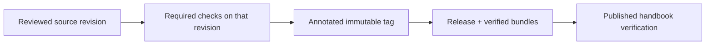

> **Applies to:** epistemic-skills v7.0.0.

# Follow the identity from source to publication

A release should let a reader answer: which source was reviewed, which checks ran, what was published, and which limitations remained? For v7, the [final publication receipt](https://github.com/ZMS-Labs/epistemic-skills/releases/download/v7.0.0/publication-receipt.json) joins those identities.

### What to inspect

| Record | Purpose |
|---|---|
| [v7.0.0 release](https://github.com/ZMS-Labs/epistemic-skills/releases/tag/v7.0.0) | Published notes and downloadable artifacts |
| [Publication receipt](https://github.com/ZMS-Labs/epistemic-skills/releases/download/v7.0.0/publication-receipt.json) | Exact commit, tag identity, checks, asset hashes, and publication observations |
| [Designated review](https://github.com/ZMS-Labs/epistemic-skills/releases/download/v7.0.0/designated-review.json) | Judgment, actual reviewer/context relationship, and scope |
| [Exact gate results](https://github.com/ZMS-Labs/epistemic-skills/releases/download/v7.0.0/exact-gates.json) | Required jobs and explicitly disclosed diagnostics |
| [v7.0.0 release policy](https://github.com/ZMS-Labs/epistemic-skills/blob/v7.0.0/RELEASING.md) | Rules governing this publication |
| [Pre-publication implementation packet](https://github.com/ZMS-Labs/epistemic-skills/blob/v7.0.0/docs/release/v7-evidence.md) | Earlier implementation evidence and the then-open gates |

The release notes match their committed source. Annotated tags remain fixed. Later documentation improvements belong to the current handbook and wiki history; they do not change the released code or rewrite old evidence.

### Documentation can improve between releases

This handbook explains v7.0.0 behavior while allowing clearer examples and navigation after publication. Canonical method links stay pinned to that release. Links labeled **current development** point to maintained repository documents that may evolve. The wiki is a separate Git repository, so publication and live verification are distinct from a source commit.

An updated handbook does not prove a user's installation upgraded. Installation, loaded context, and exercised behavior require their own observations. See [installation](Installation-and-Harness-Compatibility.md) and [the evidence guide](Testing-and-Evaluations.md).

Future releases follow the [release policy — current development](https://github.com/ZMS-Labs/epistemic-skills/blob/main/RELEASING.md), with their own source identity and evidence.
