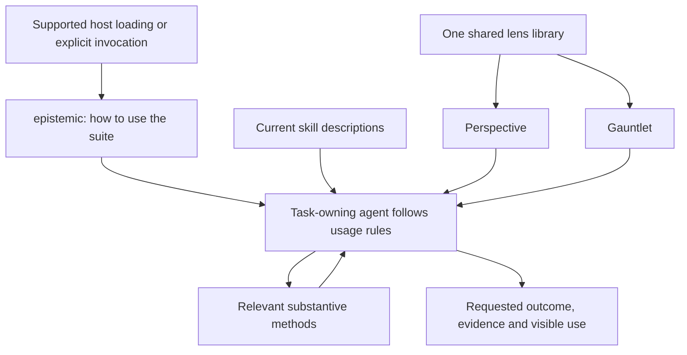

# Epistemic Skills v7: consolidated design

Date: 2026-09-18. Source baseline: `9705f70aec1285597a6ef2a341cede80010c1dcb`.

Status: consolidation of the owner's accepted design decisions. Implementation, installed behavior and release validation remain outstanding. The associated [implementation plan](../plans/2026-09-18-epistemic-skills-v7.md) separates engineering defaults from accepted product requirements.

## Purpose and decision authority

V7 should make relevant epistemic methods engage reliably, visibly and proportionately; expose consequential mistakes; and carry authorized work through to its actual outcome. More invocations, longer reports, a larger roster or mechanically valid records are not substitutes for those outcomes.

This is the current design reference. The [skill assessment](../../audits/2026-09-18-v7-skill-assessment.md) preserves per-skill reasoning, counterexamples, original proposals and owner corrections. Later accepted decisions supersede earlier proposals in that assessment. In particular, Epistemic is a usage entry, not the previously proposed coordinator. Perspective is separate from Gauntlet. A mandatory independent or different-model-family release review has been removed; the owner-designated reviewer is responsible for release judgment.

No user decision currently blocks implementation planning. Host limits, installed capabilities and alias support are facts to verify at execution time. Physical file placement, test fixture selection and display formatting are ordinary engineering choices within the requirements below. New material evidence, a consequential scope change or genuinely missing authority can reopen the affected decision; routine implementation choices cannot reopen the whole brainstorm.

## Structure and shared requirements

The diagram describes responsibilities; it is not a required execution sequence. Direct invocation of every method remains available through the host's actual interface. The task owner continues after a bounded method returns. Explicitly requested assessment ends at assessment; authorization to diagnose alone does not authorize repair. Existing relevant authorization carries forward unless withdrawn or invalidated.

Every skill must identify its question, applicability and exclusions, required inputs and reusable evidence, method, possible results and limits, and return to the original task. Applicability and exclusions must be discoverable before loading extensive reference material. Descriptions are canonical discovery data, not a second hand-maintained routing inventory.

Apply useful methods when their conditions arise; honor explicit requests. Reuse adequate applicable evidence, avoid repeated investigations for unchanged conditions, and preserve the distinction between engagement, effort and authority. Necessary capability, evidence or authority gaps hold only dependent actions or claims; independent authorized work continues. Skills do not introduce new authority or universal approval gates.

Every skill actually used receives a concise visible acknowledgment, individually or in a combined account of contributions. Announcing or reading a skill is not proof of applying its method. A method may confirm the existing approach, return no material finding or report an unresolved limit. Ordinary work requires no absent-trigger report or process-only artifact.

## Complete skill disposition and acceptance map

There are seventeen intended canonical entries: the fifteen current methods, the new Perspective method and the revived usage entry. The historical alias is not an eighteenth substantive skill. Count is a consequence of useful boundaries and remains revisable on evidence.

| ID | Entry | Required v7 behavior | Discriminating acceptance example |
|---|---|---|---|
| R01 | epistemic | Canonical usage entry titled Using Epistemic Skills; historical alias using-epistemic-skills where supported. Teach discovery, current instruction loading, application, visibility and continuation. No separate planner, dispatch engine, lens selector, substantive verdict or task ledger. | A plain bug report receives the relevant debugging method; an explicit specialist request does not require an extra coordinator. |
| R02 | metacognate | Preserve substantive examination of assumptions, evidence, confidence, success criteria and approach, including explicit invocation. Remove exclusive-entry and compulsory-dispatch framing. | Detect that a green proxy fails the actual outcome; or confirm an adequate approach without inventing a correction. |
| R03 | recon | Retain brief, initiative and candidate modes. Remove mandatory example/question filler; zero residual questions is valid. Return framing to the task owner while preserving the method's read-only boundary. Refresh stale evidence descriptions. | One decisive observation corrects the brief without producing a quota of questions; a resolved plan does not trigger a new discovery project. |
| R04 | resolve | Choose derivation, literature or probe by question and adequate evidence/cost. Provide bounded single-citation verification. Distinguish verification depth, reception, artifact persistence and library deposit. Experimental evidence may be retained; production promotion needs the normal authorized path. | Verify one citation without manufacturing a multi-paper review; use a larger synthesis when the actual question requires it. |
| R05 | health | Report observed scope, bounds, coverage and unknowns. State assessment is distinct from diagnosis or proof that a particular change landed. | A service can meet availability bounds while its requested configuration remains absent. |
| R06 | triage | Integrate causal standards into one investigation. Prefer available applicable Superpowers systematic-debugging; supply an adequate standalone method otherwise. Preserve CAUSE, NARROWED, UNKNOWN and NOT-BROKEN and inherited-versus-new evidence. Continue authorized repair and original-failure verification. | Reuse an adequate diagnosis; do not terminate a repair task after naming a cause or repeat diagnosis solely for another report. |
| R07 | did-it-land | Check the intended consumer and distinguishing effect. Separate current landing, observed reversal and future overwrite risk. Retain honest persistence/coverage limits. | A future reconciler risk is not called an observed REVERTED result; a successful command with a stale consumer cannot establish LANDED. |
| R08 | watch | Commission and prove a real external observer, its detection and delivery path, current state and disable control. Repair all-applicable-state proof-history consistency. A prompt cannot provide persistence. | Partial historical proof in a SUSPECT record is rejected; a test message alone does not establish a functioning watch. |
| R09 | write-goal | Author explicitly requested outcome/proof/scope/stop contracts and adapt authorized activation to native goal/loop functionality. Discover actual surface limits and lifecycle; preserve draft-only intent, existing state and user-controlled budgets. | Respect differing payload units and completion fields, detect truncation, and inspect state before retrying an ambiguous activation. |
| R10 | manifest | Preserve mission authority, effect receipts, custody and progress frontier through interruption. Correct current documentation to actual enforcement. Reuse task records; do not require missions for ordinary work or create another router. | Resume a still-authorized remaining step without restarting settled work; receipt integrity does not falsely certify outcome acceptance. |
| R11 | decision-ledger | Preserve consequential reasoning, assumptions, corrections, provenance, revisit conditions and original predictions versus later outcomes. Make persist/resume discovery clear. Reuse adequate ADRs or other records without losing re-anchoring and outcome-review duties. | Retain the original prediction when later evidence disagrees; an ADR may satisfy persistence but does not automatically satisfy resumption verification. |
| R12 | outsource | Retain durable target-readable external relay, immutable source references and verified return. Ordinary local delegation remains ordinary. Add a real COMPLETE terminal path while preserving remaining caller integration work. | A completed relay closes without manufacturing another outbound prompt; dispatch is not claimed as acceptance or execution. |
| R13 | gauntlet | Preserve plural scrutiny and reasoned adjudication of a common subject, including open decisions and constructive revision. Select distinct questions/evidence mechanisms; use targeted follow-up, preserve dissent and unaffected evidence, and report actual separation. | A small revision reopens affected findings only; a material unresolved objection cannot become GO through budget exhaustion or vote count. |
| R14 | perspective | Add focused/adaptive lens use returning insight, improvement, finding or uncertainty to the task. It can use several lenses; reviewer or lens count alone does not make it Gauntlet. | Examine one reversibility concern and return a useful adjustment without convening a mandatory panel. |
| R15 | evidence-locked-uat | Retain observed interaction/outcome verification and routine presentation exception. Make expected and disconfirming observations executable in the compiler/judge contract. Distinguish direct checks from genuinely blinded actor/verifier work. | A success display followed by failed persistence fails acceptance; a copy-only edit receives a bounded preview check. |
| R16 | open-questions | Preserve explicitly requested scoped exhaustive interviews and bounded automatic questions for consequential user-owned decisions. Recover prior answers; support reorder, batch, strike, defer and release. | Factual unknowns are investigated rather than handed to the user; interview release ends questioning without inventing consequential authorization. |
| R17 | context-audit | Inspect actual instruction source/load/precedence and version when observable. Start scoped, expand for interactions, and maintain authorized sources/projections. Report uncertainty and exercised regression coverage honestly. | A correct source file is not proof it loaded; a quiet observation period does not prove a rarely used protection unnecessary. |

Detailed method changes, source anchors and conditions that could reverse packaging choices remain in the per-skill assessment. The table includes all entries; it does not replace those substantive requirements with one-line summaries.

## R18: shared lens library

The [accepted library assessment](../../audits/2026-09-18-v7-lens-library-assessment.md) and [102-member inventory](../../audits/2026-09-18-v7-lens-members.json) define the required dispositions. Each current ID must be accounted for: 15 retain, 68 refine, seven combine as modes, six relocate and six remain retired. These are dispositions of source IDs, not arithmetic for a promised final count.

Perspective and Gauntlet consume one canonical repertoire. Each reusable method identifies its question and applicability, evidence, procedure, possible findings including none, useful consequence, revision conditions, blind spots and stopping/return boundary. Functional descriptions lead selection; historical aliases remain intelligible. Empirical counterevidence and changes to authorized value criteria are distinct kinds of revision conditions.

Apply the member inventory's concrete edits. Priorities include conclusion-prescribing cards, unsupported population claims, intent/psychology inference, narrow checks presented as universal assurance, inverted value-of-information falsification, and dialectical synthesis claiming both never to rule and to emit a ruling. Preserve distinct causal, statistical, provenance and arithmetic methods; shared-dependency analysis versus fault experiments; incident coordination versus individual recovery; lifecycle versus distributional effects.

Combine the accepted operating-model, adversary-profile, measurement and sunk-cost modes while preserving their discoverable questions and lookup provenance. Keep generation, evaluation, gates and adjudication roles separate; the same source or mode does not create independent corroboration. Preserve retired IDs and historical replay. A task-specific adapted lens does not automatically enter the permanent library.

Develop the three accepted queued methods: evidence-synthesis-auditor, stakeholder-representation-auditor and hermetic-reproducibility-auditor. They must define their actual procedures and limits before becoming available. Preserve the complete bounded literature record and its contrary evidence; it supplies rationale, not proof that the prompts improve behavior.

## R19: delivery, compatibility and native harness facts

Maintain one canonical Epistemic usage body. Supported host integrations supply it early enough to influence dependent work, including appropriate resume/context-reset boundaries. Detailed method bodies load on demand. Explicit invocation or documented host instructions provide a fallback where startup delivery is unavailable. Do not silently change mission-custody hook semantics or claim that a shipped snippet is live.

Verify actual host/surface/version, discovery exposure, source identity, relevant description/body integrity and applicable alias support. Detect conflicts where observable; preserve customized installations and correct only within authority. Reuse valid session knowledge instead of auditing installations every turn. A concise first-use acknowledgment and later substantive-method receipts provide visibility without repeated banners.

Repair the existing loaded-description checker: arbitrary substrings must not pass as intact descriptions. Allow only justified presentation normalization, with tests distinguishing harmless wrapping from missing instructions. Source integrity, captured listing content, actual context delivery and observed application are different evidence levels.

Write-goal must discover constraints of the actual invocation surface: required fields; objective and completion fields; character/code-point/code-unit/byte/token limits and counted wrappers; reference availability; existing goals; native budgets, iteration, pause/cancel/resume and stop/block semantics; activation acknowledgment and readback. Use current tool schemas or installed implementation/help, then official documentation where needed. Profiles are dated scoped evidence, not timeless platform promises. Do not invent exact platform limits or silently weaken goals to fit them. Preserve essential constraints and verify any referenced fuller contract is retrievable on relevant resume paths. No substitute persistent runner is part of v7.

## R20: review, authorization and closure

The owner-designated reviewer may review the candidate. No additional model family, outside reviewer or fabricated independent identity is a release prerequisite. This changes release policy; it does not permit self-checks to claim blinding or erase legitimate task-specific authorization, receipt integrity or custody requirements.

Findings distinguish unmet requirements, user-owned tradeoffs and optional improvements. Material findings name affected action, evidence and resolution condition. Recheck changed behavior and relevant dependencies after repair; preserve unaffected evidence. Mere repetition of an objection or optional suggestion does not reopen acceptance. Material new evidence can reopen the affected conclusion. Budget exhaustion records a limit rather than success or an unlimited new review cycle.

## R21: evidence and bounded evaluation

Separate mechanical contract checks, exercised workflow/host evidence and comparative task benefit. Reuse existing checks and fixtures. Historical directed trials, simulations, source-only checks and the exploratory four-arm campaign keep their original limits and results.

For comparative work, freeze the candidate, baseline, cases, success criteria, model/configuration, provider availability, actual discovery context, repeat budget and scoring procedure before dispatch. Use isolated task state and natural prompts for activation cases; explicit invocation has separate cases. Do not supply a shared reasoning template that teaches both arms the candidate intervention. Keep all raw outcomes and failures; retain scorer corrections and apply them consistently. Root remains the assigned reviewer for ambiguous evidence.

Measure correct completion, missed/caught material defects, unsupported assurance, authority/scope deviations, unnecessary questions or repeated work, actual method application, visible acknowledgment and continuation. Report time, tokens and tools as costs. More invocations or a high aggregate score cannot compensate for a material unresolved failure of a claimed behavior. Small or noisy comparisons support only scoped conclusions. Fix a material failure or withdraw its support claim; do not silently rerun unchanged candidates until they pass.

## R22: public repository and release presentation

Keep private identities, machine/network details, raw private telemetry and account/access information out of public artifacts. Use existing privacy/security checks and safe examples. Preserve historical Git attribution, release tags, original review results and the meaning of historical IDs. No history rewrite is part of this design.

Update current README, canonical skill sources, host metadata, discovery/count checks, build surfaces and current handbook/release guidance together. Explain the usage entry, direct access, real examples and tested support clearly. Seventeen is the intended canonical entry count after both additions; aliases and lenses are not new substantive skills. Public claims must distinguish installed, loaded, exercised and comparatively supported behavior.

Existing native goals/loops and active work are not automatically rewritten, restarted or resubmitted because a package was upgraded. Preserve user changes and reconcile actual installed state. Historical documentation remains historical; current guidance must not present retired policies as current.

## Scope closure

**Settled:** all 17 entry boundaries; the usage-entry revival and alias; metacognate's substantive purpose; visible use; preferred debugging plus standalone fallback; Perspective/Gauntlet separation; all 102 lens dispositions and three additions; native goal/loop adaptation; continuity ownership; assigned-reviewer policy; bounded evidence approach.

**Verify during implementation:** exact host startup/resume and alias behavior; effective loaded descriptions and version conflicts; native goal limits and lifecycle; current available runners/providers; installed execution and comparative results. These require observation, not another abstract brainstorm.

**Engineering defaults:** keep the canonical roster in its existing location initially and expose shared guidance to both consumers; use ordinary concise receipts without a rigid new grammar; organize work by the nine plan bundles; use an explicitly bounded pilot before broader reliability claims. These are reversible choices, not assertions of measured superiority.

**Deferred:** the rest of the 27 queued lens concepts; mandatory extra model families; a general orchestrator, policy server or native-goal replacement; a new standalone skill for every lens; blanket historical cleanup; universal effectiveness claims; wide external-package comparison unless a specific unresolved capability claim requires it.

**Completion:** all R01-R22 requirements have a recorded implementation disposition and relevant checks; changed runtime paths have honest exercise evidence or explicit withdrawn support; public docs and packaging agree with the candidate; material unresolved failures do not hide behind passing unrelated tests; the assigned reviewer makes a bounded release judgment. Completion of a document, skill subtask or native loop is not completion of v7. Publication status remains separate from local implementation and verification.
