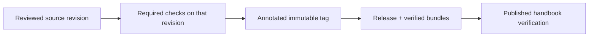

> **Applies to:** epistemic-skills v7.2.0.

# Follow the identity from source to publication

A release should let a reader answer: which source was reviewed, which checks ran, what was published, and which limitations remained? For the current release (v7.2.0), the [final publication receipt](https://github.com/ZMS-Labs/epistemic-skills/releases/download/v7.2.0/publication-receipt.json) joins those identities.

### What to inspect

| Record | Purpose |
|---|---|
| [v7.2.0 release](https://github.com/ZMS-Labs/epistemic-skills/releases/tag/v7.2.0) | Published notes and downloadable artifacts |
| [Publication receipt](https://github.com/ZMS-Labs/epistemic-skills/releases/download/v7.2.0/publication-receipt.json) | Exact commit, tag identity, checks, asset hashes, and publication observations |
| [Designated review](https://github.com/ZMS-Labs/epistemic-skills/releases/download/v7.2.0/designated-review.json) | Judgment, actual reviewer/context relationship, and scope |
| [Exact gate results](https://github.com/ZMS-Labs/epistemic-skills/releases/download/v7.2.0/exact-gates.json) | Required jobs and explicitly disclosed diagnostics |
| [v7.2.0 release policy](https://github.com/ZMS-Labs/epistemic-skills/blob/v7.2.0/RELEASING.md) | Rules governing this publication |
| [Pre-publication authorization](https://github.com/ZMS-Labs/epistemic-skills/blob/v7.2.0/docs/release/PREAUTH-7.2.0.md) | Owner authorization, firing condition, and reviewer designation recorded before the candidate existed |
| [v7.1.0 release](https://github.com/ZMS-Labs/epistemic-skills/releases/tag/v7.1.0) | The previous support point; its records remain unchanged |

Released notes match their committed sources. Annotated tags remain fixed. Later documentation improvements belong to the current handbook and wiki history; they do not change the released code or rewrite old evidence.

### Documentation can improve between releases

This handbook explains v7.2.0 behavior while allowing clearer examples and navigation after publication. Canonical method links stay pinned to that release. Links to other repository documents, such as the maintainer guide and the release policy, point to those documents as they stood at the source commit named in the footer; newer versions may exist on the main branch. The wiki is a separate Git repository, so publication and live verification are distinct from a source commit.

An updated handbook does not prove a user's installation upgraded. Installation, loaded context, and exercised behavior require their own observations. See [Installation and Harness Compatibility](Installation-and-Harness-Compatibility.md) and [Testing and Evaluations](Testing-and-Evaluations.md).

Future releases follow the [release policy](https://github.com/ZMS-Labs/epistemic-skills/blob/main/RELEASING.md), with their own source identity and evidence.
